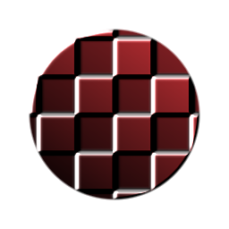

# Uber Relief

<table>
<tr style="border: 0;">
<td style="border: 0;" valign="top">

{width="128px"}

## Uber Relief

**In:** *Filter/Effekte*

**Fortgeschrittene**

</td>
<td style="border: 0;" valign="top">

## Beschreibung

Erweiterte, funktionsreiche Version von [Relief](../../../../../../compositing-graphs/nodes-reference-for-com/atomic-nodes/emboss/emboss.md). Führt einen aufwändigen gefälschten 2D-Beleuchtungseffekt auf der Grundlage einer Höhenkarte durch.

Nützlich, wenn du bei bestimmten Texturierungs-Stilen eine Beleuchtung einbauen möchtest, die du nicht brauchst, aber viel Kontrolle erfordert.

## Parameter

### Eingaben

* **Farbe**: *Farbeingabe*\
  Zu änderndes Basis-Image.
* **Height**: *Graustufen-Eingabe*\
  Als Treiber für den Effekt verwendete Höhenkarte.

### Parameter

* **Umgebungsfarbe**: *(Farbwert)*Farbe, die in schattierten Bereichen verwendet wird.
* **Diffuse Farbe**: *(Farbwert)*In beleuchteten Bereichen verwendete Farbe.
* **Specular-Farbe**: *(Farbwert)*Für Specular-Reflexionen verwendete Farbe
* **Lichtintensität**: *0.0 - 1.0*\
  Intensität des (gefälschten) Lichts.
* **Lichtwinkel**: *0.0 - 1.0*\
  Einfallswinkel des (gefälschten) Lichts
* **Specular-Intensität**: *0.0 - 1.0* Intensität der Specular-Reflexionen.
* **Specular-Glossarität**: *0.0 - 1.0* Größe der Specular-Markierung.
* **Diffuse Raueit**: *0.0 - 1.0* Raueit, die bei der Berechnung der diffusen Beleuchtung verwendet wird.
* **Schattendeckkraft**: *0.0 - 1.0* Deckkraft der schattierten Bereiche.

## Beispielbilder

| 

 |
| --- |
|  |

</td>
</tr>
</table>
