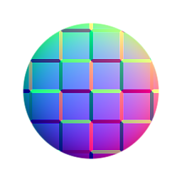

# Normale Kombination

<table>
<tr style="border: 0;">
<td width="33.33%" style="border: 0;" valign="top">

{width="128px"}

<b>In:</b> Filters > Normalen-Map

</td>
<td width="100.00%" style="border: 0;" valign="top">

## Beschreibung

Normal kombinieren kombiniert die Details zweier Normalen-Map auf mathematisch korrekte Weise.

Es ähnelt der bekannten &quot;Overlay&quot;-Methode anderer 2D-Bildbearbeitungssoftware, funktioniert aber intern etwas anders (drei Optionen).

</td>
</tr>
</table>

Auf diese Weise lassen sich 2D-generierte Normalen-Map-Details am besten und am besten zu einer durch Baking erzeugte Map hinzufügen.

Wenn Sie zwei Normalen-Map überblenden möchten, ohne ihre Details zu kombinieren (z. B. mithilfe einer Maske), sollten Sie [Normale Überblendung](../../../../../../compositing-graphs/nodes-reference-for-com/node-library/filters/normal-map/normal-blend/normal-blend.md) verwenden.

## Eingaben

|  |  |
|:---|:---|
| <b>Normal 2</b> <i>Farbe</i> | Beschreibung |
| <b>Normal 1</b> <i>Farbe</i> | Beschreibung |

## Parameter

|  |  |
|:---|:---|
| <b>Technik</b> *Ganzzahl* | Legt fest, welche interne Mischtechnik verwendet werden soll, wobei die Geschwindigkeit auf Qualität gesetzt wird.  *- Whiteout (niedrige Qualität) * Kanalmixer (hohe Qualität) * Detailorientiert (hohe Qualität)* |

## Beispiele
