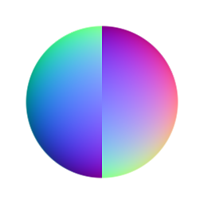

# Normale Umkehr

<table>
<tr style="border: 0;">
<td style="border: 0;" valign="top">

{width="128px"}

## Normale Umkehr

**In:** *Filters/Normal Map*

**Einfach**

</td>
<td style="border: 0;" valign="top">

## Beschreibung

Ermöglicht Ihnen die Umkehrung aller Kanäle einer Normalmap und bietet eine schnelle und einfache Verknüpfung zu dieser manuellen Vorgehensweise.

Beachten Sie, dass fast jeder Node, der eine Normalmap als Eingabe oder Ausgabe verwendet, eine Option hat, den Grünen Kanal umzukehren, für Normalmaps im DirectX- oder OpenGL-Stil. Das bedeutet, dass Sie diesen Knoten in diesen Fällen fast nie benötigen sollten.

## Parameter

* **Rot umkehren**: *False/True*
* **Grün umkehren**: *False/True*
* **Blau umkehren**: *False/True*
* **Alpha umkehren**: *False/True*

## Beispielbilder

|  |
| --- |
| Es sind keine Bilder an diese Seite angehängt. |

</td>
</tr>
</table>
