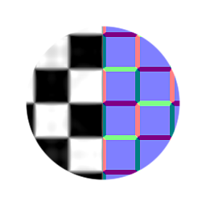

# Normal Sobel

<table>
<tr style="border: 0;">
<td style="border: 0;" valign="top">

{width="128px"}

## Normal Sobel

**In:** *Filters/Normal Map*

**Einfach**

</td>
<td style="border: 0;" valign="top">

## Beschreibung

Konvertiert einen Heightmap-Eingang in eine normale Map-Ausgabe. Eine etwas komplexere Version des [normalen atomaren Knotens](../../../../../../compositing-graphs/nodes-reference-for-com/atomic-nodes/normal/normal.md) verwendet dieser Knoten Sobel-Sampling und nicht die Standard-Sampling-Methode.

## Parameter

* **Intensität**: *0.0 - 3.0* Stärke der konvertierten Normalwerte.
* **Normales Format**: *OpenGL, DirectX*\
  Wechselt zwischen verschiedenen Normalmap-Formaten (invertiert den grünen Kanal).

## Beispielbilder

|  |
| --- |
| Es sind keine Bilder an diese Seite angehängt. |

</td>
</tr>
</table>
