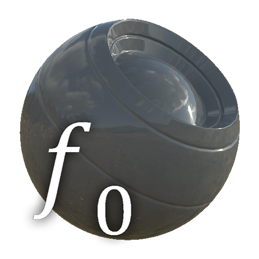

# PBR Dielektrisch F0

<table>
<tr style="border: 0;">
<td style="border: 0;" valign="top">

{width="128px"}

## PBR Dielektrisch F0

**In:** *Materialfilter/PBR-Dienstprogramme*

**Einfach**

</td>
<td style="border: 0;" valign="top">

## Beschreibung

Ein Hilfsknoten &quot;Voreinstellung&quot; für Specular-Werte bei Verwendung des Specular-PBR-Modells.

Dies ist nützlich, um schnell die richtigen Werte als Ausgangspunkt zu erhalten, sodass Sie die Farbauswahl in einem Diagramm vermeiden können.

## Parameter

* **Specular F0**: *Kunststoff, Holz, Stein, Ziegel, Sand, Beton, Gewebe, gerostetes Metall, Wasser, Eis, Glas, benutzerdefinierte IOR* Wählt einen vordefinierten Specular-Bereich aus.
* **Specular-Bereich**: *0.01 - 1.0* Passt den Specular-Wert im Bereich der ausgewählten Vorgabe an. Ermöglicht einige Anpassungen.
* **IOR**: *1.0 - 5.0* Nur aktiviert, wenn auf Benutzerdefinierte IOR festgelegt. Einen eigenen Wert wählen.

## Beispielbilder

|  |
| --- |
| Es sind keine Bilder an diese Seite angehängt. |

</td>
</tr>
</table>
