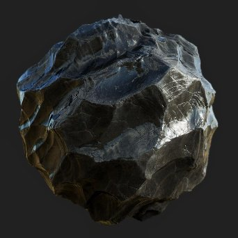

# PBR-Rendering

<table>
<tr style="border: 0;">
<td width="33.33%" style="border: 0;" valign="top">

{width="250px"}

<b>In:</b> Materialfiltern > PBR-Dienstprogramme

</td>
<td width="100.00%" style="border: 0;" valign="top">

## Beschreibung

Rendert ein PBR-Material auf eine Kugel, eine Ebene oder einen Zylinder mithilfe von Image Based Lighting (IBL). Dies ist eine Render-Engine innerhalb eines Knotens, die sehr nützlich sein kann, um Miniaturen, Vorschauen oder 2D-Assets zu generieren. Es handelt sich nicht um ein Rendering wie die 3D-Ansicht, sondern um eine tatsächliche Textur, die in Ihrem Diagramm generiert wird.

Dieser Knoten erfordert, dass mindestens ein vollständiges PBR-Material angeschlossen wird. Idealerweise verwenden Sie die Link Creation Modes, um das Material mit dem PBR-Rendering zu verbinden. Darüber hinaus benötigen Sie eine kugelförmig ausgewickelte HDRI-Umgebung für den Render, aus dem die Beleuchtung berechnet werden soll. Testmaterialien finden Sie unter PBR-Materialien. Umgebungszuordnungen finden Sie unter [3D-Ansicht in der Bibliothek.](../../../../../../compositing-graphs/nodes-reference-for-com/node-library/3d-view-library/3d-view-library.md)

</td>
</tr>
</table>

>[!WARNING]
>
> **CPU-Modul (SSE2)**
> 
> Der PBR-Rendering Node ist sehr schwer und funktioniert nicht gut mit der SSE2 CPU Engine. Wechseln Sie durch Drücken von F9 zu einer anderen Engine, wenn der Knoten extrem schlecht funktioniert.

## Eingaben

|  |  |
|:---|:---|
| <b>Material-Kanaleingänge</b> | Mehrere Material-Eingaben werden zum Rendern des Materials in der Geometrie verwendet:   - Grundfarbe - Normal - Emissive - Rauheit - Metallic - Specular level - Height - Ambient occlusion - Deckkraftmaske - Anisotropy level - Anisotropy angle - Translucency - Streuungsentfernungsskala |
| <b>Linsen-Dirt-Map</b> <i>Graustufen-Eingabe</i> | Benutzerdefinierte Karte für Dirt auf dem Objektiv, die angezeigt wird, wenn Blendenflecke sichtbar sind. |
| <b>Linsen-Blende-Map</b> <i>Graustufen-Eingabe</i> | Kann verwendet werden, um Bokeh zu überschreiben, eine unscharfe Form. Je kontrastreicher, desto sichtbarer. Denke daran, dass nur ein Kreis innerhalb der Textur aufgenommen wird, sodass jede Form in einen Kreis passen muss. |
| <b>Hintergrundeingabe</b> <i>Farbeingabe</i> | Benutzerdefinierte Zuordnung wird als Hintergrund verwendet, wenn der Parameter <b>Hintergrundmodus</b> auf <i>Hintergrundeingabe</i> festgelegt ist |
| <b>Umgebungszuordnung</b> <i>Farbeingabe</i> | Umgebungskarte, die zur Berechnung der Beleuchtung verwendet wird. Muss sphärisch abgebildet und in HDR vorliegen. |

## Ausgaben

|  |  |
|:---|:---|
| <b>Schönheit</b> | Das endgültige Rendering |
| <b>Rohbestrahlung</b> | Die Bestrahlungsdaten des endgültigen Renderings  <i>Alpha:</i> Deckkraftkarte |
| <b>Raw-Specular</b> | Die Specular-Daten des endgültigen Renderings  <i>Alpha:</i> Specular-Schattenkarte |
| <b>Normaler Weltraum</b> | Die Welt-Raum-Normale-Daten des endgültigen Renderings  <i>Alpha:</i> Welt-Raum-Höhen-Map |
| <b>Normaler Tangentialraum</b> | Der Tangente-Speicherplatz normalisiert die Daten des endgültigen Renderings.  <i>Alpha:</i> Tangente-Speicherplatz-Höhen-Map |
| <b>UVs</b> | Die UV-Daten des endgültigen Renderings  <i>Alpha:</i> Deckkraftzuordnung |

## Parameter

|  |  |
|:---|:---|
| <b>Form</b> <i>Kugel, Ebene, Zylinder</i> | Legt die zum Rendern verwendete Form fest. Benutzerdefinierte Formen sind nicht möglich. |
| <b>Versatz-Intensität</b> <i>0.0 - 0.5</i> | Legt die Intensität des Versatzes vom Height fest. |
| <b>Umgebungsdrehung</b> <i>0.0 - 1.0</i> | Dreht die Lichtumgebung. Vordrehung im Vergleich zur Bewegung der Kamera. |
| <b>Hintergrundmodus</b> <i>Farbe, Umgebung, Umgebungslicht, Hintergrundeingabe</i> | Legt fest, was im Hintergrund angezeigt wird. Die Farbe ist eine Volltonfarbe, &quot;Umgebung&quot; ist die Karte, die Sie mit einem optionalen Weichzeichner angeschlossen haben. Umgebungslicht ist eine sehr verschwommene Version der Umgebung. |
| <b>Hintergrundfarbe</b> <i>(Farbwert)</i> | Nur verfügbar, wenn der Hintergrundmodus auf &quot;Farbe&quot; eingestellt ist. |
| <b>Hintergrundunschärfe der Umgebung</b> <i>0.0 - 1.0</i> | Nur verfügbar, wenn der Hintergrundmodus auf &quot;Umgebung&quot; eingestellt ist. |
| <b>Form</b> |  |
| <b>Skalierung</b> <i>0.0 - 2.0</i> | Lege die Skalierung für die Kugel fest. |
| <b>Ebenengröße</b> <i>0.0 - 1.0</i> | Legen Sie die Skalierung für die Ebene fest. |
| <b>Zylinderradius</b> <i>0.0 - 1.0</i> | Legen Sie den Radius für den Zylinder fest. |
| <b>Zylinderlänge</b> <i>0.0 - 1.0</i> | Stellen Sie die Länge für den Zylinder ein. |
| <b>Drehung</b> <i>0.0 - 1.0</i> | Dreht die Form, ohne die Beleuchtung zu drehen. |
| <b>Drehrichtung</b> <i>0.0 - 1.0</i> | Stellt die Drehachse in 2D ein. |
| <b>Drehung um Richtung</b> <i>0.0 - 1.0</i> | Dreht die Form auf der Drehachse. |
| <b>Formenposition</b> <i>-1.0 - 1.0</i> | Verschiebt Formen. |
| <b>UV Kachelung</b> <i>1.0 - 6.0</i> | Legt die Menge der UV-Kachelung fest. |
| <b>Sphere-UV-Skalierung</b> <i>0.0 - 4.0</i> | Legt die Skalierung der UVs auf der Kugel fest. |
| <b>Ebene UV-Skalierung</b> <i>1.0 - 4.0</i> | Legt die Skalierung der UVs auf der Ebene fest. |
| <b>UV-Skalierung des Zylinders</b> <i>1.0 - 6.0</i> | Legt die Skalierung der UVs auf dem Zylinder fest. |
| <b>UV-Versatz</b> <i>0.0 - 1.0</i> | Versetzt UVs |
| <b>UVs neigen</b> <i>False/True</i> | Neigt UVs um 45 Grad für die Kugel. |
| <b>Kamera</b> |  |
| <b>Belichtung</b> <i>-4.0 - 4.0</i> | Legt die Kamerabelichtung fest. |
| <b>Farbtonzuordnung</b> <i>Linear, ACE, Film-Hejl</i> | Legen Sie fest, welche Farbtonzuordnungslösung für das endgültige Bild verwendet werden soll. |
| <b>Kamera-Modus</b> <i>Perspektive, Orthografisch</i> | Wechseln der Kamera zwischen zwei Projektionsmodi. |
| <b>Sichtfeld</b> <i>0.01 - 100.0</i> | Legt den FOV-Winkel der Kamera fest. |
| <b>Entfernung</b> <i>0.0 - 4.0</i> | Legen Sie den Abstand der Kamera vom Objektzentrum fest. |
| <b>Vignettenintensität</b> <i>0.0 - 1.0</i> | Legen Sie die Intensität des Vignetteneffekts fest. |
| <b>Vignettenradius</b> <i>0.0 - 1.0</i> | Legen Sie den Radius des Vignetteneffekts fest. |
| <b>Bildschirmposition</b> | Verschiebt die Kamera um das Objekt, kann aber auch durch ein Gizmo in der 2D-Ansicht geändert werden. |
| <b>Tiefe von Feld</b> |  |
| <b>Blenden-Radius</b> <i>0.0 - 0.1</i> | Legt den Radius der Blende fest. Höhere Werte bedeuten, dass Bereiche außerhalb des Fokus unschärfer werden (Bokeh). |
| <b>Blende Blades</b> <i>3 - 9</i> | Legt die Form der Bokeh-Weichzeichnung fest. |
| <b>Blende Ring</b> <i>0.0 - 1.0</i> | Fügt einen inneren Verlauf zur Bokeh-Form hinzu. |
| <b>Blende Difraktion</b> <i>0.0 - 2.0</i> | Fügt dem Bokeh chromatische Aberration hinzu. |
| <b>Swirly Bokeh</b> <i>0.0 - 1.0</i> | Fügt unscharfen Bokeh-Weichzeichnungsbereichen einen Wirbel oder eine sich drehende Wirkung hinzu. |
| <b>Fokusmodus</b> <i>Auto, Punkt</i> | Festlegen, ob der Fokus vorbestimmt oder vom Benutzer festgelegt ist. Mit dem Punktfokus können Sie einen Punkt in der 2D-Ansicht verschieben, um den Fokusabstand zu bestimmen. |
| <b>Fokuspunkt</b> | Wenn der Fokus auf &quot;Punkt&quot; gesetzt ist, können Sie diesen Punkt verschieben. hat ein Gizmo mit 2D-Ansicht. |
| <b>Fokusversatz</b> <i>-0.5 - 0.5</i> | Wenn der Fokus auf &quot;Auto&quot; eingestellt ist, können Sie ihn vor und zurück verschieben. |
| <b>Zuordnung der benutzerdefinierten Blende verwenden</b> <i>False/True</i> | Überschreibt die oben genannten Blendeneinstellungen und verwenden Sie die Blendenmap-Eingabe, um die Bokeh-Form zu bestimmen. Benötigt eine Eingabe. |
| <b>Post-Effekte</b> |  |
| <b>Post-Effekte aktivieren</b> <i>False/True</i> | Schaltet <i>alle</i> Nacheffekte im endgültigen Rendering um. |
| <b>Intensität der Blüte</b> <i>0.0 - 2.0</i> | Legt die Stärke des Blüteneffekts fest. |
| <b>Bloom-Schwellenwert</b> <i>0.0 - 2.0</i> | Legt einen niedrigen Schwellenwert für die Anzeige der Blüte fest. |
| <b>Bloom-Chrominanzverschiebung</b> <i>0.0 - 1.0</i> |  |
| <b>Halo-Intensität der Linse</b> <i>0.0 - 1.0</i> | Legt die Intensität für den Linseneffekt fest. |
| <b>Intensität der Blendenflecke</b> <i>0.0 - 1.0</i> | Legt die Intensität für den Blendenflecke fest. Stelle sicher, dass das Licht deines Umgebungshintergrunds sichtbar ist, um diesen Effekt richtig zu sehen. |
| <b>Intensität des Dirts der Linse</b> <i>0.0 - 1.0</i> | Legt den Effekt der Objektiv-Dirt-Map auf die Blendenflecke fest. |
| <b>Rendereinstellungen</b> |  |
| <b>Qualität der Diffusen</b> <i>16 Samples, 32 Samples, 64 Samples, 128 Samples</i> | Wechseln Sie zwischen den Qualitätsstufen für die diffuse Karte. |
| <b>Diffuse Emissive Multiplier</b> <i>0.0 - 1.0</i> | Steuert, wie stark die emittierenden Teile zur Bestrahlung beitragen. |
| <b>Diffuse der Schattenintensität</b> <i>0.0 - 1.0</i> | Steuert die Intensität der diffusen Schatten. |
| <b>Specular Dithering</b> <i>0.0 - 1.0</i> | Stellen Sie die Dithering-Rate für den Specular ein. |
| <b>Specular-Schattenmultiplikator</b> <i>0.0 - 1.0</i> | Steuert die Schattenintensität in den Specular-Reflexionen. |
| <b>Deckkraftmodus</b> <i>Dithering-Alpha-Test, Simple Alpha Überblendung</i> | Steuert die Methode zum Anwenden von Transparenz. Der Modus <i>Einfache Alpha-Überblendung</i> wird am besten auf einheitlichen Hintergründen angezeigt. |
| <b>Ambient occlusion-Intensität</b> <i>0.0 - 1.0</i> | Legt die Intensität der ambient occlusion fest. |
| <b>Material-Anpassungen</b> |  |
| <b>Normale neu berechnen</b> <i>False/True</i> | Die Normale werden von der Höhen-Map entsprechend der Intensität des Versatzes neu berechnet. |
| <b>Normales Format</b> <i>DirectX, OpenGL</i> | Zwischen verschiedenen Normalen-Map-Format wechseln (invertiert den grünen Kanal) |
| <b>Dielektrischer F0-Eingang</b> <i>Konstanter Wert, Specular level-Eingabe</i> | Festlegen, was F0-Werte antreibt. Specular level-Eingabe bedeutet, dass sie von einer Eingabe-Map gesteuert wird. |
| <b>Dielektrisches F0</b> <i>0.0 - 0.08</i> | Wenn &quot;Konstanter Wert&quot; für den dielektrischen F0-Eingang ausgewählt ist, können Sie mit diesem Schieberegler den globalen Wert einstellen. |
| <b>Überzug löschen</b> |  |
| <b>Clear Coat aktivieren</b> <i>False/True</i> | Aktiviert eine zusätzliche, einfache Klarlackschicht über dem Eingabe-Material. |
| <b>Hüllengewicht löschen</b> <i>0.0 - 1.0</i> | Legt die Intensität oder Stärke der Klarlackschicht fest. |
| <b>Coat specular level löschen</b> <i>0.0 - 1.0</i> | Legt die Rauheit der Klarlack-Ebene fest. |
| <b>Normal von Basisebene erben</b> <i>False/True</i> | Einstellen, ob Klarlack Normale aus dem Basismaterial ignoriert oder verwendet. |
| <b>Ausstrahlend</b> |  |
| <b>Emissive Lighting aktivieren</b> <i>Wahr/Falsch</i> | Schaltet den diffusen Beitrag der emissive-Beleuchtung um. |
| <b>Emissive-Intensität</b> <i>0.0 - 10.0</i> | Legt den globalen Multiplikator für die emissive-Map fest. |
| <b>Volumenstreuung</b> |  |
| <b>Volumenstreuung aktivieren</b> <i>Wahr/Falsch</i> | Schaltet die Volumenstreuung im endgültigen Rendering um.  <i>Hinweis:</i> Für die Volumenstreuung <b>Translucency</b> muss der Eingabewert <i> höher als 0,0</i> sein. |
| <b>Streuungsabstand</b> <i>0.0 - 1.0</i> | Passt den maximalen Abstand des Streueffekts an.  <i>Hinweis:</i> Dieser Wert wird mit dem <b>Streuentfernungsskala</b>-Eingabewert <i> pro Farbkanal</i> multipliziert. |
| <b>Red Shift</b> <i>0.0 - 1.0</i> | Passt die Intensität des Effekts &quot;Rote Verschiebung&quot; bei der Streuung an. |
| <b>Rayleigh</b> <i>0.0 - 1.0</i> | Passt die Intensität des Rayleigh-Effekts bei der Streuung an. |

## Beispiele

Alle Bilder wurden mithilfe von Materialien aus der Bibliothek [Substance 3D Assets](https://substance3d.adobe.com/assets) direkt in Designer im 2D-Viewport generiert.

<table style="margin-top: 32px; margin-bottom: 32px">
    <tr style="border: 0">
        <td style="border: 0; background: transparent">
            
        </td>
        <td style="border: 0; background: transparent">
            
        </td>
        <td style="border: 0; background: transparent">
            
        </td>
        <td style="border: 0; background: transparent">
            
        </td>
    </tr>
    <tr style="border: 0; background: transparent">
        <td style="border: 0; background: transparent">
            
        </td>
        <td style="border: 0; background: transparent">
            
        </td>
        <td style="border: 0; background: transparent">
            
        </td>
        <td style="border: 0; background: transparent">
            
        </td>
    </tr>
</table>
