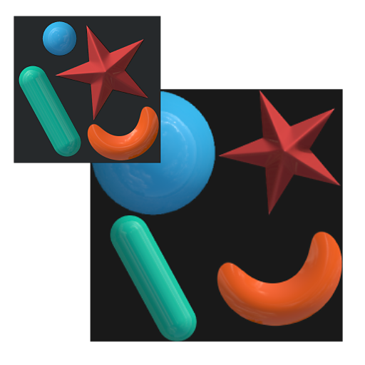

# Atlas Splitter

<table>
<tr style="border: 0;">
<td width="33.33%" style="border: 0;" valign="top">

<b>In:</b> Materialfilter/Scanverarbeitung

</td>
<td width="100.00%" style="border: 0;" valign="top">

## Beschreibung

Verwendet eine Atlasbildeingabe und teilt alle separaten Elemente in *einzelne Materialien* auf.

Sie können auch verwendet werden, um alle Elemente in einem Raster neu zu organisieren und zu verschieben.

Der Knoten funktioniert als erweiterte Anwendung des Knotens &quot;[Flood Fill](../../../../../../compositing-graphs/nodes-reference-for-com/node-library/filters/effects/flood-fill/flood-fill.md)&quot;.

</td>
</tr>
</table>

## Parameter

<b>Rasteransicht</b> *Boolescher Wert*\
Zeigt alle erkannten Formen in einem Raster an.

<b>Rasterdeckkraft</b> *Gleitend*\
Legt die Deckkraft der Rasterlinien fest, wenn die Rasteransicht auf &quot;True&quot; gesetzt ist. Debug-Option

<b>Deckkraft der Rasterauswahl</b> *Gleitend*\
Legt die Deckkraft der Rasterauswahlmarkierung fest, wenn die Rasteransicht auf &quot;True&quot; gesetzt ist. Debug-Option

<b>Automatische Skalierung</b> *Boolescher Wert*\
Die Formen werden automatisch an die Rasterzelle angepasst.

<b>Automatisches Freistellen</b> *Boolescher Wert*\
Schneidet die Ausgabegröße automatisch entsprechend der größten Form zu, um den Leerraum zu minimieren.

<b>Formauswahl</b> *Integer*\
In der Rasteransicht wird festgelegt, welche Zelle hervorgehoben ist, außerhalb der Rasteransicht wird festgelegt, welche Zelle zurückgegeben wird.

<b>Form ignorieren, die kleiner ist als </b> *Gleitend*\
Ignoriert Formen, deren Diagonale kleiner als der angegebene Wert ist.

<b>Automatische Drehung</b> *Boolescher Wert*\
Dreht die Form automatisch entsprechend dem Größenverhältnis des Begrenzungsrahmens.

<b>Drehung</b> *Gleitend*\
Globale Form - Drehwinkel

<b>Normales Eingabeformat</b> *Integer*\
Legen Sie das Format der Eingabenormalen fest. Das Festlegen des falschen Formats führt zu einem falschen Ergebnis.

<b>Deckkraftmaske verkleinern</b> *Integer*\
Verkleinert die Deckkraftmaske, um potenzielle Störungen oder isolierte Pixel zu entfernen. Es verhindert die Erkennung unerwünschter Formen und erhöht auch die Leistung.

<b>Erweiterungsbreite</b> *Gleitend*\
Wendet einen auf der Deckkraftmaske basierenden Dilatationseffekt auf alle Kanäle mit Ausnahme von &quot;Normal&quot; und &quot;Height&quot; an.

<b>Zusätzliche Eingaben aktivieren</b> *Boolescher Wert*\
Stellt USer 1- und Benutzer 2-Eingaben und -Einstellungen für alle nicht erfassten zusätzlichen Karten zur Verfügung.

<b>Benutzerdefinierte Hintergrundfarbe</b> *Boolescher Wert*\
Ermöglicht Ihnen die Auswahl einer benutzerdefinierten Hintergrundfarbe anstelle einer Erweiterung des Inhalts dieser Ebene.

<b>Grundfarben-Bg-Farbe</b> *Float3*\
Benutzerdefinierte BG-Farbe für die Grundfarbe.

<b>Normale Bg-Farbe</b> *Float3*\
Benutzerdefinierte BG-Farbe für normale Karten.

<b>Metallische Bg-Farbe</b> *Gleitend*\
Benutzerdefinierte BG-Farbe für Metall.

<b>Raueit Bg Color</b> *Gleitend*\
Benutzerdefinierte BG-Farbe für Raueit

<b>Height Bg Color</b> *Gleitend*\
Benutzerdefinierte BG-Farbe für Height

<b>Benutzer 1 Bg Color</b> *Gleitend*\
Benutzerdefinierte BG-Farbe für benutzerdefinierte Benutzer-1-Karte

<b>Benutzer 2 Bg Color</b> *Unverankerte* benutzerdefinierte BG-Farbe für benutzerdefinierte Benutzer-1-Karte

## Beispiele
