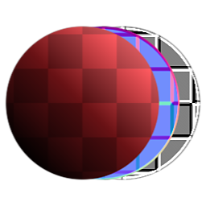

# Materialtransformation

<table>
<tr style="border: 0;">
<td width="33.33%" style="border: 0;" valign="top">

{width="128px"}

<b>In:</b> Materialfilter > Transformieren

</td>
<td width="100.00%" style="border: 0;" valign="top">

## Beschreibung

Bei &quot;Materialtransformation&quot; handelt es sich einfach um die &quot;Multi-Channel&quot;-Materialversion von [dem atomaren 2D-Transformationsknoten](../../../../../../compositing-graphs/nodes-reference-for-com/atomic-nodes/transformation-2d/transformation-2d.md). Es transformiert alle Kanäle eines Eingabematerials gleichzeitig mit derselben Schnittstelle wie &quot;2D transformieren&quot;.

Achten Sie nur darauf, die Kanäle richtig einzurichten! Standardmäßig sind &quot;Metallisch/Raueit&quot; und &quot;Specular/Glanz&quot; aktiviert, was zu Verwirrung führen kann.

</td>
</tr>
</table>

## Parameter

|  |  |
|:---|:---|
| <b>Transformation</b> <i>(Transformationsmatrix)</i> | Dreht und skaliert das Ergebnis. Das Verschieben/Schwenken erfolgt über den Parameter &quot;Versatz&quot; |
| <b>Offset</b> <i>-0.5 - 0.5</i> | Verschiebt oder verschiebt das Ergebnis. Wenn die Transformationssteuerung vorhanden ist, kann das Ergebnis durch direkte Interaktion mit der Arbeitsfläche geändert werden. |
| <b>Normales Format</b> | Wählen Sie zwischen DirectX- und OpenGL-Formaten (Grün umkehren). |
| <b>Kanäle</b> | Schalten Sie die Materialkanäle in dieser Gruppe ein und aus, z. B. wenn Sie Specular-/Glanzkarten anstelle von &quot;Metallisch/Raueit&quot; verwenden. |
