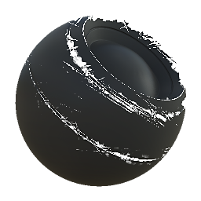

# Edge Damages

<table>
<tr style="border: 0;">
<td style="border: 0;" valign="top">

{width="128px"}

## Edge Damages

**In:** *Mesh-basierte Generatoren**/Masken-Generatoren*

**Einfach**

</td>
<td style="border: 0;" valign="top">

## Beschreibung

Generiert eine Schwarzweißmaske auf der Grundlage von durch Baking erzeugte Map und Benutzereinstellungen. Ähnlich wie [Smart Masks](https://support.allegorithmic.com/documentation/display/SPDOC/Smart+Materials+and+Masks) in [Painter](https://support.allegorithmic.com/documentation/display/SPDOC/Substance+Painter).

Diese Maske stellt Schäden an erhöhten, konvexen Kanten dar, die auf der Krümmung und dem gebackenen AO basieren.

## Parameter

### Eingaben

* **Krümmung**: *Graustufen-Eingabe*\
  Durch Baking erzeugte Map zur Platzierung von Effekten. Erforderlich!
* **Ambient-Verdeckung**: *Graustufen-Eingabe*\
  Durch Baking erzeugte Map zur Platzierung von Effekten. Erforderlich!
* **Maske (optional)**: *Graustufen-Eingabe*\
  Maskenschlitz zum Maskieren der Knoteneffekte.

### Parameter

* **Ebene**: *0.0 - 1.0*\
  Höhe des anzuwendenden Kantenschadens
* **Kontrast**: *0.0 - 1.0*\
  Passt den Kontrast des Ergebnisses an.
* **Schadensintensität**: *0.0 - 1.0* Wechselt zwischen einem zersplitterten, konsistenten Look und einem chaotischen, zerkratzten, stark beschädigten Look.

## Beispielbilder

</td>
</tr>
</table>
