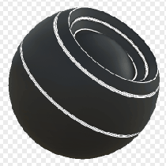

# Edge Select

<table>
<tr style="border: 0;">
<td width="33.33%" style="border: 0;" valign="top">

{width="128px"}

<b>In:</b> Mesh-basierte Generatoren > Maskengenerator

</td>
<td width="100.00%" style="border: 0;" valign="top">

## Beschreibung

Generiert eine Schwarzweißmaske auf der Grundlage von durch Baking erzeugte Map und Benutzereinstellungen. Ähnlich wie [Smart Masks](https://support.allegorithmic.com/documentation/display/SPDOC/Smart+Materials+and+Masks) in [Painter](https://support.allegorithmic.com/documentation/display/SPDOC/Substance+Painter).

Diese Maske ist die beste Methode, um jede Art von Kante basierend auf der Krümmung auszuwählen. Konvex, konkav auf jeder Ebene oder mit jedem Kontrast kann isoliert werden. Dies stellt eine hervorragende Verknüpfung bereit, um dies manuell über einen Knoten mit [Ebenen zu vermeiden](../../../../../../compositing-graphs/nodes-reference-for-com/atomic-nodes/levels/levels.md).

</td>
</tr>
</table>

## Eingaben

|  |  |
|:---|:---|
| <b>Krümmung</b> <i>Graustufen-Eingabe</i> | Durch Baking erzeugte Map zum Hervorheben von Kanten. Erforderlich! |
| <b>Maske (optional)</b> <i>Graustufen-Eingabe</i> | Maskenschlitz zum Maskieren der Knoteneffekte. |

## Parameter

|  |  |
|:---|:---|
| <b>Ebene</b> <i>0.0 - 1.0</i> | Legt den Gesamtbetrag der Kantenhervorhebung für &quot;Konvex&quot; und &quot;Konkav&quot; fest. |
| <b>Kontrast</b> <i>0.0 - 1.0</i> | Passt den Kontrast der Markierung für &quot;Konvex&quot; und &quot;Konkav&quot; an. |
| <b>Konvex</b> |  |
| <b>Konvexe Kanten, Breite</b> <i>0.0 - 1.0</i> | Legt die Breite der Markierung für konvexe Kanten fest. Denke daran, dass eine Erhöhung der Glätte leicht zu dünneren Kanten führen kann. |
| <b>Konvexe Weichheit</b> <i>0.0 - 1.0</i> | Stellen Sie die Weichheit der Überblendung für konvexe Kanten ein. |
| <b>Konvexe Intensität</b> <i>0.0 - 1.0</i> | Legt die maximale Intensität der Kantenhervorhebung für konvexe Kanten fest. Auf 0 setzen, um keine Hervorhebung vorzunehmen. |
| <b>Konkav</b> |  |
| <b>Konkave Kanten, Breite</b> <i>0.0 - 1.0</i> | Setzt die Breite der Markierung für Konkave Kanten. Denke daran, dass eine Erhöhung der Glätte leicht zu dünneren Kanten führen kann. |
| <b>Konkave Weichheit</b> <i>0.0 - 1.0</i> | Stellen Sie die Weichheit des Übergangs für konkave Kanten ein. |
| <b>Konkave Intensität</b> <i>0.0 - 1.0</i> | Legen Sie die maximale Intensität der Kantenmarkierung für konkave Kanten fest. Auf 0 setzen, um keine Hervorhebung vorzunehmen. |

## Beispiele

<table style="margin-top: 32px; margin-bottom: 32px">
    <tr style="border: 0">
        <td style="border: 0; background: transparent">
            
        </td>
    </tr>
</table>
