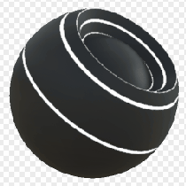

# Edge Wear

<table>
<tr style="border: 0;">
<td width="33.33%" style="border: 0;" valign="top">

{width="128px"}

<b>In:</b> Mesh-basierte Generatoren > Maskengenerator

</td>
<td width="100.00%" style="border: 0;" valign="top">

## Beschreibung

Generiert eine Schwarzweißmaske auf der Grundlage von durch Baking erzeugte Map und Benutzereinstellungen. Ähnlich wie [Smart Masks](https://support.allegorithmic.com/documentation/display/SPDOC/Smart+Materials+and+Masks) in [Painter](https://support.allegorithmic.com/documentation/display/SPDOC/Substance+Painter).

Dieser Knoten stellt den Verschleiß von Objektkanten dar. Es verfügt über einige Parameter, ist aber nicht am einfachsten zu verwenden: Wir empfehlen Ihnen, herumzuspielen und ein Gefühl für die Dinge zu bekommen. Der Knoten ist recht leistungsstark, obwohl keine benutzerdefinierte Überschreibungsmaske ausgeführt werden kann.

</td>
</tr>
</table>

## Eingaben

|  |  |
|:---|:---|
| <b>Krümmung</b> <i>Graustufen-Eingabe</i> | Durch Baking erzeugte Map für interne Effekte und Maskierung |
| <b>Maske (optional)</b> <i>Graustufen-Eingabe</i> | Maskenschlitz zum Maskieren der Knoteneffekte. |

## Parameter

|  |  |
|:---|:---|
| <b>Ebene</b> <i>0.0 - 1.0</i> | Legt die Gesamtverteilung des Effekts fest. |
| <b>Kontrast</b> <i>0.0 - 1.0</i> | Passt den Kontrast des Ergebnisses an. |
| <b>Schwellenwert</b> <i>0.0 - 1.0</i> | Ähnlich wie bei &quot;Level&quot; wird die Gesamtverteilung des Effekts festgelegt. |
| <b>Kantenbreite</b> <i>0.0 - 1.0</i> | Legt den gesamten Lichteffekt fest. Reduzieren, um sie sparsamer zu machen. |
| <b>Störung</b> <i>0.0 - 1.0</i> | Legt die Stärke des Rauschens fest, das zum Aufbrechen der Smoothness hinzugefügt werden soll. |

## Beispiele

<table style="margin-top: 32px; margin-bottom: 32px">
    <tr style="border: 0">
        <td style="border: 0; background: transparent">
            
        </td>
    </tr>
</table>
