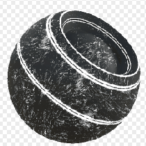

# Metal-Edge Wear

<table>
<tr style="border: 0;">
<td style="border: 0;" valign="top">

{width="128px"}

## Metal-Edge Wear

**In:** *Mesh-basierte Generatoren**/Masken-Generatoren*

**Komplex**

</td>
<td style="border: 0;" valign="top">

## Beschreibung

Generiert eine Schwarzweißmaske auf der Grundlage von durch Baking erzeugte Map und Benutzereinstellungen. Ähnlich wie [Smart Masks](https://support.allegorithmic.com/documentation/display/SPDOC/Smart+Materials+and+Masks) in [Painter](https://support.allegorithmic.com/documentation/display/SPDOC/Substance+Painter).

Diese Maske repräsentiert den Kantenverschleiß an einem Metallobjekt, wobei Kratzer und Späne an konvex erhöhten Kanten erscheinen, die möglicherweise durch gebackene dunkle AO-Bereiche maskiert werden.

## Parameter

### Eingaben

* **Krümmung**: *Graustufen-Eingabe*\
  Durch Baking erzeugte Map für interne Effekte und Maskierung.
* **Ambient-Verdeckung**: *Graustufen-Eingabe*\
  Durch Baking erzeugte Map für interne Effekte und Maskierung.
* **Schmutz-Eingabe**: *Graustufen-Eingabe*
* **Maske (optional)**: *Graustufen-Eingabe*\
  Maskenschlitz zum Maskieren der Knoteneffekte.
* **Normaler Weltraum**: *Farbeingabe*
* **Position**: *Farbeingabe*

### Parameter

* **Verschleißstufe**: *0.0 - 1.0* Legt den Gesamtverschleiß fest, der allmählich sichtbar wird.
* **Kontrast tragen**: *0.0 - 1.0* Legt den Kontrast des Endergebnisses fest.
* **Kanten-Smoothness**: *0.0 - 16.0* Legt die Smoothness des Abfalls von den Kanten der Krümmung fest.
* **Schmutz-Betrag**: *0.0 - 1.0* Legt die Menge an Schmutz fest, die zwischen den Kanten überblendet werden soll.
* **Schmutz-Skalierung**: *1 - 16* Legt die Skalierung des Schmutzes fest.
* **Maskieren der Umgebungsgeräusche**: *0.0 - 1.0* Legt den Umfang des Effekts fest, den der AO auf den endgültigen Effekt hat, wobei dunkle Bereiche maskiert werden.
* **Krümmungsgewicht**: *0.0 - 1.0* Legt den Umfang des Effekts fest, den die konvexen Kanten der Krümmung auf den endgültigen Effekt haben.
* **Benutzerdefinierten Schmutz verwenden**: *Falsch/Wahr* Aktiviert einen benutzerdefinierten Schmutz-Zuordnungs-Eingangssteckplatz.
* **Triplanar verwenden**: *Falsch/Wahr* Aktivieren Sie die Projektion [Dreidimensional](../../../../../../compositing-graphs/nodes-reference-for-com/node-library/mesh-based-generators/utilities-mesh-based-gen/tri-planar/tri-planar.md), um Nähte auszublenden.
* **Triplanarer Mischkontrast**: *0.0 - 1.0* Legt den Mischkontrast für die triplanare Projektion fest.

## Beispielbilder

</td>
</tr>
</table>
