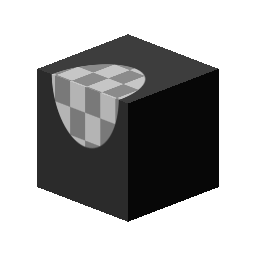

# 3D-Projektion

<table>
<tr style="border: 0;">
<td width="33.33%" style="border: 0;" valign="top">

<b>In:</b> Mesh-basierte Generatoren > Dienstprogramme

</td>
<td width="100.00%" style="border: 0;" valign="top">

## Beschreibung

Führt eine planare Projektion auf der Grundlage Baking geführt Mesh-Daten durch (Position und World Normalen-Map). Ermöglicht es Ihnen, Aufkleber unabhängig von der ursprünglichen UV-Zuordnung über Nähte hinweg zu projizieren und zu platzieren.

</td>
</tr>
</table>

## Eingaben

|  |  |
|:---|:---|
| <b>Positionszuordnung</b> <i>Farbeingabe</i> | Baking geführt Positionszuordnung |
| <b>Normaler Weltraum</b> <i>Farbeingabe</i> | Baking geführt Welt-Raum-Normale Map |
| <b>Vorhergesagte Textur</b> <i>Farbeingabe</i> | Eingabe der Textur für das Projekt auf dem Ziel. |

## Parameter

|  |  |
|:---|:---|
| <b>Positionierung</b> |  |
| <b>Projekteingabe</b> <i>UV-Position, Welt-Raum-Position</i> | Legen Sie fest, ob die Projektion in 2D/UV oder 3D/Welt-Raum positioniert werden soll. |
| <b>Zielposition der UV</b> | Nur bei UV-Positionseingabe, am besten verwendet, um einen Punkt in der 2D-Ansicht auf der Positionskarte auszuwählen. |
| <b>Zielposition</b> <i>(Farbwert)</i> | Nur mit der Option &quot;Positionseingabe für Welt-Raum&quot; können Sie eine exakte 3D-Koordinate definieren. |
| <b>Ziel Normal</b> <i>(Farbwert)</i> |  |
| <b>Drehung</b> <i>0.0 - 1.0</i> | Dreht die projizierte Textur entlang ihrer normalen Achse. |
| <b>Skalierung</b> <i>0.0 - 1.0</i> | Legen Sie die globale Skalierung für die projizierte Textur fest. |
| <b>Größe</b> <i>0.0 - 2.0</i> | Führen Sie eine ungleichmäßige Skalierung der projizierten Textur durch. |
| <b>Maskieren</b> |  |
| <b>Maximale Tiefe</b> <i>0.0 - 1.0</i> | Legt fest, wie tief die projizierte Textur erscheint und wann sie abgeschnitten wird. |
| <b>Tiefe Verblassen</b> <i>0.0 - 1.0</i> | Stellen Sie die Überblendung für die abgeschnittene Tiefe so ein, dass sie plötzlich oder verblasst. |
| <b>Normaler Schwellenwert</b> <i>-1.0 - 1.0</i> | Legen Sie den Schwellenwert für Flächen fest, die nicht genau mit der Normalausrichtung der Projektion ausgerichtet sind. |
| <b>Normale Verblassen</b> <i>0.0 - 1.0</i> | Setze die Überblendung für Flächen, die nicht auf &quot;abrupt&quot; oder &quot;Verblassen&quot; ausgerichtet sind. |

## Beispiele

<table style="margin-top: 32px; margin-bottom: 32px">
    <tr style="border: 0">
        <td style="border: 0; background: transparent">
            
        </td>
    </tr>
</table>
