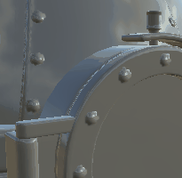

# Material Mesh Data Blender

<table>
<tr style="border: 0;">
<td style="border: 0;" valign="top">

{width="128px"}

## Material Mesh Data Blender

**In:** *Mesh-basierte Generatoren**/Dienstprogramme*

**Komplex**

</td>
<td style="border: 0;" valign="top">

## Beschreibung

Dieser Knoten soll das Hinzufügen von Details basierend auf gesicherten Daten erheblich erleichtern. Sie enthält viele Regler, mit denen Sie das gesamte Eingabematerial ändern können, basierend auf allen durch Baking erzeugte Map als Eingabematerial. Experimentieren Sie doch einmal damit, denn es gibt viele Möglichkeiten.

Es ist hilfreich, wenn Sie z. B. Kantenhervorhebung basierend auf Krümmung oder anderen Maps hinzufügen, AO-Elemente mit der Diffuse-/Grundfarbe mischen, Specular-Verdeckung basierend auf Krümmung und/oder AO hinzufügen usw.

## Parameter

### Eingaben

* **Vollständiger Materialeintrag (Gruppe &quot;Material&quot;):** Vollständiger Satz von Materialzuordnungen.\
  Diese werden von diesem Knoten geändert und dann wieder als Ausgabe zurückgegeben.
* **Ambient-Verdeckung**: *Graustufen-Eingabe*\
  Durch Baking erzeugte Map für interne Effekte und Maskierung.
* **Krümmung**: *Graustufen-Eingabe*\
  Durch Baking erzeugte Map für interne Effekte und Maskierung.
* **Height**: *Graustufen-Eingabe*
* **Normal**: *Farbeingabe*
* **Eckpunktfarbe**: *Farbeingabe*
* **Normaler Weltraum**: *Farbeingabe*

### Parameter

* **Kanäle**
  * Schalten Sie die Materialkanäle in dieser Gruppe ein und aus, z. B. wenn Sie Specular-/Glanzkarten anstelle von &quot;Metallisch/Raueit&quot; verwenden. Wirkt sich auf die Verfügbarkeit der folgenden Parameter aus.
* **Durch Baking erzeugte Map**
  * Gibt an, ob die aufgelisteten durch Baking erzeugte Map für Berechnungen verwendet werden. Wirkt sich auf die Verfügbarkeit der folgenden Parameter aus.
* **AO** diffundieren: *0.0 - 1.0* Menge an umgebender Verdeckung, die in das Diffuse-Objekt übergeht.
* **Scharfe Kanten diffundieren**: 0,0 - 1,0\
  Stärke der Krümmungsmatrix, die in den Diffuse-Effekt überblendet werden soll.
* **Farbe aus Scheitelpunktfarbe diffundieren**: 0,0 - 1,0\
  Stärke der Scheitelpunktfarbe, die mit dem Diffus-Effekt überblendet werden soll.
* **Vorbeleuchtung diffundieren**: 0,0 - 1,0\
  Anzahl der (gefälschten) Vorbeleuchtung, basierend auf den World Space Normale.
* **Gezielter Lichtausgleich für Zeichentrickbilder**: 0,0 - 1,0\
  Verschiebt für das Diffuse zwischen realistischer und Cartoon-Beleuchtung.
* **Ebenen für die Vorbeleuchtung von Zeichentrickbildern diffundieren**: 0-10\
  Steuert den Look der cartoonartigen Beleuchtungsberechnungen.
* **Zeichentrickkonturen verteilen**: 0,0 - 1,0\
  Steuert den Look der cartoonartigen Beleuchtungsberechnungen.
* **Grundfarbe AO**: 0,0 - 1,0\
  Die Menge der Umgebungsfarbe, die in die Grundfarbe übergegangen werden soll.
* **Grundfarbenscharfe Kanten**: 0,0 - 1,0\
  Stärke der Krümmungszuordnung, die in die Grundfarbe übergegangen werden soll.
* **Basisfarbe aus Scheitelpunktfarbe**: 0,0 - 1,0\
  Stärke der Scheitelpunktfarbe, die mit der Grundfarbe überblendet werden soll
* **Normale Materialintensität**: 0,0 - 1,0\
  Füllkraft der eingebrannten (Tangenten-)Normalmap.
* **SpecularAO**: 0,0 - 1,0\
  Mischungsstärke des AO im Specular.
* **Specular Hell scharfe Kanten**: 0,0 - 1,0\
  Die Füllkraft der Krümmung im Specular.
* **Specular-Zeichentrickkonturen**: 0,0 - 1,0\
  Die Stärke des Comic-Effekts &quot;Specular&quot; für die Kantenkontur auf Basis der Krümmung.
* **Glossarität dunkel scharfe Kanten**: 0,0 - 1,0\
  Die Stärke der Krümmung im Glanz.
* **Raueit helle scharfe Kanten**: 0,0 - 1,0\
  Stärke der Krümmung in der Raueit.
* **Raue Zeichentrickkonturen**: 0,0 - 1,0\
  Die Stärke der Komposition eines Effekts &quot;Raueit&quot; für Cartoons, basierend auf dem Effekt &quot;Krümmung&quot;
* **Metallisch helle scharfe Kanten**: 0,0 - 1,0\
  Die Füllkraft der Krümmung im Metall.
* **Metallische Zeichentrickkonturen**: 0,0 - 1,0\
  Die Stärke des Comic-Effekts &quot;Metallische Kanten - Umrisse&quot; auf Basis der Rundung.
* **AO Materialintensität**: 0,0 - 1,0\
  Mischen Sie die Stärke von durch Baking erzeugte Map AO mit Material-generiertem AO, um wie viel Grad beide AO-Maps kombiniert werden.
* **Materialintensität des Heights**: 0,0 - 1,0\
  Mischen Sie die Stärke von durch Baking erzeugte Map-Height mit Material-generiertem Height, um wie viel Grad beide Höhenkarten kombiniert werden.
* **Height-Materialmischungstyp**: Verstärkung, Interpolation\
  Füllmethode zum Kombinieren beider Höhenkarten.

## Beispielbilder

</td>
</tr>
</table>
