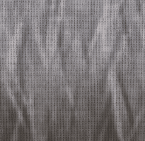

# Gewebeverwitterung

<table>
<tr style="border: 0;">
<td width="33.33%" style="border: 0;" valign="top">

{width="128px"}

<b>In:</b> Mesh-basierte Generatoren > Verwitterung

</td>
<td width="100.00%" style="border: 0;" valign="top">

## Beschreibung

Dies ist ein Vollmaterial-Effekt, der auf mehreren Kanälen gleichzeitig funktioniert. Es fügt einen zufälligen Stoff-Verschleißeffekt hinzu, mit Kontrolle für Alter und Schmutzigkeit. Dieser Effekt funktioniert nur dann sehr gut, wenn Sie die richtigen Baking geführt AO- und Welt-Raum-Normalmaps angeschlossen haben, da diese benötigt werden, um alles entsprechend zu berechnen und zu generieren.

Vergewissern Sie sich, dass Sie die [Link Creation Modes](../../../../../../interface/the-graph-view/link-creation-modes/link-creation-modes.md) vollständig verstehen, wenn Sie mit vollständigen Materialien arbeiten.

</td>
</tr>
</table>

## Eingaben

|  |  |
|:---|:---|
| <b>Umgebungs-Verdeckung</b> <i>Graustufen-Eingabe</i> | Durch Baking erzeugte Map für interne Effekte und Maskierung. |
| <b>Normaler Weltraum</b> <i>Farbeingabe</i> |  |
| <b>Maske</b> <i>Graustufen-Eingabe</i> | Maskenschlitz zum Maskieren der Knoteneffekte. Mit dem Parameter &quot;Maske&quot; umschaltbar. |

## Parameter

|  |  |
|:---|:---|
| <b>Kanäle</b> | Schalten Sie die Materialkanäle in dieser Gruppe ein und aus, z. B. wenn Sie Specular-/Glanzkarten anstelle von &quot;Metallisch/Raueit&quot; verwenden. |
| <b>Erweitert</b> |  |
| <b>Normales Format</b> <i>DirectX, OpenGL</i> | Wechselt zwischen verschiedenen Normalmap-Formaten (invertiert den grünen Kanal). |
| <b>Maske</b> <i>False/True</i> | Schaltet die Verwendung der Maskenkarte ein oder aus. |
| <b>Effekt</b> |  |
| <b>Dust</b> <i>0.0 - 1.0</i> | Überblendungen mit dunklerer Dust, basierend auf den Bereichen, die in der Normalmap des Welt-Raums nach oben zeigen. |
| <b>Schmutzigkeit</b> <i>0.0 - 1.0</i> | Überblendungen mit globalem Dirt-/Verwischungseffekt, hauptsächlich aufgrund von verdeckten (dunklen) Bereichen in der AO. |
| <b>Kanten, die </b> tragen <i>0.0 - 1.0</i> | Fügt einen Scharfzeichner-/Verstärkereffekt für Kanten hinzu, der auf dem Material &quot;Normal&quot; basiert. |
| <b>Verwendet</b> <i>0.0 - 1.0</i> | Überblendungen in sehr dunklem akkumuliertem Dirt in Falten, auf der Basis von AO. Maximal- und Minimalwerte sind in der Regel sehr extrem, verwenden Sie diese mit Vorsicht. |
| <b>Alter</b> <i>0.0 - 1.0</i> | Überblendungen über einer globalen Kachelung Verschleißmuster. Die Einstellung &quot;Schwellenwert&quot; unten steuert den AO-Einfluss. Maximal- und Minimalwerte sind in der Regel sehr extrem. |
| <b>Altersschwellenwert</b> <i>0.0 - 1.0</i> | Legt fest, in welchem Umfang die AO den Parameter Alter beeinflusst. |
| <b>Alter steigt</b> <i>0.0 - 1.0</i> | Steuert die Überblendung von subtilen zusätzlichen Falten im Effekt &quot;Alter&quot;. |
| <b>Scratches mit scharfen Kanten skalieren</b> <i>1.0 - 32.0</i> | Legt die Skalierung kleiner Kratzer fest, die hauptsächlich den Effekt &quot;Verwendet&quot; und &quot;Alter&quot; wegschaben. |
| <b>Intensität der Verkrümmung der scharfen Kanten der Scratches</b> <i>0.0 - 1.0</i> | Legt die Intensität der Verformung für die oben genannten kleinen Kratzer fest. |
| <b>Alte Fabric-Entsättigung</b> <i>0.0 - 1.0</i> | Steuert die Entsättigung des Effekts &quot;Alter&quot;. |
| <b>Alte Fabric-Helligkeit</b> <i>0.0 - 1.0</i> | Steuert die Helligkeit des Effekts &quot;Alter&quot;. *Dies ist ein sehr wichtiger Parameter, der geändert werden muss, um das gewünschte Aussehen zu erhalten. Die Ergebnisse können jedoch extrem sein: mit subtilen Änderungen verwenden.* |
| <b>Überblenden</b> |  |
| <b>Diffuse-Intensität</b> <i>0.0 - 1.0</i> | Mischungsstärke des Diffusors. |
| <b>Intensität der Grundfarbe</b> <i>0.0 - 1.0</i> | Mischungsstärke der Grundfarbe. |
| <b>Normalintensität</b> <i>0.0 - 1.0</i> | Die Füllkraft von &quot;Normal&quot;. |
| <b>Specular-Intensität</b> <i>0.0 - 1.0</i> | Die Stärke des Speculars. |
| <b>Glanz-Intensität</b> <i>0.0 - 1.0</i> | Die Stärke des Glanzes beim Mischen. |
| <b>Intensität der Rauheit</b> <i>0.0 - 1.0</i> | Die Stärke der Raueit. |
| <b>Ambient occlusion-Intensität</b> <i>0.0 - 1.0</i> | Mischfestigkeit der Ambient-Verdeckung. |
| <b>Height-Intensität</b> <i>0.0 - 1.0</i> | Die Stärke des Heights beim Mischen. |

## Beispiele

<table style="margin-top: 32px; margin-bottom: 32px">
    <tr style="border: 0">
        <td style="border: 0; background: transparent">
            
        </td>
    </tr>
</table>
