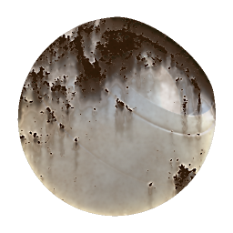

# Verwitterung im Rost

<table>
<tr style="border: 0;">
<td style="border: 0;" valign="top">

{width="128px"}

## Verwitterung im Rost

**In:** *Mesh-basierte Generatoren**/Wetter*

**Komplex**

</td>
<td style="border: 0;" valign="top">

## Beschreibung

## Parameter

### Eingaben

* **Ambient-Verdeckung**: *Graustufen-Eingabe*\
  Durch Baking erzeugte Map für interne Effekte und Maskierung.
* **Krümmung**: *Graustufen-Eingabe*\
  Durch Baking erzeugte Map für interne Effekte und Maskierung.
* **Position**: *Farbeingabe*
* **Maske** : *Graustufen-Eingabe*\
  Maskenschlitz zum Maskieren der Knoteneffekte. Mit dem Parameter &quot;Maske&quot; umschaltbar.

### Parameter

* **Kanäle**
  * Schalten Sie die Materialkanäle in dieser Gruppe ein und aus, z. B. wenn Sie Specular-/Glanzkarten anstelle von &quot;Metallisch/Raueit&quot; verwenden.
* **Erweitert**
  * **Normales Format**: *DirectX, OpenGL*\
    Wechselt zwischen verschiedenen Normalmap-Formaten (invertiert den grünen Kanal).
  * **Maske**: *False/True*\
    Schaltet die Verwendung der Maskenkarte ein oder aus.
* **Effekt**
  * **Rost-Verteilung**: *0.0 - 1.0*
  * **Smoothness wird verteilt**: *0.0 - 1.0*
  * **Schadensskala &#39;Vernish&#39;**: *0.0 - 1.0*
  * **Drips-Intensität**: *0.0 - 1.0*
  * **Anzahl der Drips-Samples**: *0 - 32*
  * **Drips-Smoothness**: *0.0 - 1.0*
* **Überblenden**
  * **Diffuse Intensität**: *0.0 - 1.0*\
    Mischungsstärke des Diffusors.
  * **Grundfarbintensität**: *0.0 - 1.0*\
    Mischungsstärke der Grundfarbe.
  * **Normalintensität**: *0.0 - 32.0*\
    Die Füllkraft von &quot;Normal&quot;.
  * **Specular-Intensität**: *0.0 - 1.0*\
    Die Stärke des Speculars.
  * **Glanzintensität**: *0.0 - 1.0*\
    Die Stärke des Glanzes beim Mischen.
  * **Intensität der Raueit**: *0.0 - 1.0*\
    Die Stärke der Raueit.
  * **Metallische Intensität**: *0.0 - 1.0*\
    Mischfestigkeit des Metallic.
  * **Umgebungsintensität der Verdeckung**: *0.0 - 1.0*\
    Mischfestigkeit der Ambient-Verdeckung.
  * **Height-Intensität**: *0.0 - 1.0*\
    Die Stärke des Heights beim Mischen.

## Beispielbilder

</td>
</tr>
</table>
