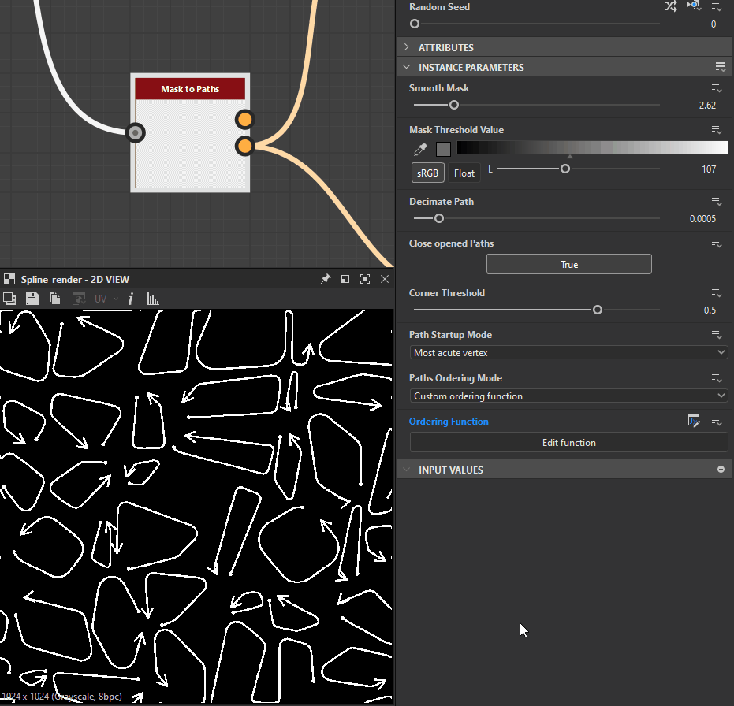

# Auf Pfade maskieren

<table>
<tr style="border: 0;">
<td width="33.33%" style="border: 0;" valign="top">

<b>In:</b> Spline &amp; Path Tools > Path Tools

</td>
<td width="100.00%" style="border: 0;" valign="top">

## Beschreibung

Konvertiert ein Graustufen-Eingabemuster <b>Maske</b> in eine Liste von Pfadsegmenten, die in der Ausgabe <b>Pfade</b> codiert sind.

Es stehen Steuerelemente über die Startposition von generierten Pfaden sowie deren Reihenfolge in der Liste zur Verfügung.

Die generierten Pfade können mithilfe dedizierter Knoten weiter verarbeitet werden - z. B. [Pfad 2D transformieren](../../../../../../compositing-graphs/nodes-reference-for-com/node-library/spline-paths-tools/path-tools/path-2d-transform/path-2d-transform.md), [Pfadeverkrümmung](../../../../../../compositing-graphs/nodes-reference-for-com/node-library/spline-paths-tools/path-tools/paths-warp/paths-warp.md) - oder mithilfe des Knotens [Pfad zu Spline](../../../../../../compositing-graphs/nodes-reference-for-com/node-library/spline-paths-tools/path-tools/paths-to-spline/paths-to-spline.md) in Splines konvertiert werden, um Formen entlang dieser Pfade zuzuordnen oder Streuungen zu erstellen.

</td>
</tr>
</table>

>[!NOTE]
>
> Die zum Codieren von Pfaden verwendete Methode wird auf der Seite [Paths Format Specifications](../../../../../../compositing-graphs/nodes-reference-for-com/node-library/spline-paths-tools/path-tools/paths-format-spe/paths-format-specifications.md) erläutert.

## Eingaben

|  |  |
|:---|:---|
| <b>Maske</b> <i>Graustufen</i> | Das Eingabemuster, das in eine Liste von Pfaden konvertiert werden soll. |

## Ausgaben

|  |  |
|:---|:---|
| <b>Vorschau</b> <i>Farbe</i> | Eine Vorschau, die über der Maske angeordnet ist, um die Effekte der Parameter zu visualisieren. |
| <b>Pfade</b> <i>Farbe</i> | Eine Liste von in einem Farbbild codierten Pfaden. Jeder Pfad beschreibt eine Liste von codierten Segmenten. Das Ergebnis kann mit einem anderen Pfad verarbeitenden Knoten verarbeitet oder an einen [Pfad zu Spline](../../../../../../compositing-graphs/nodes-reference-for-com/node-library/spline-paths-tools/path-tools/paths-to-spline/paths-to-spline.md)-Knoten gesendet werden, um es als Splines weiter zu verarbeiten. |

## Parameter

|  |  |
|:---|:---|
| <b>Maske glätten</b> <i>Gleitend</i> | Wenden Sie Glättung auf die Eingabemaske an. Nützlich, wenn das Eingabemuster sehr scharfe Kanten aufweist, was normalerweise Artefakte verursacht. |
| <b>Schwellenwert für Maske</b> <i>Gleitend</i> | Der Graustufenwert von <b>Maske</b>, der verwendet wird, um die Außenseite (Werte &lt; Schwellenwert für Maskenebene) und die Innenseite (Werte > Schwellenwert für Maskenebene) der Form voneinander zu trennen. |
| <b>Pfad dezimieren</b> <i>Gleitend</i> | Steuert implizit die Anzahl der zu generierenden Segmente. Eine hohe Anzahl an Dezimationen macht runde Formen etwas polygonal, während keine Dezimation fast ein Segment pro Pixel generiert. Ein angemessener Betrag passt die Form sowohl der geraden Linien als auch der Kurven besser an, ohne viele Zwischenpunkte für gerade Linien zu erstellen. |
| <b>Geöffnete Pfade schließen</b> <i>Boolescher Wert</i> | Erstellen Sie ein Scheitelpunkt zwischen dem Anfangs- und dem Endabschnitt eines offenen Pfads. Wenn Sie diese Option deaktivieren, können unerwünschte Linien, die Ihr Muster auf unerwartete Weise durchlaufen, behoben werden. Pfade werden jedoch möglicherweise nicht mehr geschlossen. |
| <b>Eckschwellenwert</b> <i>Gleitend</i> | Jeder in Pfaden codierte Scheitelpunkt kann ein Flag enthalten, das angibt, ob er hart (d. h. eine Ecke) oder glatt ist. Mit diesem Parameter können Sie mehr oder weniger Ecken entsprechend dem Winkel zwischen den benachbarten Segmenten markieren. <i>Hinweis:</i> Dieses &#39;corner&#39;-Flag wird derzeit von keinem bestehenden Scheitelpunkt unterstützt, kann jedoch in einem [Path Knoten Processor](../../../../../../compositing-graphs/nodes-reference-for-com/node-library/spline-paths-tools/path-tools/paths-vertex-processor/paths-vertex-processor.md) verwendet werden. Sie können auch die Ecken mit dem Knoten [Vorschaupfade](../../../../../../compositing-graphs/nodes-reference-for-com/node-library/spline-paths-tools/path-tools/preview-paths/preview-paths.md) anzeigen. |
| <b>Pfad-Startmodus</b> <i>Integer</i> | Die Methode zur Auswahl des Scheitelpunkts, der der Anfang jedes generierten Pfades um die Formen in der Maske sein soll. Dies hat erhebliche Auswirkungen auf die Konvertierung der generierten <b>Pfade in Splines</b> mithilfe des dedizierten Scheitelpunkts, da mehrere Spline-Knoten den Anfang und das Ende der Splines verwenden. *- Höchster Scheitelpunkt:* Der Scheitelpunkt, der den niedrigsten Winkel mit seinem vorherigen und nächsten Scheitelpunkt bildet. *- Scheitelpunkt am äußersten Rand einer angegebenen Richtung:* Der letzte Scheitelpunkt in einer bestimmten Richtung  *- Scheitelpunkt, der einem angegebenen Richtung am nächsten liegt position * Scheitelpunkt am weitesten von einer angegebenen Position entfernt * Benutzerdefinierte Startfunktion:* Wählen Sie mit einer benutzerdefinierten Funktion den  aus, der als Start für jeden Pfad verwendet werden soll. |
| <b>Startrichtung</b> <i>Gleitend</i> | Der Winkel, der die Richtung beschreibt, die zur Auswahl des Startwinkels verwendet wird. Scheitelpunkt: Für jeden Pfad wird der letzte Scheitelpunkt in dieser Richtung ausgewählt. Der Wert ist eine *Anzahl von Windungen*, die zum Drehen eines Vektors mit der X-Richtung nach links verwendet wird. Das bedeutet, dass 0 einen Richtungsvektor von (-1, 0) und 0,25 (90 Grad) einen Richtungsvektor von (0, 1) festlegt. <i>Hinweis:</i> Dieser Parameter ist verfügbar, wenn <b>Pfad-Startmodus</b> auf &quot;Scheitelpunkt am äußersten Rand einer angegebenen Richtung&quot; festgelegt ist |
| <b>Startzielposition</b> <i>Float2</i> | Die Position im Bild, an der der Start-Scheitelpunkt ausgewählt wird. Für jeden Pfad wird der Scheitelpunkt ausgewählt, der dieser Position am nächsten bzw. am weitesten davon entfernt ist, entsprechend dem ausgewählten <b>Pfad-Startmodus</b>. <i>Hinweis:</i> Dieser Parameter ist verfügbar, wenn <b>Pfad-Startmodus</b> auf &quot;Scheitelpunkt, der einer angegebenen Position am nächsten liegt&quot; oder &quot;Scheitelpunkt, der von einer angegebenen Position am weitesten entfernt ist&quot; festgelegt ist |
| <b>Startfunktion</b> <i>Gleitend</i> | Die Funktion, mit der der Scheitelpunkt zum Starten ausgewählt wurde. Es gibt einen Float -Wert zurück. Für jeden Scheitelpunkt wird die Funktion ausgeführt und der Scheitelpunkt ausgewählt, für den die Funktion das *höchste Ergebnis* zurückgibt. Verfügbare Variablen: *-* Scheitelpunkt.cornerness(Fließkommazahl)*:* Die Punktzahl des Scheitelpunkts als Anwärter auf den Eckenstatus  *-* Scheitelpunkt.pos(Fließkommazahl2)*:* Die Position des Scheitelpunkts im Bildbereich <i>Hinweis:</i> Dieser Parameter ist verfügbar, wenn der Pfad-Startmodus auf &quot;Scheitelpunkt, der einer angegebenen Position am nächsten liegt&quot; oder auf &quot;Benutzerdefinierte Startfunktion&quot; festgelegt ist |
| <b>Bestellmodus</b> <i>Integer</i> | Die Methode zum Anordnen der generierten Pfade. Die Position oder Größe des *Begrenzungsrahmens für Pfade* (Bbox) kann als Kriterium zum Anordnen der Pfade verwendet werden. Dies hat erhebliche Auswirkungen auf die Konvertierung der generierten <b>Pfade in Splines</b> mithilfe des dedizierten Knotens, da mehrere Spline-Knoten die Splines-Reihenfolge verwenden. *- Legacy (schnell):* Die in der vorherigen Version dieses Knotens verwendete Methode, die eine deutlich bessere Leistung bietet  *- Durch Bbox-Mittelposition entlang der Richtung:* Pfade werden gemäß der Position des Mittelpunkts ihrer Bbox angeordnet, von der ersten bis zur letzten entlang der angegebenen Richtung  *- Nach Bbox Bbox oben links entlang der Richtung:* Pfade werden gemäß der Position der oberen linken Ecke ihrer Bbox angeordnet, von der ersten bis zur letzten entlang der angegebenen Richtung  *- Nach Bbox-Größe - Größte bis kleinste:* Pfade werden gemäß der Größe ihrer Bbox angeordnet, von der größten bis zur kleinsten  *- Nach Bbox-Größe - Kleinste Vom kleinsten zum größten:* Pfade werden entsprechend der Größe ihrer Box sortiert, vom kleinsten zum größten  *- Benutzerdefinierte Ordnungsfunktion:* Verwenden einer benutzerdefinierten Funktion zum Sortieren von Pfaden |
| <b>Bestellrichtung</b> <i>Gleitend</i> | Der Winkel, der die Richtung beschreibt, in der die Pfade entlang dieser Richtung vom ersten zum letzten Pfad angeordnet werden. Der Wert ist eine *Anzahl von Windungen*, die zum Drehen eines X-Links-Richtungsvektors verwendet wird. Das bedeutet, dass 0 einen Richtungsvektor von (-1, 0) und 0,25 (90 Grad) einen Richtungsvektor von (0, 1) festlegt. |
| <b>Bestellfunktion</b> <i>Gleitend</i> | Die Funktion, mit der die Pfade sortiert werden. Es gibt einen Float -Wert zurück. Pfade werden gemäß dem Wert dieser Funktion in *aufsteigender Reihenfolge* sortiert. Mit anderen Worten, das Ergebnis der Funktion für jeden Pfad ist der *Sortierschlüssel*, der zum Sortieren der Pfade verwendet wird. Verfügbare Variablen: * bbox.center (Fließkommazahl2): Die Position der Mitte der Pfadbox * bbox.topleft (Fließkommazahl2): Die Position der oberen linken Ecke der Pfadbox * bbox.size (Fließkommazahl2): Die Größe des Pfads B (X: width, Y: Height) |

## Beispiele

<table>
<tr style="border: 0;">
<td style="border: 0;" valign="top">

<table>
  <tr>
    <td>
      
       <i>Vorher</i>
    </td>
    <td>
      
       <i>Nach</i>
    </td>
  </tr>
</table>

</td>
<td style="border: 0;" valign="top">

<table>
  <tr>
    <td>
      
       <i>Vorher</i>
    </td>
    <td>
      
       <i>Nach</i>
    </td>
  </tr>
</table>

</td>
</tr>
</table>

<table>
<tr style="border: 0;">
<td style="border: 0;" valign="top">

{zoomable="yes"}

</td>
<td style="border: 0;" valign="top">

{zoomable="yes"}

</td>
</tr>
</table>

<table>
<tr style="border: 0;">
<td style="border: 0;" valign="top">

{zoomable="yes"}

</td>
<td style="border: 0;" valign="top">

{zoomable="yes"}

</td>
</tr>
</table>
