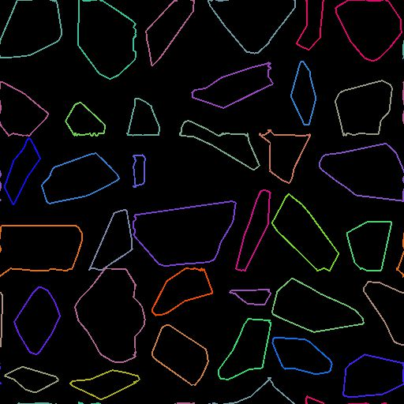

# Pfadverkrümmung

<table>
<tr style="border: 0;">
<td width="33.33%" style="border: 0;" valign="top">

<b>In:</b> Spline &amp; Path Tools > Path Tools

</td>
<td width="100.00%" style="border: 0;" valign="top">

## Beschreibung

Verformen Sie die Eingabepfade entsprechend der <b>Verlaufseingabe</b>. (Derselbe Effekt wie der Knoten [Verkrümmen](../../../../../../compositing-graphs/nodes-reference-for-com/atomic-nodes/warp/warp.md).)

</td>
</tr>
</table>

## Eingaben

|  |  |
|:---|:---|
| <b>Pfade</b> <i>Farbe</i> | Eine Liste der codierten Segmentpfade. Verbinden Sie diese Eingabe mit dem Ergebnis einer [Maske mit Pfaden](../../../../../../compositing-graphs/nodes-reference-for-com/node-library/spline-paths-tools/path-tools/mask-to-paths/mask-to-paths.md) oder mit einem anderen Pfadverarbeitungsknoten. |
| <b>Verlaufseingabe</b> <i>Graustufen</i> | Der Height-ähnliche Eingang steuert sowohl den Grad als auch die Richtung der Verformung. (Derselbe Effekt wie der Knoten [Verkrümmen](../../../../../../compositing-graphs/nodes-reference-for-com/atomic-nodes/warp/warp.md).) |

## Ausgaben

|  |  |
|:---|:---|
| <b>Pfade</b> <i>Farbe</i> | Die transformierten Pfade. Sie können entweder [Pfadevorschau](../../../../../../compositing-graphs/nodes-reference-for-com/node-library/spline-paths-tools/path-tools/preview-paths/preview-paths.md) verwenden, um eine Vorstellung davon zu erhalten, was das Ergebnis darstellt, einen anderen Pfadeverarbeitungsknoten verwenden oder ihn in einen [Pfad zu Spline](../../../../../../compositing-graphs/nodes-reference-for-com/node-library/spline-paths-tools/path-tools/paths-to-spline/paths-to-spline.md) eingeben, um ihn als Splines weiter zu verarbeiten. |

## Parameter

|  |  |
|:---|:---|
| <b>Intensität</b> <i>Gleitend</i> | Der Parameter <b>Intensität</b> legt die Intensität der Verformung fest. |
| <b>Anzahl der Schritte</b> <i>Integer</i> | Verwenden Sie einen höheren Wert, um die Eingabepfade in mehreren kleinen Schritten zu verkrümmen. Dies kann verhindern, dass sich der Pfad selbst kreuzt, insbesondere wenn hohe <b>Intensitätswerte</b> verwendet werden. |

## Beispiele

<table>
<tr style="border: 0;">
<td style="border: 0;" valign="top">

<table>
  <tr>
    <td>
      
       <i>Vorher</i>
    </td>
    <td>
      
       <i>Nach</i>
    </td>
  </tr>
</table>

</td>
<td style="border: 0;" valign="top">

<table>
  <tr>
    <td>
      
       <i>Vorher</i>
    </td>
    <td>
      
       <i>Nach</i>
    </td>
  </tr>
</table>

</td>
</tr>
</table>

<table>
<tr style="border: 0;">
<td style="border: 0;" valign="top">

</td>
<td style="border: 0;" valign="top">

</td>
</tr>
</table>
