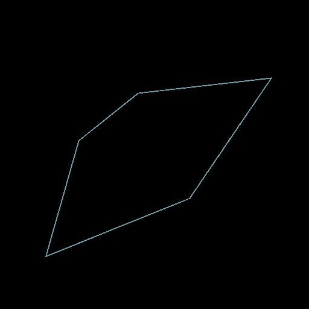

# Quad-Transformation auf Pfad

<table>
<tr style="border: 0;">
<td width="33.33%" style="border: 0;" valign="top">

<b>In:</b> Spline &amp; Path Tools > Path Tools

</td>
<td width="100.00%" style="border: 0;" valign="top">

## Beschreibung

Deformieren Sie einen Pfad mit 4 Griffen.

</td>
</tr>
</table>

## Eingaben

|  |  |
|:---|:---|
| <b>Pfade</b> <i>Farbe</i> | Eine Liste der codierten Segmentpfade. Verbinden Sie diese Eingabe mit dem Ergebnis einer [Maske mit Pfaden](../../../../../../compositing-graphs/nodes-reference-for-com/node-library/spline-paths-tools/path-tools/mask-to-paths/mask-to-paths.md) oder mit einem anderen *Pfad*-Verarbeitungsknoten. |

## Ausgaben

|  |  |
|:---|:---|
| <b>Pfade</b> <i>Farbe</i> | Die veränderten Pfade. Sie können entweder [Pfadevorschau](../../../../../../compositing-graphs/nodes-reference-for-com/node-library/spline-paths-tools/path-tools/preview-paths/preview-paths.md) verwenden, um eine Vorstellung davon zu erhalten, was das Ergebnis darstellt, einen anderen Pfadeverarbeitungsknoten verwenden oder ihn in einen [Pfad zu Spline](../../../../../../compositing-graphs/nodes-reference-for-com/node-library/spline-paths-tools/path-tools/paths-to-spline/paths-to-spline.md) eingeben, um ihn als Splines weiter zu verarbeiten. |

## Parameter

|  |  |
|:---|:---|
| <b>p00</b> <i>Float2</i> | Die Position des oberen linken Handles. |
| <b>p01</b> <i>Float2</i> | Die Position des oberen rechten Handles. |
| <b>p02</b> <i>Float2</i> | Die Position des linken unteren Griffs. |
| <b>p03</b> <i>Float2</i> | Die Position des rechten unteren Griffs. |

## Beispiele

<table>
<tr style="border: 0;">
<td style="border: 0;" valign="top">

<table>
  <tr>
    <td>
      
       <i>Vorher</i>
    </td>
    <td>
      
       <i>Nach</i>
    </td>
  </tr>
</table>

</td>
<td style="border: 0;" valign="top">

<table>
  <tr>
    <td>
      
       <i>Vorher</i>
    </td>
    <td>
      
       <i>Nach</i>
    </td>
  </tr>
</table>

</td>
</tr>
</table>

<table>
<tr style="border: 0;">
<td style="border: 0;" valign="top">

</td>
<td style="border: 0;" valign="top">

</td>
</tr>
</table>
