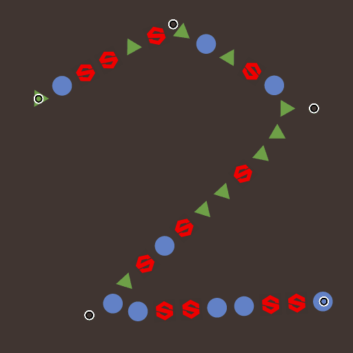

# Streuung auf Spline-Farbe

<table>
<tr style="border: 0;">
<td width="33.33%" style="border: 0;" valign="top">

In: Spline &amp; Path Tools > Spline-Werkzeuge

</td>
<td width="100.00%" style="border: 0;" valign="top">

## Beschreibung

Zeichnet die angegebenen Muster entlang der Eingabe-Splines über dem Eingabehintergrund.

</td>
</tr>
</table>

Der Knoten bietet umfassende Anpassungsoptionen für die Steuerung der Streuung von Mustern.

Einige Aspekte der Streuung können mithilfe von Bildern von anderen Knoten im Diagramm gesteuert werden, um den dynamischen Aspekt des Ergebnisses zu fördern.

>[!NOTE]
>
> Siehe auch [Streuung auf Spline-Graustufen](../../../../../../compositing-graphs/nodes-reference-for-com/node-library/spline-paths-tools/spline-tools/scatter-spline-grayscale/scatter-on-spline-grayscale.md).

## Eingangsanschlüsse

<b>Hintergrund </b>*Graustufen* (Primär)Das Graustufenbild, über das Splines gezeichnet werden sollen.

<b>Spline Coords </b>*Color* Die Koordinaten der in den RGBA-Kanälen eines Farbbildes codierten Spline-Punkte:\
<b>R</b> - X-Position\
<b>G</b> - Y-Position\
<b>B</b> - Height\
<b>A</b> - Paketdaten:\
* Signieren: Die Spline ist geschlossen (negativ) oder offen (positiv).\
* Absoluter Wert: Thickness + 1.

<b>Spline-Daten</b> *Farbe* Zusätzliche Daten der Eingabe-Splines, die in den RGBA-Kanälen eines Farbbildes codiert sind.\
<b> R</b> - Tangenten X\
<b> G</b> - Tangenten Y\
<b> B</b> - Nicht verwendet\
<b> A</b> - Nicht verwendet

<b>Spline-Betrag</b> *Integer* Die Anzahl der Eingabe-Splines.

<b>Mustereingabe #</b> *Graustufen* Muster, die entlang der Splines gestreut werden sollen.

<b>Zuordnungsskalierung</b> *Graustufen* Die Karte, die die Skalierung der verstreuten Muster steuert. Der Effekt dieser Karte wird durch den Parameter &quot;Eingangsmultiplikator für skalierte Karte&quot; gesteuert und mit den anderen Parametern in der Gruppe &quot;Größe&quot; kombiniert.

<b>Height-Map</b> *Graustufen* Die Karte, die das Height der verstreuten Muster steuert. Die Wirkung dieser Map wird durch den Parameter &quot;Height Input Multiplier&quot; gesteuert und mit den anderen &quot;Color&quot;-Parametern in der Gruppe &quot;Color&quot; kombiniert.

<b>Maskenzuordnung</b> *Graustufen* Die Karte, die die Maskierung der verstreuten Muster steuert. Der Effekt dieser Karte wird durch den Parameter &quot;Schwellenwert der Maskenzuordnung&quot; gesteuert und mit den anderen Parametern &quot;Maske&quot; in der Gruppe &quot;Farbe&quot; kombiniert.

## Ausgangsanschlüsse

<b>Ausgabe</b> *Graustufen* Das Bild, das die Muster darstellt, die entlang der Eingabespline(n) über dem Eingabehintergrund verstreut sind.

## Parameter

<b>Spline-Eingabe</b> *Integer* Die Methode zum Auswählen der Splines, die für Streuungsmuster verwendet werden sollen:
* *Alle Splines*: Alle Splines in der Eingabeliste verwenden
* *Einzelne Spline*: Verwenden Sie nur den angegebenen Spline aus der Eingabeliste.
* *Spline-Bereich*: Verwenden Sie nur die Splines im angegebenen Bereich aus der Eingabeliste.

<b>Spline-Index</b> *Integer* (Verfügbar, wenn &quot;Spline-Eingabe&quot; auf &quot;Einzelne Spline&quot; festgelegt ist)Der Listenindex des Spline, der für Streumuster verwendet werden soll.

<b>Spline-Bereich</b> *Integer2* (Verfügbar, wenn &quot;Spline-Eingabe&quot; auf &quot;Spline-Bereich&quot; festgelegt ist)Der Bereich der Listenindizes einschließlich der Splines, die für Streumuster verwendet werden sollen.

<b>Streuung-Modus</b> *Integer* Die Methode zum Streuen der Muster entlang der Splines, die sich auf die Anzahl der Muster auf jedem Spline auswirkt:
* Formstärke: Die angegebene Anzahl von gleichmäßig verteilten Mustern wird gestreut.
* Formabstand: Die Anzahl der Muster wird automatisch an den angegebenen gleichmäßigen Abstand angepasst.\
  In beiden Fällen fallen das erste und das letzte Muster genau auf den Anfang bzw. das Ende jedes Splines.

<b>Betrag der Form</b> *Integer* (verfügbar, wenn &quot;Streuung Mode&quot; auf &quot;Shape Amount&quot; festgelegt ist)Die Anzahl der gleichmäßig verteilten Muster, die entlang jedes Splines verstreut sind.

<b>Formverteilung entlang Spline</b> *Integer* (Verfügbar, wenn &quot;Streuung Mode&quot; auf &quot;Shape Amount&quot; festgelegt ist)Die Methode zum Verteilen der Muster entlang eines Splines:
* *Von Quelle*: Der Abstand der Muster wird durch die Tangenten des Spline-Punkts beeinflusst, bei denen die Formen in der Nähe von Punkten mit langen Tangenten weiter auseinander liegen.
* *Einheitlich*: Die Muster werden entlang der Spline gleichmäßig verteilt, unabhängig von ihren Tangenten und ihrer Flugbahn.

<b>Formabstand</b> *Gleitkommawert* (verfügbar, wenn &quot;Mustermodus&quot; auf &quot;Formabstand&quot; festgelegt ist)Die Mindestentfernung entlang eines Splines, um die Streuungen beabstandet werden sollen, während das erste und das letzte Muster noch am Anfang bzw. Ende jedes Splines landen.

<b>Start</b> *Gleitend* Verschiebt den Punkt vom Anfang eines Splines an, an dem die Streuung beginnt. Der Wert ist die normalisierte Länge jedes Splines.

<b>Ende</b> *Gleitend* Versetzt den Punkt vom Anfang eines Splines an dem Punkt, an dem die Streuung endet. Der Wert ist die normalisierte Länge jedes Splines.

<b>Form-Pivot</b> *Gleitkomma2* Verschiebt den Drehpunkt des Musters X und Y im Spline-Tangentenraum.\
Wenn man bedenkt, dass der Drehpunkt auf dem Spline platziert ist, verschiebt dies effektiv die Muster entlang oder senkrecht zum Spline.\
Hinweis: Die Positionen der Drehpunkte wirken sich auf den Effekt der Parameter &quot;Skalierung&quot; und &quot;Drehung (Pivot)&quot; aus.

+++Muster
<b>Muster</b> *Integer* Das Muster, das entlang der Splines gestreut werden soll:\
*- Mustereingabe*: Verwenden Sie die Muster, die den Eingängen &quot;Pattern Input #&quot; zugeführt werden.\
*- Quadrat;
* Festplatte
* Paraboloid;
* Bell
* Gaußsch
* Thorn
* Pyramide
* Ziegelstein;
* Abstufung;
* Wellen;
* Half Bell;
* Glocke geriffelt;
* Halbmond;
* Kapsel;
* Kegel
* Abstufung mit Versatz;
* Hemisphäre*

<b>Mustereingabenummer</b> *Integer* (verfügbar, wenn &quot;Pattern&quot; auf &quot;Pattern Input&quot; festgelegt ist): Wählt den Index des Eingabemusters aus, das gestreut werden soll.

<b>Mustereingabeverteilung</b> *Integer* (verfügbar, wenn &quot;Pattern&quot; auf &quot;Pattern Input&quot; festgelegt ist)Die Methode, mit der ausgewählt wird, welches der Eingabemuster auf einem bestimmten Spline gestreut werden soll:\
*- Zufällig*: ein Muster wird nach dem Zufallsprinzip ausgewählt;\
*- entlang Spline*: Der Musterindex nimmt entlang der Spline allmählich zu.\
*- Musterindex*: Schleifen über den Index der Eingabemuster entlang jedes Splines;\
*- Spline-Index*: Der Index der Eingabemuster wird in der Liste der Eingabesplines von einem Spline zum nächsten durchlaufen.

<b>Verteilungs-Jittering</b> *Float* (verfügbar, wenn &quot;Pattern Input Distribution&quot; auf &quot;Along Spline&quot; festgelegt ist)Erhöht oder verringert den ausgewählten Index von Mustern auf dem Spline zufällig.

<b>Erstes Muster überschreiben</b> *Boolescher Wert* Wählen Sie manuell den Index des Musters aus, der am Anfang jedes Splines platziert werden soll.

<b>Erster Mustereingabeindex</b> *Integer* (Verfügbar, wenn &quot;Erstes Muster überschreiben&quot; auf &quot;Wahr&quot; gesetzt ist)Der Index des Musters, der am Anfang jedes Splines platziert werden soll.

<b>Letztes Muster überschreiben</b> *Boolescher Wert* Wählen Sie manuell den Index des Musters aus, der am Ende jedes Splines platziert werden soll.

<b>Letzter Mustereingabeindex</b> *Integer* (Verfügbar, wenn &quot;Letztes Muster überschreiben&quot; auf &quot;Wahr&quot; gesetzt ist)Der Index des Musters, der am Ende jedes Splines platziert werden soll.

+++

+++Duplikate
<b>Verteilungsmodus</b> *Integer* Die zum Platzieren der duplizierten Muster verwendete Methode:\
*- Linear*: Duplikate werden gleichmäßig entlang der Spline-Normalen von der ursprünglichen Position des Musters beabstandet.\
*- Kreis*: duplizierte Formen werden entlang eines virtuellen Kreises angeordnet, der auf der Spline an der ursprünglichen Position des Musters zentriert ist.

<b>Anzahl der Duplikate</b> *Integer* Die Anzahl der duplizierten Muster.

<b>Offset</b> *Float2* (verfügbar, wenn &quot;Verteilungsmodus&quot; auf &quot;Linear&quot; eingestellt ist): Wendet einen Versatz auf die Positionen der Duplikate an, die sich entlang der Tangente (parallel) und der Normalen (senkrecht) des Splines befinden.\
Duplikate auf gegenüberliegenden Seiten des Splines werden in entgegengesetzte Richtungen verschoben.

<b>Offset-Center</b> *Float2* (verfügbar, wenn &quot;Verteilungsmodus&quot; auf &quot;Linear&quot; eingestellt ist)Wendet auf die Duplikate entlang des Splines einen Versatz auf X (parallel) und Y (senkrecht) an.

<b>Spread Angle</b> *Gleitend* (verfügbar, wenn &quot;Verteilungsmodus&quot; auf &quot;Kreisförmig&quot; eingestellt ist)Der Bogen des virtuellen Kreises, entlang dem Duplikate verteilt werden, als der Winkel dieses Bogens, wobei 1 der volle Kreis ist.

<b>Offset-Abstand</b> *Float* (verfügbar, wenn &quot;Verteilungsmodus&quot; auf &quot;Kreis&quot; festgelegt ist)Der Radius des virtuellen Kreises, entlang dem Duplikate verteilt werden.

<b>Drehung</b> *Gleitend* Dreht den virtuellen Kreis, entlang dem Duplikate verteilt werden.

<b>Startdämpfung/Enddämpfung versetzen</b> *Float2* Faktoren im Abstand vom Mittelpunkt des Splines zu Anfang und Ende, wenn Versätze auf Duplikate angewendet werden.\
Dies bedeutet, dass die Abstände bei Duplikaten, die näher an den Enden eines Splines liegen, verringert werden.

<b>Versatzdämpfung durch Thickness</b> *Gleitende* Faktoren in der Thickness des Splines, wenn Versätze auf Duplikate angewendet werden.\
Dies bedeutet, dass die Abstände für Duplikate auf einem Abschnitt eines Splines mit einer niedrigeren Thickness verringert werden.

+++

+++Größe
<b>Größenmodus</b> *Integer* Die Methode zum Festlegen der Größe der gestreuten Muster:\
*- Normal*: Die Größe wird mithilfe eines globalen Parameters &quot;Skalierung&quot; einheitlich gesteuert.\
*- Thickness aus Spline* verwenden: Die Größe hängt von der Thickness des Splines ab.

<b>Auswirkungen der Thickness</b> *Ganzzahl* (verfügbar, wenn &quot;Größenmodus&quot; auf &quot;Thickness aus Spline verwenden&quot; festgelegt ist)Gibt an, welche Achse der Skalierung eines Musters von der Thickness des Splines gesteuert werden soll:
* X &amp; Y: die Thickness wird mit der Schriftgröße sowohl auf der X- als auch auf der Y-Achse multipliziert;
* X: die Thickness wird nur mit der Größe auf der X-Achse multipliziert;
* Y: Die Thickness wird nur mit der Größe der Y-Achse multipliziert.\
  Wenn das Muster nicht multipliziert wird, entspricht seine ursprüngliche Skalierung der gesamten Bildspanne.\
  Das bedeutet, dass im X-Modus die Größe in der Y-Achse die gesamte Bildspanne ist und mit dem Parameter &quot;Größe&quot; angepasst werden muss. Dasselbe gilt für die Größe in der X-Achse, wenn der Y-Modus verwendet wird.

<b>Größe</b> *Gleitkommawert2* Die ursprüngliche Größe der Muster in X und Y, bevor andere Anpassungen durch andere Parameter vorgenommen werden.

<b>Größe zufällig</b> *Float2* Wendet einen zufälligen Multiplikator bis zum angegebenen Wert an, um die Größe der Muster in X und Y zu reduzieren.

<b>Skalierung der Thickness</b> *Gleitkommawert* (verfügbar, wenn &quot;Größenmodus&quot; auf &quot;Thickness aus Spline verwenden&quot; festgelegt ist)Ein zusätzlicher Multiplikator für die Skalierung der Muster, wenn er von der Thickness des Splines gesteuert wird.

<b>Skalierung</b> *Unverankert* (verfügbar, wenn &quot;Größenmodus&quot; auf &quot;Normal&quot; festgelegt ist)Ein globales Steuerelement für die Größe aller Muster, wobei 1 die gesamte Bildspanne ist.\
Die Skalierung wird relativ zum Drehpunkt eines Musters angewendet. Die Pivot-Position kann mit dem Parameter &quot;Form Pivot&quot; versetzt werden.

<b>Zufällige Skalierung</b> *Gleitend* Wendet einen zufälligen Multiplikator bis zum angegebenen Wert an, um die Größe der Muster zu verringern.

<b>Zuordnungseingabemultiplikator skalieren</b> *Gleitend* Steuert die Intensität der Skalierungszuordnungs-Eingabe. Diese Karte dient als Multiplikator für die aktuelle Größe der Muster.\
Der Effekt dieser Karte wird mit den anderen Parametern in der Gruppe &quot;Größe&quot; kombiniert.

<b>Sampling-Eingabemodus für Skalierung</b> *Texturraum* Die Methode zum Zuordnen der Werte in der Skalierungszuordnung zu den Splines:\
*- Texturraum*: Die Werte werden auf die Splines angewendet, wenn sie in einer Textur unter Verwendung der UV-Koordinaten der Textur platziert würden. Dadurch wird der Wert effektiv auf die Splines &quot;an Ort und Stelle&quot; angewendet.\
*- Horizontal entlang Spline*: Die Werte werden direkt auf die Koordinaten der codierten Splines angewendet (siehe Spline-Koordinaten-Eingabe), wobei jede Zeile auf einen anderen Spline von oben nach unten angewendet wird.\
*- Stunde. entlang der Spline (Rand). Versatz X)*: Die Werte werden direkt auf die Koordinaten der codierten Spline-Linien angewendet (siehe Spline-Koordinateneingabe), mit einem zufälligen horizontalen Versatz in der Skalierungszuordnung für jeden Spline (d. h. jede Zeile in Spline-Koordinaten).\
*- Stunde. entlang der Spline (Rand). Offset Y)*: Die Werte werden direkt auf die Koordinaten der codierten Spline-Linien angewendet (siehe Spline-Koordinateneingabe), wobei für jeden Spline (d. h. jede Zeile in Spline-Koordinaten) ein zufälliger vertikaler Versatz in der Skalierungszuordnung angezeigt wird.

<b>Dämpfung starten/beenden</b> *Gleitend2* Faktoren im Abstand vom Mittelpunkt des Splines zu Anfang und Ende beim Skalieren der Muster.\
Das bedeutet, dass die Größe bei Mustern, die sich näher an den Extremitäten eines Splines befinden, verringert wird.

+++

+++Position
<b>Lokaler Offset</b> *Gleitkomma2* Wendet einen Versatz auf die Positionen der Muster entlang der Tangente (parallel) und Normalen (senkrecht) des Splines an.

<b>Lokaler Versatz zufällig</b> *Gleitkomma2* Wendet einen zusätzlichen zufälligen Versatz auf die Positionen der Muster entlang der Tangente (parallel) und Normalen (senkrecht) des Splines an.

<b>Lokaler Versatz zufälliger Mittelpunkt</b> *Gleitkomma2* Verschiebt den Mittelpunkt des zufälligen Versatzes, der durch den Parameter Lokaler Versatz zufällig entlang der Tangente (parallel) und Normalen (senkrecht) des Splines angewendet wird.

<b>Dämpfung für lokalen Versatz Start/Ende</b> *Gleitend2* Faktoren im Abstand vom Mittelpunkt des Splines zu Anfang und Ende, wenn Positionsoffsets auf die Muster angewendet werden.\
Dies bedeutet, dass die Abstände bei Mustern, die näher an den Extremitäten eines Splines sind, verringert werden.

<b>Dämpfung des lokalen Offsets durch Thickness</b> *Gleitende* Faktoren in der Thickness des Splines, wenn Versätze auf Muster angewendet werden.\
Dies bedeutet, dass die Abstände für Duplikate auf einem Abschnitt eines Splines mit einer niedrigeren Thickness verringert werden.

<b>Offset auf Spline</b> *Gleitend* Wendet einen Positionsversatz auf die Muster entlang der Splines an.

<b>Zufälliger Versatz auf Spline</b> *Gleitend* Wendet einen zusätzlichen Positionsoffset auf die Muster entlang der Splines an.

+++

+++Rotation
<b>An Tangente ausrichten</b> *Boolesch* Dreht die Muster so, dass sie der Richtung des Splines an ihrer Position entsprechen.

<b>Drehung (Pivot)</b> *Gleitend* Dreht die Muster um ihre Drehpunkte.\
Die Pivot-Position kann mit dem Parameter &quot;Form Pivot&quot; versetzt werden.

<b>Drehung zufällig (Pivot)</b> *Gleitend* Wendet eine zusätzliche zufällige Drehung auf die Muster um ihre Drehpunkte an.\
Die Pivot-Position kann mit dem Parameter &quot;Form Pivot&quot; versetzt werden.

<b>Drehungszufallszentrum (Pivot)</b> *Gleitend* Dreht um die Achse des Musters und schwenkt den Mittelpunkt der zufälligen Drehungen, die durch den Parameter &quot;Drehung zufällig&quot; angewendet werden.

<b>Drehung (Mitte)</b> *Gleitend* Dreht die Muster um ihren Mittelpunkt.

<b>Drehung zufällig (Mitte)</b> *Gleitend* Wendet eine zusätzliche zufällige Drehung auf die Muster um ihren Mittelpunkt an.

<b>Drehungszufallszentrum (Mitte)</b> *Gleitend* Dreht um den Mittelpunkt des Musters den Mittelpunkt der zufälligen Drehungen, die durch den Parameter &quot;Drehung zufällig&quot; angewendet werden.

+++

+++Color
<b>Hintergrundfarbe</b> *Float4* Die Hintergrundfarbe im Ausgabebild.

<b>Füllmethode</b> *Integer* Die Methode zum Mischen der Farben von Mustern mit dem Hintergrund und anderen überlappenden Mustern:\
*-* hinzufügen: Füge die Farben zusammen.
* *Alpha-Überblendung*: Wendet eine einfache Transparenzüberblendung mit dem Alphakanal des Musters an. Das zuletzt gezeichnete Muster ist vorne.

<b>Farbmodus</b> *Integer* Die Methode zum Mischen, bei der die Farbe jedes Musters ausgewählt wird:\
*- Basisfarbe*: Die Grundfarbe wird auf alle Muster angewendet.
* *Position*: Die Position des Musters im Texturraum wird verwendet, um seine Farbe so zu steuern, dass die X- und Y-Koordinaten den roten bzw. grünen Kanälen zugeordnet werden.

<b>Form-Grundfarbe</b> *Float4* Die Grundfarbe der Muster.

<b>Farbeingabemultiplikator</b> *Gleitend* Steuert die Intensität der Farbzuordnungs-Eingabe. Diese Karte dient als Multiplikator für die aktuelle Farbe der Muster.\
Der Effekt dieser Karte wird mit den anderen Parametern in der Gruppe &quot;Farbe&quot; kombiniert.\
Hinweis: Die Ausgangsfarbe ist das gewichtete Ergebnis aller Farbmultiplikatoren.

<b>Farbzuordnungs-Eingabeaufnahmemodus</b> *Integer* Die Methode zum Zuordnen der Werte in der Farbzuordnung zu den Splines:\
*- Texturraum*: Die Werte werden auf die Splines angewendet, wenn sie in einer Textur unter Verwendung der UV-Koordinaten der Textur platziert würden. Dadurch wird der Wert effektiv auf die Splines &quot;an Ort und Stelle&quot; angewendet.\
*- Horizontal entlang Spline*: Die Werte werden direkt auf die Koordinaten der codierten Splines angewendet (siehe Spline-Koordinaten-Eingabe), wobei jede Zeile auf einen anderen Spline von oben nach unten angewendet wird.\
*- Stunde. entlang der Spline (Rand). Versatz X)*: Die Werte werden direkt auf die Koordinaten der codierten Spline-Linien angewendet (siehe Spline-Koordinateneingabe), mit einem zufälligen horizontalen Versatz in der Farbkarte für jeden Spline (d. h. jede Zeile in Spline-Koordinaten).\
*- Stunde. entlang der Spline (Rand). Offset Y)*: Die Werte werden direkt auf die Koordinaten der codierten Spline-Linien angewendet (siehe Spline-Koordinateneingabe), mit einem zufälligen vertikalen Versatz in der Farbkarte für jeden Spline (d. h. jede Zeile in Spline-Koordinaten).

<b>Zufallsfarbe</b> *Float4* Wendet einen zufälligen Versatz bis zu den angegebenen Werten auf die Farben der Muster im HSV-Raum sowie deren Alpha an.\
*Hinweis:* Die Ausgabefarbe ist das gewichtete Ergebnis aller Farbmultiplikatoren.

<b>Zufälliges Farbzentrum</b> *Gleitend* Wendet einen Versatz auf den Bereich des zufälligen Versatzes an, der in der Zufallsfarbe angewendet wird\
Ein Wert von -1 bedeutet, dass alle Zufallswerte höher und ein Wert von 1 bedeutet, dass alle Zufallswerte niedriger sind.

<b>Spline-Thickness-Multiplikator</b> *Gleitend* Die Intensität, mit der die Farbe jedes Musters mit der Thickness des Splines an seiner Position multipliziert wird.\
Hinweis: Die Ausgangsfarbe ist das gewichtete Ergebnis aller Farbmultiplikatoren.

<b>Formskalierungsmultiplikator</b> *Fließend* Die Intensität, mit der die Farbe jedes Musters mit seiner Skala multipliziert wird.\
Hinweis: Die Ausgangsfarbe ist das gewichtete Ergebnis aller Farbmultiplikatoren.

<b>Formindexmultiplikator</b> *Fließend* Die Intensität, mit der die Farbe jedes Musters mit seinem normalisierten Index multipliziert wird.\
Hinweis: Die Ausgangsfarbe ist das gewichtete Ergebnis aller Farbmultiplikatoren.

<b>Spline-Height-Multiplikator</b> *Gleitend* Die Intensität, mit der die Farbe jedes Musters mit dem Height des Splines an seiner Position multipliziert wird.\
Hinweis: Die Ausgangsfarbe ist das gewichtete Ergebnis aller Farbmultiplikatoren.

<b>Zufällige Luminanz</b> *Gleitend* Wendet einen zufälligen Multiplikator bis zum angegebenen Wert an, um die Luminanz der Muster zu verringern.\
Hinweis: Die Ausgangsfarbe ist das gewichtete Ergebnis aller Farbmultiplikatoren.

<b>Spline-Thickness-Multiplikator</b> *Gleitend* Die Intensität, mit der das Alpha jedes Musters mit der Thickness des Splines an seiner Position multipliziert wird.\
Hinweis: Die Ausgangsfarbe ist das gewichtete Ergebnis aller Farbmultiplikatoren.

<b>Formskalierungsmultiplikator</b> *Fließend* Die Intensität, mit der das Alpha jedes Musters mit seiner Skala multipliziert wird.\
Hinweis: Die Ausgangsfarbe ist das gewichtete Ergebnis aller Farbmultiplikatoren.

<b>Formindexmultiplikator</b> *Fließend* Die Intensität, mit der das Alpha jedes Musters mit seinem normalisierten Index multipliziert wird.\
Hinweis: Die Ausgangsfarbe ist das gewichtete Ergebnis aller Farbmultiplikatoren.

<b>Spline-Height-Multiplikator</b> *Gleitend* Die Intensität, mit der das Alpha jedes Musters mit dem Height des Splines an seiner Position multipliziert wird.\
Hinweis: Die Ausgangsfarbe ist das gewichtete Ergebnis aller Farbmultiplikatoren.

<b>Zufällige Luminanz</b> *Gleitend* Wendet einen zufälligen Multiplikator bis zum angegebenen Wert an, um den Alphakanal der Muster zu verringern.\
Hinweis: Die Ausgangsfarbe ist das gewichtete Ergebnis aller Farbmultiplikatoren.

<b>Zufällige Maske</b> *Gleitend* Passt den Bereich der zufälligen Maskierung von Mustern an, wobei 0 bedeutet, dass keine Muster maskiert werden und 1 bedeutet, dass alle Muster maskiert werden.

<b>Schwellenwert für Maskenzuordnung</b> *Gleitkommawerte* Werte in der Maskenzuordnung unter diesem Schwellenwert werden als schwarz verarbeitet, während Werte über dem Schwellenwert als weiß verarbeitet werden.\
Das bedeutet, dass alle Muster in Bereichen der Maskenübersicht unter diesem Wert maskiert werden.

<b>Maskenzuordnungs-Eingabeaufnahmemodus</b> *Integer* Die Methode zum Zuordnen der Werte in der Maskenzuordnung zu den Splines:\
*- Texturraum*: Die Werte werden auf die Splines angewendet, wenn sie in einer Textur unter Verwendung der UV-Koordinaten der Textur platziert würden. Dadurch wird der Wert effektiv auf die Splines &quot;an Ort und Stelle&quot; angewendet.\
*- Horizontal entlang Spline*: Die Werte werden direkt auf die Koordinaten der codierten Splines angewendet (siehe Spline-Koordinaten-Eingabe), wobei jede Zeile auf einen anderen Spline von oben nach unten angewendet wird.\
*- Stunde. entlang der Spline (Rand). Versatz X)*: Die Werte werden direkt auf die Koordinaten der codierten Spline-Linien angewendet (siehe Spline-Koordinateneingabe), mit einem zufälligen horizontalen Versatz in der Skalierungszuordnung für jeden Spline (d. h. jede Zeile in Spline-Koordinaten).\
*- Stunde. entlang der Spline (Rand). Offset Y)*: Die Werte werden direkt auf die Koordinaten der codierten Spline-Linien angewendet (siehe Spline-Koordinateneingabe), wobei für jeden Spline (d. h. jede Zeile in Spline-Koordinaten) ein zufälliger vertikaler Versatz in der Skalierungszuordnung angezeigt wird.

<b>Maskenzuordnung umkehren</b> *Boolean* Kehrt die Werte der Maskenzuordnung mit einem Vorgang &quot;Eins minus&quot; um (1 - x).

<b>Maske umkehren</b> *Boolean* Kehrt die Maskierung der Muster um.

+++

<b>Nicht-quadratische Korrektur</b> *Boolescher Wert* Passen Sie die Positionen der Punkte an, um die Spline-Form in nicht quadratischen Auflösungen beizubehalten.

## Beispiele

<table>
<tr style="border: 0;">
<td style="border: 0;" valign="top">

<table>
  <tr>
    <td>
      
       <i>Vorher</i>
    </td>
    <td>
      
       <i>Nach</i>
    </td>
  </tr>
</table>

</td>
<td style="border: 0;" valign="top">

<table>
  <tr>
    <td>
      
       <i>Vorher</i>
    </td>
    <td>
      
       <i>Nach</i>
    </td>
  </tr>
</table>

</td>
</tr>
</table>

<table>
<tr style="border: 0;">
<td style="border: 0;" valign="top">

</td>
<td style="border: 0;" valign="top">

</td>
</tr>
</table>
