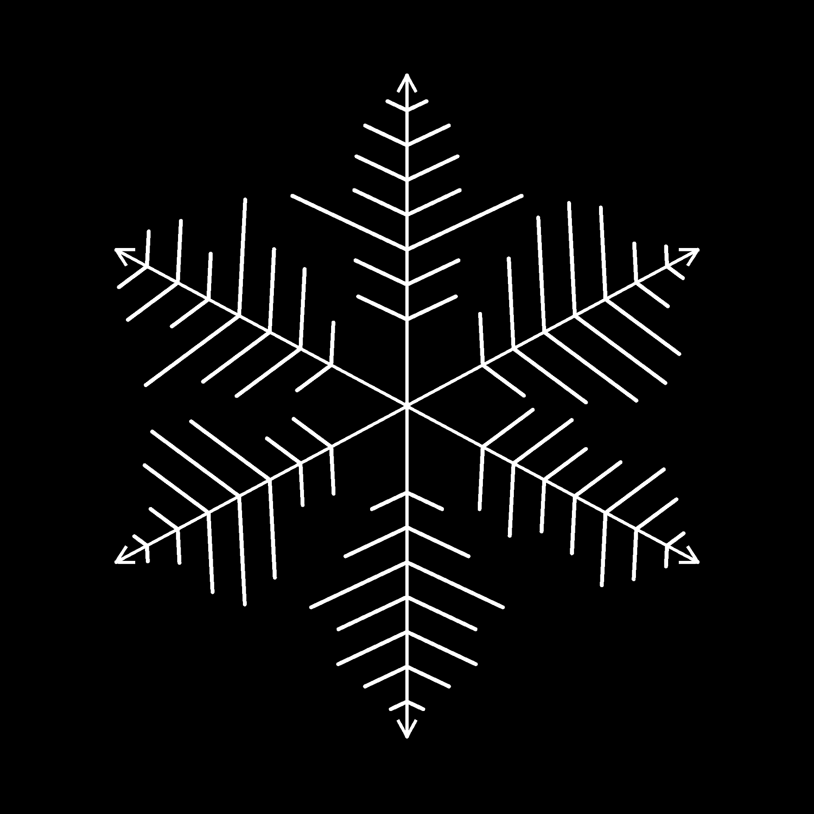

# Streuung Splines on Splines

<table>
<tr style="border: 0;">
<td width="33.33%" style="border: 0;" valign="top">

<b>In:</b> Spline &amp; Path Tools > Spline-Werkzeuge

</td>
<td width="100.00%" style="border: 0;" valign="top">

## Beschreibung

Platziert Splines entlang der übergeordneten Splines für die Eingabe.

Der Node bietet umfassende Anpassungsoptionen, mit denen Sie die Streuung von Splines steuern und einfache, gerade Splines oder eigene benutzerdefinierte Splines in der Streuung verwenden können.

Mithilfe des Knotens können Sie komplexe Strukturen für das Zuordnen von Farben und Bildern mithilfe der Knoten [Spline Mapper](../../../../../../compositing-graphs/nodes-reference-for-com/node-library/spline-paths-tools/spline-tools/spline-mapper-grayscale/spline-mapper-grayscale.md) oder als Skelett für das Platzieren von Formen mithilfe der Streuung [auf den Knoten Spline](../../../../../../compositing-graphs/nodes-reference-for-com/node-library/spline-paths-tools/spline-tools/scatter-spline-grayscale/scatter-on-spline-grayscale.md) erstellen.

</td>
</tr>
</table>

<table>
<tr style="border: 0;">
<td style="border: 0;" valign="top">

### Tutorial

Klicken Sie auf das Bild auf der rechten Seite, um auf unser <b>Tutorial </b> zuzugreifen. Dort erhalten Sie eine Einführung in die Funktionen des Knotens und seine Verwendung im Rahmen eines Spline-basierten Workflows.

</td>
<td style="border: 0;" valign="top">

</td>
</tr>
</table>

## Eingaben

|  |  |
|:---|:---|
| <b>Vorschau</b> *Graustufen* | Die Vorschau der Eingabe-Splines als Graustufenbild. |
| <b>Spline-Kabel</b> *Farbe* | Die Koordinaten der Punkte der übergeordneten Splines, die in den RGBA-Kanälen eines Farbbildes codiert sind:  <b>R</b> - X-Position <b>G</b> - Y-Position <b>B</b> - Height <b>A</b> - Packed data:          - Signieren: Spline ist geschlossen (negativ) oder offen (positiv) - Absoluter Wert: THICKNESS + 1 |
| <b>Spline-Daten</b> *Farbe* | Zusätzliche Daten der übergeordneten Splines, die in den RGBA-Kanälen eines Farbbilds codiert sind:  <b>R</b> - Tangenten X <b>G</b> - Tangenten Y <b>B</b> - Tangenten Z <b>A</b> - Nicht verwendet |
| <b>Spline-Betrag</b> *Integer* | Die Anzahl der übergeordneten Splines. |
| <b>Benutzerdefinierte Spline-Codes</b> *Farbe* | Die Koordinaten der Punkte der benutzerdefinierten Splines, die in den RGBA-Kanälen eines Farbbildes codiert sind:  <b>R</b> - X-Position <b>G</b> - Y-Position <b>B</b> - Height <b>A</b> - Packed data:          - Signieren: Spline ist geschlossen (negativ) oder offen (positiv) - Absoluter Wert: THICKNESS + 1 |
| <b>Benutzerdefinierte Spline-Daten</b> *Farbe* | Zusätzliche Daten zu den benutzerdefinierten Splines, die in den RGBA-Kanälen eines Farbbildes codiert sind:  <b>R</b> - Tangenten X <b>G</b> - Tangenten Y <b>B</b> - Tangenten Z <b>A</b> - Nicht verwendet |
| <b>Benutzerdefinierter Spline-Betrag</b> *Integer* | Die Anzahl der benutzerdefinierten Splines. |
| <b>Zuordnungsskalierung</b> *Graustufen* | Die Graustufen-Map, die die Skalierung der gestreuten Splines steuert.  Der Effekt dieser Karte wird durch den <b>Scale Map Input Multiplier</b>-Parameter gesteuert und mit den anderen Parametern in der <b>Size</b>-Gruppe kombiniert. |
| <b>Rotation Map</b> *Graustufen* | Die Graustufenkarte, die die Drehung der gestreuten Splines steuert.  Die Wirkung dieser Map wird durch den <b>Rotation Map-Eingabemultiplikator</b>-Parameter gesteuert und mit den anderen Parametern in der <b>Drehung</b>-Gruppe kombiniert. |

## Ausgaben

|  |  |
|:---|:---|
| <b>Vorschau</b> *Graustufen* | Die Vorschau der verstreuten Splines als Graustufenbild. |
| <b>Spline-Kabel</b> *Farbe* | Die Koordinaten der Punkte der gestreuten Splines, die in den RGBA-Kanälen eines Farbbildes codiert sind:  <b>R</b> - X-Position <b>G</b> - Y-Position <b>B</b> - Height <b>A</b> - Packed data:          - Signieren: Spline ist geschlossen (negativ) oder offen (positiv) - Absoluter Wert: THICKNESS + 1 |
| <b>Spline-Daten</b> *Farbe* | Zusätzliche Daten zu den gestreuten Splines, die in den RGBA-Kanälen eines Farbbildes codiert sind:  <b>R</b> - Tangenten X <b>G</b> - Tangenten Y <b>B</b> - Nicht verwendet <b>A</b> - Nicht verwendet |
| <b>Spline-Betrag</b> *Integer* | Die Anzahl der verstreuten Splines. |

## Parameter

|  |  |
|:---|:---|
| <b>Seite</b> *Integer* | Steuert, auf welcher Seite(n) der übergeordneten Splines die Splines gestreut werden sollen, da &quot;vorwärts&quot; die Richtung der *übergeordneten* Splines ist:  - <b>Links</b> Platzieren Sie die Splines auf der linken Seite. - <b>Rechts</b> Platzieren Sie die Splines auf der rechten Seite. - <b>Links + Rechts</b> Platzieren Sie die Splines auf beiden Seiten. - <b>Links / Rechts - Alternate</b> Platzieren Sie Splines dann links rechts alternativ (z. B. jede andere Seite). - <b>Links/Rechts - Zufällig</b> Wählen Sie die Seite zufällig für jeden Spline aus. |
| <b>Betragsmodus</b> *Integer* | Die Methode zum Streuen der Splines entlang der übergeordneten Splines, die sich auf die Anzahl der gestreuten Splines auf jeder übergeordneten Spline auswirkt:  - <b>Fester Betrag pro Spline</b> Der angegebene Betrag an gleichmäßig beabstandeten Splines wird gestreut. - <b>Abstand</b> Der Betrag an Splines wird automatisch angepasst, um an den angegebenen gleichmäßigen Abstand anzupassen.  In beiden Fällen befinden sich der erste und der letzte gestreute Spline genau am Anfang bzw. Ende jedes übergeordneten Splines. |
| <b>Spline-Betrag pro Spline</b> *Integer* | Die Anzahl der gleichmäßig beabstandeten Splines, die entlang jeder übergeordneten Spline verstreut sind. |
| <b>Spline-Abstand</b> *Gleitend* | Der Mindestabstand entlang übergeordneter Splines, um den Splines ein Abstand zueinander gesetzt werden sollen, während der erste und der letzte Spline noch am Anfang bzw. Ende jedes übergeordneten Splines landen. |
| <b>Spline-Typ</b> *Integer* | Wählt aus, welcher Spline-Typ auf den übergeordneten Splines gestreut werden soll:  - <b>Gerade</b> Ein einfacher, gerader Spline. - <b>Benutzerdefinierter Spline</b> Der Spline(n), der/die für die <b>Benutzerdefinierte Spline</b>-Eingaben bereitgestellt wird/werden. Mehrere Splines werden unterstützt, wenn sie zusammen an eine Liste angehängt werden. |
| <b>Benutzerdefinierte Spline-Auswahl</b> *Integer* | Wenn Sie mehrere benutzerdefinierte Splines verwenden, die an eine Liste angehängt sind, können Sie mit diesem Parameter auswählen, wie diese Splines in der Streuung verteilt werden sollen.  - <b>Gesamte Liste</b> Alle Splines werden als Gruppe verteilt. - <b>Sequenziell</b> Jeder einzelne Spline wird in der Reihenfolge gestreut und in einer Schleife um die Liste geschlungen. - <b>Zufällig</b> Für jeden gestreuten Spline wird ein zufälliger Spline aus der Liste ausgewählt. |
| <b>Start</b> *Gleitend* | Versetzt den Punkt vom Anfang der übergeordneten Splines an die Stelle, an der die Streuung beginnt. Der Wert ist die normalisierte Länge jedes übergeordneten Splines. |
| <b>Ende</b> *Gleitend* | Verschiebt den Punkt vom Anfang der übergeordneten Splines an der Stelle, an der die Streuung endet. Der Wert ist die normalisierte Länge jedes übergeordneten Splines. |
| <b>Richtung spiegeln</b> *Boolescher Wert* | Kehrt die Richtung der gestreuten Splines um. |
| <b>Symmetriemodus links/rechts</b> *Integer* | Die Methode der Symmetrie, die auf die Splines angewendet wird, die auf jeder Seite der übergeordneten Splines verstreut sind.  - <b>Deaktiviert</b> Es wird keine Symmetrie angewendet, die Splines werden auf jeder Seite mit einer einfachen Drehung platziert. - <b>Linke Symmetrie</b> Der Spline auf der linken Seite ist symmetrisch zum Spline auf der rechten Seite relativ zum übergeordneten Spline. - <b>Rechte Symmetrie</b> Der Spline auf der rechten Seite ist symmetrisch zum Spline auf der linken Seite relativ zum übergeordneten Spline. |
| <b>Links/Rechts zufälliger Link</b> *Boolescher Wert* | Steuert, ob die Splines auf jeder Seite des übergeordneten Splines die gleichen Werte verwenden sollen, wenn zufällige Drehung, zufällige Skalierung usw. verwendet werden. Mit anderen Worten:  - <i>Falsch:</i> Jeder Spline verwendet separate zufällige Werte - <i>Wahr:</i> Beide Splines verwenden dieselben zufälligen Werte. |
| <b>Spline-Pivot-Modus</b> *Integer* | Legt die Methode zum Platzieren des Drehpunkts für gestreute Splines fest, der sich auf die Drehung und Skalierung auswirkt. Beachten Sie, dass der Drehpunkt *immer auf dem übergeordneten Spline* platziert ist und seine Steuerelemente sich auf den gestreuten Spline auswirken. Mit anderen Worten: Der Pivot bewegt sich nicht, sondern der gestreute Spline, der sich relativ dazu bewegt und skaliert.  - <b>Position entlang des Splines</b> Bewegen Sie den Pivot entlang des gestreuten Splines. - <b>Absolute Position</b> Legen Sie eine beliebige Position für den Pivot fest. |
| <b>Pivot-Position entlang Spline</b> *Gleitend* | Die normierte Position des Drehzapfens entlang der gestreuten Spline, wobei 0 sein Anfang und 1 sein Ende ist. Beachten Sie, dass der Drehpunkt der *Richtung* des gestreuten Splines folgt und sich die Ausrichtung des Splines ändern kann, um die Position und Drehung des Drehpunkts relativ zum übergeordneten Spline beizubehalten. |
| <b>Absolute Pivot-Position</b> *Float2* | Die Position des Drehpunkts im UV-Raum. |
| <b>Nicht-quadratische Korrektur</b> *Boolescher Wert* | Passen Sie die Splines-Positionen und die Thickness an, um die Form in nicht quadratischen Auflösungen beizubehalten. <i>Hinweis:</i> Bei der Verwendung von benutzerdefinierten Splines sollte der benutzerdefinierte Splines das *gleiche Bildverhältnis* wie die <b>Splines der Streuung auf Splines</b> verwenden. |
| <b>Größe</b> |  |
| <b>Spline-Skalierung</b> *Gleitend* | Ein globales Steuerelement für die Größe aller Splines, wobei 1 ihre volle Originalgröße ist. Die Skalierung wird relativ auf den Pivot eines Splines angewendet. Die Pivot-Position kann mit dem Parameter <b>Spline Pivot</b> versetzt werden. |
| <b>Spline-Skalierung zufällig</b> *Gleitend* | Wendet einen zufälligen Multiplikator bis zum angegebenen Wert an, um die Größe der Splines zu verringern. |
| <b>Zuordnungseingabemultiplikator skalieren</b> *Gleitend* | Steuert die Intensität der <b>Skalierungszuordnung</b>-Eingabe. Diese Karte dient als Multiplikator für die aktuelle Größe der Muster. Der Effekt dieser Karte wird mit den anderen Parametern in der Gruppe <b>Größe</b> kombiniert. |
| <b>Sampling-Modus für Zuordnungseingabe skalieren</b> *Integer* | Die Methode zum Zuordnen der Werte in der <b>Skalierungszuordnung</b> zu den Splines:  - <b>Texturen-Leerzeichen</b> Die Werte werden auf die Splines angewendet, wo sie sich befinden würden, wenn sie in einer Textur unter Verwendung der UV-Koordinaten der Textur platziert würden. Dadurch wird der Wert effektiv auf die Splines &quot;in place&quot;  - <b>Horizontal entlang Spline </b> angewendet. Die Werte werden direkt auf die codierten Splines-Koordinaten angewendet (siehe <b>Spline-Koordinaten</b>-Eingabe), wobei jede Zeile auf einen anderen Spline von oben nach unten angewendet wird - <b>Hor. entlang der Spline (Rand). offset X)</b> Die Werte werden direkt auf die Koordinaten der codierten Splines angewendet (siehe <b>Spline Coords</b> Eingabe), mit einem zufälligen horizontalen Versatz in der <b>Skalierungszuordnung</b> für jeden Spline (d. h. jede Zeile in <b>Spline Coords</b>) - <b>Stunde. entlang der Spline (Rand). offset Y)</b> Die Werte werden direkt auf die Koordinaten der codierten Splines angewendet (siehe <b>Spline Coords</b> Eingabe), mit einem zufälligen vertikalen Versatz in der <b>Skalierungszuordnung</b> für jeden Spline (d. h. jede Zeile in <b>Spline Coords</b>) |
| <b>Dämpfung starten/beenden</b> *Float2* | Klammert bei der Skalierung der Splines den Abstand zwischen dem Mittelpunkt des Splines und seinen Werten <b>Anfang</b> und <b>Ende</b> ein. Dies bedeutet, dass die Größe für Splines, die sich näher an den Enden eines Splines befinden, verringert wird. |
| <b>Position</b> |  |
| <b>Lokaler Offset</b> *Float2* | Wendet einen Versatz auf die Positionen der Splines entlang der Tangente des übergeordneten Splines (parallel) und der Senkrechten (senkrecht) an. |
| <b>Offset auf Spline-Bereich</b> *Integer* | Legt den Bereich des Versatzes fest, der auf die gestreuten Splines entlang der übergeordneten Splines angewendet wird.  - <b>Intervall</b> Der Bereich erstreckt sich über das Intervall *zwischen* jedem gestreuten Spline. - <b>Übergeordneter Spline</b> Der Bereich erstreckt sich über die *volle Länge* des übergeordneten Splines. |
| <b>Offset auf Spline</b> *Gleitend* | Wendet einen Positionsversatz auf die Splines entlang der übergeordneten Splines an. |
| <b>Bereich für zufällige Verschiebung</b> *Integer* | Legt den Bereich des zufälligen Versatzes fest, der auf die gestreuten Splines entlang der übergeordneten Splines angewendet wird.  - <b>Intervall</b> Der Bereich erstreckt sich über das Intervall *zwischen* jedem gestreuten Spline. - <b>Übergeordneter Spline</b> Der Bereich erstreckt sich über die *volle Länge* des übergeordneten Splines. |
| <b>Zufälliger Versatz auf Spline</b> *Gleitend* | Wendet einen zusätzlichen Positionsversatz auf die Splines entlang der übergeordneten Splines an. |
| <b>Offset durch Thickness</b> *Gleitend* | Wendet einen Versatz auf die gestreuten Splines entlang der Normalen der übergeordneten Splines bis zur Thickness der übergeordneten Splines an. Mit dem Wert 1 können Sie die gestreuten Splines effektiv auf der *Fläche* der Hülle der übergeordneten Splines platzieren. |
| <b>Drehung</b> |  |
| <b>Benutzerdefinierte Spline-Ausrichtung</b> *Integer* | Steuert die Anfangsausrichtung der benutzerdefinierten Spline(s) auf den übergeordneten Splines.  - <b>Tangente des ersten Punkts</b> Die Splines werden entsprechend der Tangente ihres ersten Punkts ausgerichtet. Mit anderen Worten, sie gehen von den übergeordneten Splines in die Richtung, die durch ihren ersten Punkt festgelegt wird. - <b>Bildraum</b> Die Splines werden so platziert, wie sie ursprünglich angezeigt wurden, ohne dass ihre Position oder Ausrichtung zusätzlich angepasst wird, als ob das Bild, das sie darstellt, auf dem übergeordneten Spline läge. |
| <b>Rotationsmodus</b> *Integer* | Legt die anfängliche Ausrichtung der verstreuten Splines fest.  - <b>Von Spline</b> Die Splines sind so ausgerichtet, dass sie der *Normalen* der übergeordneten Splines an ihrer Position entsprechen. - <b>Absolut</b> Die Splines sind alle auf *gleiche Weise* ausgerichtet, unabhängig von der Richtung der übergeordneten Splines. |
| <b>Drehung</b> *Gleitend* | Dreht die Splines um ihre Drehpunkte in verschiedenen Drehungen. Die Pivot-Position kann mit dem Parameter <b>Spline Pivot</b> versetzt werden. |
| <b>Drehung zufällig</b> *Gleitend* | Wendet eine zusätzliche zufällige Drehung auf die Splines um ihre Drehpunkte an, in der Anzahl der Windungen. Die Pivot-Position kann mit dem Parameter <b>Spline Pivot</b> versetzt werden. |
| <b>Linker/Rechter Winkel</b> *Gleitend* | Steuert den Winkel der symmetrischen Drehung, die auf die Splines auf jeder Seite der übergeordneten Splines angewendet wird, in der Anzahl der Windungen. |
| <b>Linker/Rechter Winkel zufällig</b> *Gleitend* | Fügt den Splines auf jeder Seite der übergeordneten Splines eine zufällige symmetrische Drehung in der Anzahl der Windungen hinzu. |
| <b>Rotation Map-Eingangsmultiplikator</b> *Gleitend* | Steuert die Intensität der <b>Rotation Map</b>-Eingabe. Diese Karte dient als Multiplikator für die aktuelle Drehung der Muster. Der Effekt dieser Karte wird mit den anderen Parametern in der Gruppe <b>Drehung</b> kombiniert. |
| <b>Rotation Map-Eingabeaufnahmemodus</b> *Integer* | Die Methode zum Zuordnen der Werte in der <b>Rotation Map</b> zu den Splines:  - <b>Textur-Leerzeichen</b> Die Werte werden auf die Splines angewendet, wo sie sich befinden würden, wenn sie in einer Textur unter Verwendung der UV-Koordinaten der Textur platziert würden. Dadurch wird der Wert effektiv auf die Splines &quot;in place&quot;, - <b>Horizontal entlang Spline </b> angewendet. Die Werte werden direkt auf die codierten Spline-Koordinaten angewendet (siehe <b>Spline-Koordinaten</b>-Eingabe), wobei jede Zeile auf einen anderen Spline von oben nach unten angewendet wird, - <b>Hor. entlang der Spline (Rand). offset X)</b> Die Werte werden direkt auf die Koordinaten der codierten Splines angewendet (siehe <b>Spline Coords</b> Eingabe), mit einem zufälligen horizontalen Versatz in der <b>Rotation Map</b> für jeden Spline (d. h. jede Zeile in <b>Spline Coords</b>). - <b>Hor. entlang der Spline (Rand). offset Y)</b> Die Werte werden direkt auf die Koordinaten der codierten Splines angewendet (siehe <b>Spline Coords</b> Eingabe), mit einem zufälligen vertikalen Versatz in der <b>Rotation Map</b> für jeden Spline (d. h. jede Zeile in <b>Spline Coords</b>)<b>.</b> |
| <b>Auswirkungen auf Rotation Map-Eingabe</b> *Integer* | Wählt den Drehungsparameter aus, der von der <b>Rotation Map </b> beeinflusst wird:  - <b>Spline rotation</b> Die Karte beeinflusst die globale Drehung der Splines im Uhrzeigersinn. - <b>Linker/Rechter Winkel</b> Die Karte beeinflusst die symmetrische Drehung der <b>Linken/Rechten</b> Splines. |
| <b>Height</b> |  |
| <b>Height-Modus starten</b> *Integer* | Die Methode zum Berechnen des Anfangs-Heights der gestreuten Splines.  - <b>Manuell</b> Legen Sie den gleichen absolute Wert für alle gestreuten Splines fest. - <b>Von übergeordnetem Spline (+ benutzerdefinierter Spline)</b> Verwenden Sie das Height des übergeordneten Splines, und fügen Sie dann das Height des benutzerdefinierten Splines mit dem <b>Height für den benutzerdefinierten Spline-Start hinzu.</b> Parameter. - <b>Von benutzerdefiniertem Spline</b> Verwenden Sie das Height des benutzerdefinierten Spline wie vorhanden.  <i>Hinweis:</i> Legen Sie den <b>Spline-Typ</b> auf &quot;Benutzerdefiniertes Spline&quot; fest und verbinden Sie die <b>Benutzerdefiniertes Spline</b>-Eingaben, um das Height benutzerdefinierter Splines zu verwenden. |
| <b>Benutzerdefiniertes Spline-Start-Height Mult.</b> *Gleitend* | Steuert den Beitrag des eigenen Anfangs-Heights des benutzerdefinierten Splines zum Anfangs-Height der gestreuten Splines, wobei 1 bedeutet, dass das vollständige Height des benutzerdefinierten Splines verwendet wird. Das Height des benutzerdefinierten Splines wird entsprechend dem ausgewählten <b>Startmodus des Heights</b>: - <i>Vom übergeordneten Spline (+ benutzerdefinierter Spline):</i> Das Height wird dem übergeordneten Spline hinzugefügt - <i>Vom benutzerdefinierten Spline:</i> Das Height wird direkt verwendet |
| <b>Height-Offset starten</b> *Gleitend* | Wendet einen absoluten Versatz auf das Anfangs-Height des gestreuten Splines an. |
| <b>Height starten</b> *Gleitend* | Legt einen absoluten Wert für das Anfangs-Height des gestreuten Splines fest. |
| <b>Height beenden</b> *Integer* | Die Methode zum Berechnen des letzten Heights der gestreuten Splines.  - <b>Manuell</b> Legen Sie den gleichen absolute Wert für alle gestreuten Splines fest. - <b>Von übergeordnetem Spline (+ benutzerdefinierter Spline)</b> Verwenden Sie das Height des übergeordneten Splines, und fügen Sie dann das Height des benutzerdefinierten Splines mit dem <b>Height für das benutzerdefinierte Spline-Ende hinzu.</b> Parameter. - <b>Von benutzerdefiniertem Spline</b> Verwenden Sie das Height des benutzerdefinierten Spline wie vorhanden.  <i>Hinweis:</i> Legen Sie den <b>Spline-Typ</b> auf benutzerdefiniertes Spline fest und verbinden Sie die <b>Eingaben für benutzerdefinierte Spline</b>, um das Height benutzerdefinierter Splines zu verwenden. |
| <b>Benutzerdefiniertes Spline-End-Height.</b> *Gleitend* | Steuert den Beitrag des eigenen End-Heights des benutzerdefinierten Splines zum End-Height der verstreuten Splines, wobei 1 bedeutet, dass das vollständige Height des benutzerdefinierten Splines verwendet wird. Das Height des benutzerdefinierten Splines wird entsprechend dem ausgewählten <b>Height-Endmodus</b> anders verwendet: - <i>Vom übergeordneten Spline (+ benutzerdefinierter Spline):</i> Das Height wird dem übergeordneten Spline hinzugefügt - <i>Vom benutzerdefinierten Spline:</i> Das Height wird direkt verwendet |
| <b>Height-Versatz beenden</b> *Gleitend* | Wendet einen absoluten Versatz auf das Height des gestreuten Splines an. |
| <b>Height beenden</b> *Gleitend* | Legt einen absoluten Wert für das Height des gestreuten Splines fest. |
| <b>Thickness</b> |  |
| <b>Thickness starten</b> *Integer* | Die Methode zum Berechnen der Anfangs-Thickness der gestreuten Splines.  - <b>Manuell</b> Legen Sie den gleichen absolute Wert für alle gestreuten Splines fest. - <b>Von übergeordnetem Spline</b> Verwenden Sie die Thickness des übergeordneten Splines. - <b>Von benutzerdefiniertem Spline</b> Verwenden Sie die Thickness des benutzerdefinierten Splines.  <i>Hinweis:</i> Legen Sie den <b>Spline-Typ</b> auf benutzerdefiniertes Spline fest und verbinden Sie die <b>benutzerdefinierte Spline</b> 4} Eingaben, um die Thickness von benutzerdefinierten Splines zu verwenden. |
| <b>Multiplikator der Thickness starten</b> *Gleitend* | Skaliert die Anfangs-Thickness der gestreuten Splines, wobei 1 die volle Thickness ist. |
| <b>Offset der Thickness starten</b> *Gleitend* | Wendet einen absoluten Versatz auf die Anfangs-Thickness des gestreuten Splines an. |
| <b>Thickness starten</b> *Gleitend* | Legt einen absoluten Wert für die Anfangs-Thickness des gestreuten Splines fest. |
| <b>Thickness beenden</b> *Integer* | Die Methode zum Berechnen der End-Thickness der gestreuten Splines.  - <b>Manuell</b> Legen Sie den gleichen absolute Wert für alle gestreuten Splines fest. - <b>Von übergeordnetem Spline</b> Verwenden Sie die Thickness des übergeordneten Splines. - <b>Von benutzerdefiniertem Spline</b> Verwenden Sie die Thickness des benutzerdefinierten Splines.  <i>Hinweis:</i> Legen Sie den <b>Spline-Typ</b> auf benutzerdefiniertes Spline fest und verbinden Sie die <b>benutzerdefinierte Spline. 4} Eingaben, um die Thickness von benutzerdefinierten Splines zu verwenden.</b> |
| <b>Multiplikator der Thickness beenden</b> *Gleitend* | Skaliert die Anfangs-Thickness der gestreuten Splines, wobei 1 die volle Thickness ist. |
| <b>Offset der Thickness beenden</b> *Gleitend* | Wendet einen absoluten Versatz auf die Thickness des gestreuten Splines an. |
| <b>Thickness beenden</b> *Gleitend* | Legt einen absolute Wert für die End-Thickness des gestreuten Splines fest. |
| <b>Vorschau</b> |  |
| <b>Richtungshelfer anzeigen</b> *Boolescher Wert* | Zeigt einen Punkt am Anfang des Splines und eine Pfeilspitze am Ende in der <b>Vorschau</b>-Ausgabe an. |
| <b>Umschlag der Thickness anzeigen</b> *Boolescher Wert* | Zeigt an den Kanten der Spline-Thickness zusätzliche Linien an. |
| <b>Thickness (px)</b> *Gleitend* | Passt die Thickness der Spline-Visualisierung in der <b>Vorschau</b>-Ausgabe in Pixel an. |
| <b>Segmentierungsbetrag</b> *Integer* | Passt die Anzahl der Segmente an, die zum Zeichnen der Spline-Visualisierung in der <b>Vorschau</b>-Ausgabe verwendet werden. Je höher der Wert, desto glatter die Linie. |
| <b>Hintergrundintensität</b> *Gleitend* | Die Intensität der <b>Vorschau</b>-Eingabe in der <b>Vorschau</b>-Ausgabenvisualisierung. |

## Beispiele

<table>
<tr style="border: 0;">
<td style="border: 0;" valign="top">

{zoomable="yes"}

</td>
<td style="border: 0;" valign="top">

{zoomable="yes"}

</td>
</tr>
</table>

<table>
<tr style="border: 0;">
<td style="border: 0;" valign="top">

{zoomable="yes"}

</td>
<td style="border: 0;" valign="top">

{zoomable="yes"}

</td>
</tr>
</table>

## Renderings

<table>
<tr style="border: 0;">
<td style="border: 0;" valign="top">

{zoomable="yes"} rendern

</td>
<td style="border: 0;" valign="top">

{zoomable="yes"} rendern

</td>
</tr>
</table>

{zoomable="yes"} rendern
