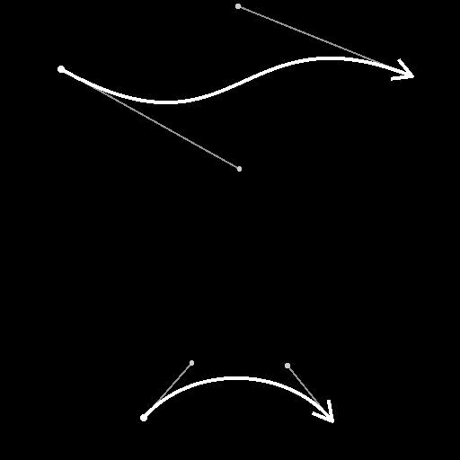

# Spline Bridge (2 Splines)

<table>
<tr style="border: 0;">
<td width="33.33%" style="border: 0;" valign="top">

<b>In:</b> Spline &amp; Path Tools > Spline-Werkzeuge

</td>
<td width="100.00%" style="border: 0;" valign="top">

## Beschreibung

Generiert Splines von <b>Spline #1</b> bis <b>Spline #2</b> entlang dieser Splines. Die generierten Splines können linear (gerade) oder kubisch (Bézier) (gekrümmt) sein.

</td>
</tr>
</table>

>[!IMPORTANT]
>
> Wenn die an die <b>Spline #1</b>- und <b>Spline #2</b>-Eingaben übergebenen Daten mehr als einen Spline enthalten, wird nur der letzte Spline in jeder Liste verwendet.

## Eingangsanschlüsse

<b>Vorschau #1</b> *Graustufen* Die Vorschau der Eingabe-Splines #1 als Graustufenbild.

<b>Spline-#1</b> *Farbe* Die Koordinaten der Punkte der Eingabe-Splines #1 in den RGBA-Kanälen eines Farbbildes codiert.\
<b>R</b> - X-Position\
<b>G</b> - Y-Position\
<b>B</b> - Height\
<b>A</b> - Paketdaten:\
* Signieren: Die Spline ist geschlossen (negativ) oder offen (positiv).\
* Absoluter Wert: Thickness + 1.

<b>Spline-#1</b> *Farbe* Zusätzliche Daten der Eingabe-Splines #1 in den RGBA-Kanälen eines Farbbildes codiert.\
<b>R</b> - Tangenten X\
<b>G</b> - Tangenten Y\
<b>B</b> - Nicht verwendet\
<b>A</b> - Nicht verwendet

<b>Spline-Betrag #1</b> *Integer* Die Anzahl der Eingabe-Splines #1.

<b>Vorschau #2</b> *Graustufen* Die Vorschau der Eingabe-Splines #2 als Graustufenbild.

<b>Spline-#2</b> *Farbe* Die Koordinaten der #2 der Eingabesplines, die in den RGBA-Kanälen eines Farbbildes codiert sind.\
<b>R</b> - X-Position\
<b>G</b> - Y-Position\
<b>B</b> - Height\
<b>A</b> - Paketdaten:\
* Signieren: Die Spline ist geschlossen (negativ) oder offen (positiv).\
* Absoluter Wert: Thickness + 1.

<b>Spline-#2</b> *Farbe* Zusätzliche Daten der Eingabe-Splines #2 in den RGBA-Kanälen eines Farbbildes codiert.\
<b>R</b> - Tangenten X\
<b>G</b> - Tangenten Y\
<b>B</b> - Nicht verwendet\
<b>A</b> - Nicht verwendet

<b>Spline-Betrag #2</b> *Integer* Die Anzahl der Eingabe-Splines #2.

<b>Tangentenlängenkurve starten</b> *Graustufen* (verfügbar, wenn &quot;Splines-Typ für Brücke&quot; auf &quot;Kubische Bézier&quot; festgelegt ist)Das Bild, das eine Kurve anhand der Werte der ersten Pixelzeile beschreibt.\
Diese Eingabe wird verwendet, um die Länge der &quot;out&quot;-Tangenten für den Startpunkt jedes generierten Spline-Effekts entlang der Spline-#1 zu steuern.\
Sie können einen Kurvenknoten zum Erstellen der Kurve verwenden.

<b>Tangentendrehungskurve starten</b> *Graustufen* (verfügbar, wenn &quot;Splines-Typ für Brücke&quot; auf &quot;Kubische Bézier&quot; festgelegt ist)Das Bild, das eine Kurve anhand der Werte der ersten Pixelzeile beschreibt.\
Diese Eingabe wird verwendet, um die Drehung der &quot;out&quot;-Tangenten für den Startpunkt jedes generierten Spline-Effekts entlang der Spline-#1 zu steuern.\
Der Graustufenwert des Bildes stellt eine Anzahl von Windungen dar.\
Sie können einen Kurvenknoten zum Erstellen der Kurve verwenden.

<b>Tangenten-Endlängenkurve</b> *Graustufen* (verfügbar, wenn &quot;Splines-Typ für Brücke&quot; auf &quot;Kubische Bézier&quot; festgelegt ist)Das Bild, das eine Kurve anhand der Werte der ersten Pixelzeile beschreibt.\
Diese Eingabe wird verwendet, um die Länge der &quot;in&quot;-Tangenten für den Endpunkt jedes generierten Spline-Effekts entlang der Spline-#2 zu steuern.\
Sie können einen Kurvenknoten zum Erstellen der Kurve verwenden.

<b>Tangentendrehkurve beenden</b> *Graustufen* (verfügbar, wenn &quot;Splines-Typ für Brücke&quot; auf &quot;Kubische Bézier&quot; festgelegt ist)Das Bild, das eine Kurve anhand der Werte der ersten Pixelzeile beschreibt.\
Diese Eingabe wird verwendet, um die Drehung der &quot;in&quot;-Tangenten für den Endpunkt jedes generierten Spline-Effekts entlang der Spline-#2 zu steuern.\
Der Graustufenwert des Bildes stellt eine Anzahl von Windungen dar.\
Sie können einen Kurvenknoten zum Erstellen der Kurve verwenden.

## Ausgangsanschlüsse

<b>Vorschau</b> *Graustufen* Die Vorschau der Ausgabe-Splines als Graustufenbild.

<b>Spline-Kabel</b> *Farbe* Die Koordinaten der Punkte der Ausgabesplines, die in den RGBA-Kanälen eines Farbbildes codiert sind.\
<b>R</b> - X-Position\
<b>G</b> - Y-Position\
<b>B</b> - Height\
<b>A</b> - Paketdaten:\
* Signieren: Die Spline ist geschlossen (negativ) oder offen (positiv).\
* Absoluter Wert: Thickness + 1.

<b>Spline-Daten</b> *Farbe* Zusätzliche Daten der Ausgabe-Splines, die in den RGBA-Kanälen eines Farbbildes codiert sind.\
<b>R</b> - Tangenten X\
<b>G</b> - Tangenten Y\
<b>B</b> - Nicht verwendet\
<b>A</b> - Nicht verwendet

<b>Spline-Betrag</b> *Integer* Die Anzahl der Ausgabe-Splines.

## Parameter

<b>Splines-Betrag für Bridge</b> *Integer* Die Anzahl der Splines, die entlang der Spline-#1 in der Spline-#2 generiert wurden.

<b>Bridge-Splines-Typ</b> *Integer* Der generierte Spline-Typ:
* Linear: eine gerade Spline von Anfang bis Ende;
* Kubische Bézier: eine gekrümmte Spline von Anfang bis Ende, wobei die Kurve durch die Länge und den Winkel der Start- und Endpunkte gesteuert wird.

<b>Spline starten #1</b> *Gleitend* Verschiebt die Position entlang der Spline-#1 von der aus Splines generiert werden. Der Wert ist die normalisierte Länge der Spline-#1.\
Ein höherer Wert führt dazu, dass die gleiche Anzahl von Splines enger zusammengepackt wird.

<b>Spline starten #2</b> *Gleitend* Verschiebt die Position entlang der Spline-#2 von der aus Splines generiert werden. Der Wert ist die normalisierte Länge der Spline-#2.\
Ein höherer Wert führt dazu, dass die gleiche Anzahl von Splines enger zusammengepackt wird.

<b>Spline-#1 beenden</b> *Gleitend* Verschiebt die Position entlang der Spline-#1 bis zu der Stelle, an der Splines generiert werden. Der Wert ist die normalisierte Länge der Spline-#1.\
Ein niedrigerer Wert führt dazu, dass die gleiche Anzahl von Splines enger zusammengepackt wird.

<b>Spline-#1 beenden</b> *Gleitend* Verschiebt die Position entlang der Spline-#2 bis zu der Stelle, an der Splines generiert werden. Der Wert ist die normalisierte Länge der Spline-#2.\
Ein niedrigerer Wert führt dazu, dass die gleiche Anzahl von Splines enger zusammengepackt wird.

<b>Spline-Versatz #1</b> *Gleitend* Wendet einen Versatz auf den Anfangspunkt aller Splines entlang der Spline-#1 an. Der Wert ist die normalisierte Länge der Spline-#1.\
Splines, die den Anfang oder das Ende des Splines erreichen, werden dort belassen.

<b>Spline-Versatz #2</b> *Gleitend* Wendet einen Versatz auf den Anfangspunkt aller Splines entlang der Spline-#2 an. Der Wert ist die normalisierte Länge der Spline-#2.\
Splines, die den Anfang oder das Ende des Splines erreichen, werden dort belassen.

<b>Zufallsstart versetzen</b> *Gleitend* Wendet einen zufälligen Versatz auf den Anfangspunkt jedes Spline-#1 an. Der Wert ist der normalisierte Abstand zwischen den Splines in der Spline-#1.\
Wenn der Wert 0 beibehalten wird, werden die Splines in gleichmäßigen Abständen zwischen dem Spline-Anfangspunkt #1 dem Spline-Endpunkt und dem Spline-Endpunkt #1.

<b>Versatz zufälliges Ende</b> *Gleitend* Wendet einen zufälligen Versatz auf den Endpunkt jedes Splines entlang der Spline-#2 an. Der Wert ist der normalisierte Abstand zwischen den Splines in der Spline-#2.\
Wenn der Wert 0 beibehalten wird, werden die Splines in gleichmäßigen Abständen zwischen dem Spline-Anfangspunkt #2 dem Spline-Endpunkt und dem Spline-Endpunkt #2.

<b>Tangentiallängenanfang</b> *Gleitkommawert* (verfügbar, wenn &quot;Splines-Typ der Brücke&quot; auf &quot;Kubische Bézier&quot; festgelegt ist)Die Länge der &quot;Out&quot;-Tangente für den Startpunkt auf der Spline-#1 aller generierten Splines.

<b>Tangentiallängenende</b> *Gleitkommawert* (verfügbar, wenn der &quot;Spline-Bridge-Typ&quot; auf &quot;Kubische Bézier&quot; festgelegt ist)Die Länge der &quot;In&quot;-Tangente für den Endpunkt auf der Spline-#2 aller generierten Splines.

<b>Tangentialdrehungsbeginn</b> *Gleitkommawert* (verfügbar, wenn der &quot;Splines-Typ der Brücke&quot; auf &quot;Kubische Bézier&quot; festgelegt ist)Die Drehung der &quot;Out&quot;-Tangente für den Startpunkt auf der Spline-#1 aller generierten Splines.\
Der Wert ist eine Anzahl von Umdrehungen.

<b>Tangentialdrehungsende</b> *Gleitkommawert* (verfügbar, wenn der &quot;Splines-Typ der Brücke&quot; auf &quot;Kubische Bézier&quot; festgelegt ist)Die Drehung der &quot;In&quot;-Tangente für den Endpunkt auf der Spline-#2 aller generierten Splines.\
Der Wert ist eine Anzahl von Umdrehungen.

+++Vorschau
<b>Segmentierungsbetrag</b> *Integer* Passt die Anzahl der Segmente an, die zum Zeichnen der Spline-Visualisierung in der Vorschauausgabe verwendet werden.\
Je höher der Wert, desto glatter die Linie.

<b>Richtungshelfer anzeigen</b> *Boolescher Wert* Zeigt einen Punkt am Anfang des Splines und eine Pfeilspitze an seinem Ende in der Vorschauausgabe an.

<b>Umschlag der Thickness anzeigen</b> *Boolescher Wert*\
Zeigt an den Kanten der Spline-Thickness zusätzliche Linien an.

<b>Thickness (px)</b> *Gleitend* Passt die Thickness der Spline-Visualisierung in Pixel in der Vorschauausgabe an.

+++

## Beispiele

<table>
<tr style="border: 0;">
<td style="border: 0;" valign="top">

<table>
  <tr>
    <td>
      
       <i>Vorher</i>
    </td>
    <td>
      
       <i>Nach</i>
    </td>
  </tr>
</table>

</td>
<td style="border: 0;" valign="top">

</td>
</tr>
</table>
