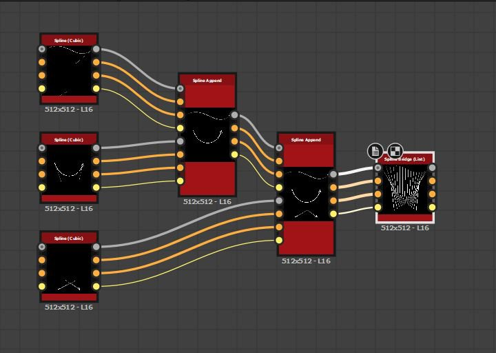

# Spline Bridge (Liste)

<table>
<tr style="border: 0;">
<td width="33.33%" style="border: 0;" valign="top">

<b>In:</b> Spline &amp; Path Tools > Spline-Werkzeuge

</td>
<td width="100.00%" style="border: 0;" valign="top">

## Beschreibung

Generiert Splines, die alle Splines in der Eingabeliste entlang dieser Splines durchlaufen.

Die generierten Splines können linear (gerade) oder quadratisch (gekrümmt) sein.

</td>
</tr>
</table>

>[!TIP]
>
> Die generierten Splines wechseln vom ersten Spline in der Liste zum letzten und durchlaufen die mittleren Splines, indem sie der Reihenfolge dieser Splines in der Liste genau folgen.
> 
> Daher sollten Sie die Reihenfolge beachten, in der Sie vorher Splines anfügen.

## Eingangsanschlüsse

<b>Vorschau</b> *Graustufen* Die Vorschau der Eingabe-Splines als Graustufenbild.

<b>Spline-Kabel</b> *Farbe* Die Koordinaten der in den RGBA-Kanälen eines Farbbildes codierten Punkte der Eingabesplines:\
<b> R</b> - X-Position\
<b> G</b> - Y-Position\
<b> B</b> - Height\
<b>A</b> - Paketdaten:\
* Signieren: Die Spline ist geschlossen (negativ) oder offen (positiv).\
* Absoluter Wert: Thickness + 1.

<b>Spline-Daten</b> *Farbe* Zusätzliche Daten der Eingabe-Splines, die in den RGBA-Kanälen eines Farbbildes codiert sind.\
<b> R</b> - Tangenten X\
<b> G</b> - Tangenten Y\
<b> B</b> - Nicht verwendet\
<b> A</b> - Nicht verwendet

<b>Spline-Betrag</b> *Integer* Die Anzahl der Eingabe-Splines.

## Ausgangsanschlüsse

<b>Vorschau</b> *Graustufen* Die Vorschau der Ausgabe-Splines als Graustufenbild.

<b>Spline-Kabel</b> *Farbe* Die Koordinaten der Punkte der Ausgabesplines, die in den RGBA-Kanälen eines Farbbildes codiert sind.\
<b>R</b> - X-Position\
<b>G</b> - Y-Position\
<b>B</b> - Height\
<b>A</b> - Paketdaten:\
* Signieren: Die Spline ist geschlossen (negativ) oder offen (positiv).\
* Absoluter Wert: Thickness + 1.

<b>Spline-Daten</b> *Farbe* Zusätzliche Daten der Ausgabe-Splines, die in den RGBA-Kanälen eines Farbbildes codiert sind.\
<b>R</b> - Tangenten X\
<b>G</b> - Tangenten Y\
<b>B</b> - Nicht verwendet\
<b>A</b> - Nicht verwendet

<b>Spline-Betrag</b> *Integer* Die Anzahl der Ausgabe-Splines.

## Parameter

<b>Spline-Betrag für Bridge</b> *Integer* Die Anzahl der Splines, die über die Eingabe-Splines generiert wurden.

<b>Bridge-Splines-Typ</b> *Integer* Der generierte Spline-Typ:
* Linear: eine scharfe Spline, die Zwischenkeilnuten mit geraden Trajektorien von Anfang bis Ende verbindet;
* Quadratische Bézier: eine gekrümmte Spline, die mittlere Splines mit glatten Trajektorien von Anfang bis Ende verbindet.\
  Hinweis: Für die Berechnung eines quadratischen Bézier-Splines sind mindestens 3 Splines für den Eingang erforderlich.

<b>Eingabe-Splines sind geschlossen</b> *Boolesch* Steuert, ob der erste und der letzte Punkt der Eingabe-Splines als ein einzelner Punkt verarbeitet werden sollen. Dadurch wird verhindert, dass der erste und der letzte Spline-Verlauf dupliziert werden.

<b>Richtung spiegeln</b> *Boolean* Kehrt die Richtung des Splines um.

<b>Bridge-Spline schließen</b> *Boolesch* Erweitert die durchlaufenden Splines, um wieder mit dem ersten Spline in der Eingabeliste verbunden zu werden.

<b>Versatz der ersten Spline-Brücke </b>*Gleitkomma2* Wendet einen Versatz auf den Anfang aller durchlaufenen Splines an. Der Wert ist die normalisierte Länge der Eingabe-Splines.\
Generierte Splines, die den Anfang oder das Ende der durchlaufenen Splines treffen, werden dort belassen.

<b>Versatz der letzten Spline-Brücke </b>*Gleitkomma2*\
Wendet einen Versatz auf das Ende aller durchlaufenen Splines an. Der Wert ist die normalisierte Länge der Eingabe-Splines.\
Generierte Splines, die den Anfang oder das Ende der durchlaufenen Splines treffen, werden dort belassen.

<b>Bereich für zufällige Verschiebung</b> *Ganze Zahl* Der maximale Abstand, der für den zufälligen Versatz verwendet wird, der auf Splines angewendet wird.\
*- Übergeordneter Spline:* Die gesamte Länge des übergeordneten Splines wird verwendet. Kann zu Überschneidungen führen.\
*- Intervall:* Das Intervall zwischen den Brückenzwickeln wird verwendet. Dadurch werden Überschneidungen vermieden. Dieser Abstand nimmt mit zunehmender Anzahl der Brückenverzahnungen ab.

<b>Zufallsversatz starten</b> *Gleitkommawert* Ein Multiplikator für den zufälligen Versatz, der auf die Startposition von Brückenzahnkeilen angewendet wird, wobei der maximale Abstand durch den Parameter <b>Bereich für zufällige Versätze</b> angegeben wird.

<b>Zufallsverschiebung beenden</b> *Gleitkommawert* Ein Multiplikator für den zufälligen Versatz, der auf die Endposition von Brückenzahnkeilen angewendet wird, wobei der maximale Abstand durch den Parameter <b>Bereich für zufällige Versätze</b> angegeben wird.

<b>Globaler zufälliger Versatz</b> *Gleitkommawert* Ein Multiplikator für den *gleichen Betrag* des zufälligen Versatzes, der auf die *beiden* der Anfangs- und Endposition der Brückenkeilnuten angewendet wird, wobei der maximale Abstand durch den <b>Parameter des zufälligen Versatzbereichs</b> angegeben wird.

<b>Einheitliche Verteilung</b> *Boolescher Wert* Wenn dieser Wert auf &quot;Wahr&quot; gesetzt ist, werden die Punkte der generierten Splines mit gleichmäßigen Abständen von Anfang bis Ende angeordnet.

+++Stärke
<b>Thickness-Modus</b> *Integer* Die Methode zum Erfassen des Thickness-Werts für die Brückensplines.\
*- Übergeordnete Splines erben:* Die Thickness der übergeordneten Splines an den Start- und Endpositionen der Brückenzweige wird verwendet.\
*- Überschreiben:* Der im Parameter <b>Thickness</b> angegebene willkürliche Wert wird verwendet

<b>Thickness</b> *Gleitkommawert* Der Wert für die absolute Thickness, der auf die Brückenzwickel angewendet wird.

<b>Thickness zufällig</b> *Gleitkommawert* Ein zufälliger Multiplikator für die Thickness der Brückenzwickel, wobei die anfängliche Thickness, auf die dieser Multiplikator angewendet wird, durch den Parameter <b>Thickness-Modus</b> angegeben wird.

+++

+++Höhe
<b>Height-Modus</b> *Integer* Die Methode zum Erfassen des Height-Werts für die Brückensplines.\
*- Übergeordnete Splines erben:* Das Height der übergeordneten Splines an den Start- und Endpositionen der Brückenzweige wird verwendet.\
*- Überschreiben:* Der im Parameter <b>Height</b> angegebene willkürliche Wert wird verwendet

<b>Height-Offset</b> *Gleitkommawert* Der Wert des Versatzes, der auf das von den übergeordneten Splines geerbte Height angewendet wird, bevor dieses Height auf die Brückensplines angewendet wird.

<b>Height</b> *Gleitkommawert* Der Wert für das absolute Height, der auf die Brückenzwickel angewendet wird.

<b>Height zufällig</b> *Gleitkommawert* Ein zufälliger Anpassungsbetrag für das Height der Brückenzwickel, wobei diese Anpassung von dem ausgewählten <b>Parameter für den Height-Modus</b> abhängt:\
*- Von übergeordneten Splines erben:* Der Wert ist ein Multiplikator für das geerbte Height.\
*- Überschreiben:* Der Wert ist ein Offset, der dem Height hinzugefügt wird.

+++

<b>Nicht-quadratische Korrektur </b>*Boolesch*

Passen Sie die Punktpositionen und die Thickness an, um die Spline-Form in nicht quadratischen Auflösungen beizubehalten.\
Dies wirkt sich auch auf die einheitliche Verteilung aus.

+++Vorschau
<b>Richtungshelfer anzeigen</b> *Boolescher Wert* Zeigt einen Punkt am Anfang des Splines und eine Pfeilspitze an seinem Ende in der Vorschauausgabe an.

<b>Umschlag der Thickness anzeigen</b> *Boolescher Wert*\
Zeigt an den Kanten der Spline-Thickness zusätzliche Linien an.

<b>Segmentierungsbetrag</b> *Integer* Passt die Anzahl der Segmente an, die zum Zeichnen der Spline-Visualisierung in der Vorschauausgabe verwendet werden.\
Je höher der Wert, desto glatter die Linie.

<b>Thickness (px)</b> *Gleitend* Passt die Thickness der Spline-Visualisierung in Pixel in der Vorschauausgabe an.

<b>Intensität der Hintergrundvorschau</b> *Unverankert* Die Intensität der Vorschauvisualisierung.

+++

## Beispiele

<table>
<tr style="border: 0;">
<td style="border: 0;" valign="top">

<table>
  <tr>
    <td>
      
       <i>Vorher</i>
    </td>
    <td>
      
       <i>Nach</i>
    </td>
  </tr>
</table>

</td>
<td style="border: 0;" valign="top">

</td>
</tr>
</table>

