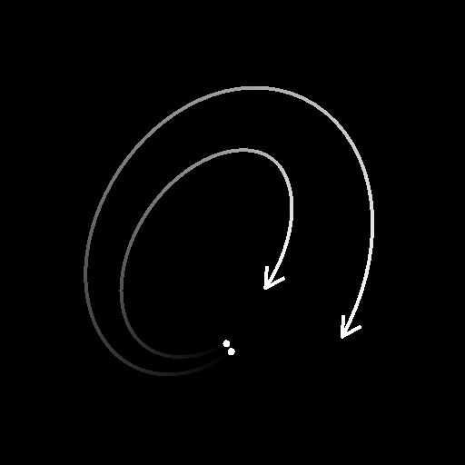

# Spline-Flow-Mapper

<table>
<tr style="border: 0;">
<td width="33.33%" style="border: 0;" valign="top">

<b>In:</b> Spline &amp; Path Tools > Spline-Werkzeuge

</td>
<td width="100.00%" style="border: 0;" valign="top">

## Beschreibung

Zeichnet eine Flow Map, in der Flussvektordaten entlang der Eingabe-Splines gezeichnet werden.

Mit Splines kannst du die Richtung, die Trajektorie, die Intensität und die Thickness des Flows steuern. Außerdem kannst du die Verlaufsrampe verwenden, mit der die gezeichneten Daten in den neutralen Hintergrund überblendet werden.

</td>
</tr>
</table>

>[!IMPORTANT]
>
> Das Ergebnis kann unerwünschte Artefakte außerhalb der Hülle des Spline-Effekts sein, wenn sehr niedrige Werte für die Thickness verwendet werden. Dies ist ein bekanntes Problem.

## Eingaben

|  |  |
|:---|:---|
| <b>Spline-Kabel</b> <i>Farbe</i> | Die Koordinaten der in den RGBA-Kanälen eines Farbbildes codierten Punkte der Eingabesplines: <b>R</b> - X position <b>G</b> - Y position <b>B</b> - Height <b>A</b> - Packed data: - Sign: Spline ist geschlossen (negativ) oder offen (positiv); - Absolute Wert: Thickness + 1. |
| <b>Spline-Daten</b> <i>Farbe</i> | Zusätzliche Daten der Eingabe-Splines, die in den RGBA-Kanälen eines Farbbildes codiert sind. <b>R</b> - Tangenten X <b>G</b> - Tangenten Y <b>B</b> - Nicht verwendet <b>A</b> - Nicht verwendet |
| <b>Spline-Betrag</b> <i>Integer</i> | Die Anzahl der Eingabe-Splines. |
| <b>Dämpfungsprofilkurve</b> <i>Graustufen</i> | Das Bild, das eine Kurve anhand der Werte der ersten Pixelzeile beschreibt. Wenn der Parameter &quot;Dämpfungsprofil&quot; auf &quot;Eingangsprofilkurve&quot; eingestellt ist, wird mit dieser Eingabe die Verlaufsrampe für die Dämpfung der Flussvektordaten gesteuert, die entlang des Splines gezeichnet werden. Sie können einen Knoten vom Typ [Kurve](../../../../../../compositing-graphs/nodes-reference-for-com/atomic-nodes/curve/curve.md) verwenden, um die Kurve zu erstellen. |

## Ausgaben

|  |  |
|:---|:---|
| <b>Ausgabe</b> <i>Farbe</i> | Die in einem Farbbild codierte Ausgabestromzuordnung. |

## Parameter

|  |  |
|:---|:---|
| <b>Segmentierungsbetrag</b> <i>Integer</i> | Splines werden in Segmente vereinfacht, bevor sie von Vektor-Flussdaten durchlaufen werden. Eine größere Anzahl von Segmenten führt zu einer glatteren Flusszuordnung entlang von Kurven. |
| <b>Modus</b> <i>Integer</i> | Die Methode zum Auswählen der Splines, entlang denen Vektordatensätze gezeichnet werden sollen:   - <i>Spline-Liste zeichnen</i>: Alle Splines in der Eingabeliste werden verwendet; - <i>Einzelne Spline zeichnen</i>: Nur der Spline mit dem angegebenen Index wird verwendet; - <i>Spline-Bereich zeichnen</i>: Es werden nur die Splines verwendet, deren Index im angegebenen Bereich enthalten ist. |
| <b>Spline-Index zeichnen</b> <i>Ganzzahl</i> (verfügbar, wenn &quot;Modus&quot; auf &quot;Einzelne Spline zeichnen&quot; festgelegt ist) | Der Index der Spline, entlang der Daten für den Vektorfluss gezeichnet werden sollen. |
| <b>Spline-Bereich zeichnen</b> <i>Ganzzahl2</i> (verfügbar, wenn &quot;Modus&quot; auf &quot;Spline-Bereich zeichnen&quot; festgelegt ist) | Der Bereich der Indizes für die Splines, entlang denen Vektor-Flussdaten gezeichnet werden sollen. |
| <b>Thickness-Modus</b> <i>Integer</i> | Die Methode zum Festlegen der Thickness der gezeichneten Vektordatenstromdaten   - <i>Manuell</i>: Legen Sie die Thickness explizit mit einem beliebigen Wert fest; - <i>Von Spline</i>: Verwenden Sie die Thickness des Splines. |
| <b>Thickness</b> <i>Fließkommazahl</i> (verfügbar, wenn &quot;Thickness-Modus&quot; auf &quot;Manuell&quot; festgelegt ist) | Der beliebige Wert für die Thickness der entlang der Splines gezeichneten Vektor-Flussdaten. |
| <b>Thicknessen-Multiplikator</b> <i>Fließkommazahl</i> (verfügbar, wenn &quot;Thickness-Modus&quot; auf &quot;Von Spline&quot; festgelegt ist) | Ein globaler Multiplikator für die Thickness der entlang der Splines gezeichneten Vektor-Flussdaten, wenn diese Thickness von der der Splines gesteuert wird. |
| <b>Richtung</b> <i>Integer</i> | Die Richtung des Vektorflusses in Bezug auf den Spline.  - <i>Tangente</i>: Verwenden Sie den Spline-Tangente-Vektor; - <i>Normal</i>: Verwenden Sie den normalen Vektor des Splines; - <i>Normal gespiegelt</i>: Verwenden Sie die gespiegelte Version des normalen Vektors des Splines. |
| <b>Richtung spiegeln</b> <i>Boolesche Wert</i> | Kehrt die Richtung der Splines um, was sich auch auf die Richtung des Flussvektors auswirkt. |
| <b>Dämpfungsprofil</b> <i>Ganzzahl</i> | Die Verlaufsrampe, die zum Zeichnen der Dämpfung der Flussvektordaten verwendet wird, die entlang der Spline gezeichnet werden:  - <i>Linear</i>: Einen linearen Verlauf verwenden; - <i>Gaußsch</i>: Gaußsche Verlaufsrampe verwenden - <i>Eingangsprofilkurve </i>: Verwenden Sie die Kurve für den Eingang der Dämpfungsprofilkurve als Verlaufsrampe. |
| <b>Dämpfung starten</b> <i>Boolesche Wert</i> | Fügt einen Halbkreis am Anfang des Splines hinzu. Der Halbkreis verwendet die gleiche Dämpfung wie der Spline. |
| <b>Enddämpfung</b> <i>Boolesche Wert</i> | Fügt einen Halbkreis am Ende des Splines hinzu. Der Halbkreis verwendet die gleiche Dämpfung wie der Spline. |
| <b>Spline-Height-Dämpfung</b> <i>Fließkommazahl</i> | Die Intensität der Flussvektordaten, die entlang der Spline gezeichnet werden, wird mit dem Height der Spline multipliziert, wobei die gezeichneten Daten an die neutrale Hintergrundfarbe (0,5, 0,5, 0) übergehen, wenn das Height näher an 0 kommt. |
| <b>Nicht-quadratische Korrektur</b> <i>Boolesche Wert</i> | Passen Sie die Punktpositionen und die Thickness an, um die Spline-Form in nicht quadratischen Auflösungen beizubehalten. Dies wirkt sich auch auf die einheitliche Verteilung aus. |

## Beispiele

<table>
<tr style="border: 0;">
<td style="border: 0;" valign="top">

<table>
  <tr>
    <td>
      
       <i>Vorher</i>
    </td>
    <td>
      
       <i>Nach</i>
    </td>
  </tr>
</table>

</td>
<td style="border: 0;" valign="top">

</td>
</tr>
</table>
