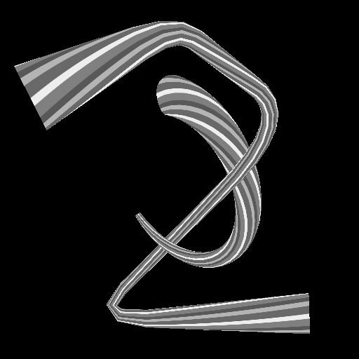

# Spline Mapper Graustufen

<table>
<tr style="border: 0;">
<td width="33.33%" style="border: 0;" valign="top">

<b>In:</b> Spline &amp; Path Tools > Spline-Werkzeuge

</td>
<td width="100.00%" style="border: 0;" valign="top">

## Beschreibung

Ordnet ein Graustufenbild einer Grundform zu, die entlang der Eingabesplines gestreckt ist.

Die Grundform kann eine Ebene, ein Halbzylinder oder ein Zylinder sein. Die Zylinder können entlang der Spline verdreht werden, um das abgebildete Bild entsprechend zu verformen.

</td>
</tr>
</table>

Der Knoten gibt das zugeordnete Bild als Graustufenbild sowie weitere Informationen wie Height, UVs (d. h. Bildkoordinaten) und eine ID-Maske aus, mit der jeder zugeordnete Spline einzeln ausgewählt werden kann.

>[!IMPORTANT]
>
> Das Ergebnis kann unerwünschte Artefakte außerhalb der Hülle des Spline-Effekts sein, wenn sehr niedrige Werte für die Thickness verwendet werden. Dies ist ein bekanntes Problem.

>[!NOTE]
>
> Siehe auch [Spline Mapper Color](../../../../../../compositing-graphs/nodes-reference-for-com/node-library/spline-paths-tools/spline-tools/spline-mapper-color/spline-mapper-color.md).

## Eingaben

|  |  |
|:---|:---|
| <b>Spline-Kabel</b> <i>Farbe</i> | Die Koordinaten der in den RGBA-Kanälen eines Farbbildes codierten Punkte der Eingabesplines: <b>R</b> - X-Position <b>G</b> - Y-Position <b>B</b> - Height <b>A</b> - Packed data:  - Sign: Spline ist geschlossen (negativ) oder offen (positiv);  - Absolute Wert: Thickness + 1. |
| <b>Spline-Daten</b> <i>Farbe</i> | Zusätzliche Daten der Eingabe-Splines, die in den RGBA-Kanälen eines Farbbildes codiert sind. <b>R</b> - Tangenten X <b>G</b> - Tangenten Y <b>B</b> - Nicht verwendet <b>A</b> - Nicht verwendet |
| <b>Spline-Betrag</b> <i>Integer</i> | Die Anzahl der Eingabe-Splines. |
| <b>Farbzuordnung</b> <i>Graustufen</i> | Das Eingabe-Graustufenbild, das entlang der Eingabe-Splines zugeordnet werden soll. |
| <b>Height-Map</b> <i>Graustufen</i> | Die Graustufen-Höhen-Map für die Eingabe, die entlang der Eingabe-Splines zugeordnet werden soll. |
| <b>Twist Curve</b> <i>Graustufen</i> | Das Bild, das eine Kurve anhand der Werte der ersten Pixelzeile beschreibt. Wenn der Parameter <b>Form</b> auf <i>Halbzylinder</i> oder <i>Zylinder</i> festgelegt ist, wird diese Eingabe verwendet, um die Verdrillung der UVs um die Form herum zu steuern. Die Auswirkungen werden mithilfe des Parameters <b>UVs-Kurvenmultiplikator verdrehen</b> gesteuert. Die Kurve stellt ein Profil für den Umfang der Drehung entlang der Spline bereit, wobei das erste Pixel in der Zeile die Drehung am Anfang der Spline und das letzte die Drehung am Ende ist. Der Graustufenwert stellt eine Anzahl von Windungen dar. Sie können einen Knoten vom Typ [Kurve](../../../../../../compositing-graphs/nodes-reference-for-com/atomic-nodes/curve/curve.md) verwenden, um die Kurve zu erstellen. |

## Ausgaben

|  |  |
|:---|:---|
| <b>Farbe</b> <i>Graustufen</i> | Das Ergebnis der Zuordnung des Farbeingabebilds über die Eingabe-Splines als Graustufenbild. |
| <b>Height</b> <i>Graustufen</i> | Das Ergebnis der Zuordnung des Height-Eingabebilds über die Eingabe-Splines als Graustufenbild. |
| <b>UV</b> <i>Farbe</i> | Die UVs (d. h. Koordinaten) der Zuordnung über die Eingabe-Splines hinweg, codiert in einem Farbbild. |
| <b>ID</b> <i>Graustufen</i> | Eine Maske der Bilder, die entlang der Eingabe-Splines zugeordnet sind, wobei die weißen Werte von einem Spline zum nächsten um 1 erhöht werden, sodass jede Form unabhängig ausgewählt werden kann. |

## Parameter

|  |  |
|:---|:---|
| <b>Segmentierungsbetrag</b> <i>Integer</i> | Splines werden in Segmente vereinfacht, bevor Bildkoordinaten sie durchlaufen. Eine höhere Anzahl von Segmenten führt zu einer glatteren Zuordnung entlang Kurven. |
| <b>UVs automatisch skalieren</b> <i>Boolescher Wert</i> | Passt die Skalierung der Koordinaten automatisch an, um ein quadratisches Bild beizubehalten, wenn es den Splines zugeordnet wird. |
| <b>UV-Skalierung</b> <i>Float2</i> | Passt die Skalierung der zugeordneten Koordinaten in X (horizontal) und Y (vertikal) an. Höhere Werte führen zu einem dichter gekachelten Bild. |
| <b>Modus</b> <i>Integer</i> | Die Methode zum Auswählen der Splines, entlang denen das Bild zugeordnet werden soll:  - <i>Spline-Liste zeichnen</i>: Alle Splines in der Eingabeliste werden verwendet; - <i>Einzelne Spline zeichnen</i>: Nur der Spline mit dem angegebenen Index wird verwendet; - <i>Spline-Bereich zeichnen</i>: Es werden nur die Splines verwendet, deren Index im angegebenen Bereich enthalten ist. |
| <b>Spline-Index zeichnen</b> <i>Integer</i> | (Verfügbar, wenn &quot;Modus&quot; auf &quot;Einzelne Spline zeichnen&quot; eingestellt ist) Der Index der Spline, entlang der das Bild zugeordnet werden soll. |
| <b>Spline-Bereich zeichnen</b> <i>Integer2</i> | (Verfügbar, wenn &quot;Modus&quot; auf &quot;Spline-Bereich zeichnen&quot; eingestellt ist) Der Indexbereich für die Splines, entlang denen das Bild zugeordnet werden soll. |
| <b>Start</b> <i>Gleitend</i> | Versetzt den Anfang des Abschnitts des Spline-Effekts, der zugeordnet werden soll. Der Wert stellt die normalisierte Länge des Splines dar. |
| <b>Ende</b> <i>Gleitend</i> | Versetzt das Ende des Abschnitts des Spline-Effekts, der zugeordnet werden soll. Der Wert stellt die normalisierte Länge des Splines dar. |
| <b>Thickness-Modus</b> <i>Integer</i> | Die Methode zum Festlegen der Thickness des zugeordneten Bildes:  - <i>Manuell</i>: Legen Sie die Thickness explizit mit einem beliebigen Wert fest; - <i>Von Spline</i>: Verwenden Sie die Thickness des Splines. |
| <b>Thickness</b> <i>Gleitend</i> | (Verfügbar, wenn &quot;Thickness-Modus&quot; auf &quot;Manuell&quot; eingestellt ist) Der willkürliche Wert für die Thickness des zugeordneten Bildes entlang der Splines. |
| <b>Thicknessen-Multiplikator</b> <i>Gleitend</i> | (Verfügbar, wenn &quot;Thickness-Modus&quot; auf &quot;Von Spline&quot; eingestellt ist) Ein globaler Multiplikator für die Thickness des zugeordneten Bildes entlang der Splines, wenn diese Thickness von der der Splines gesteuert wird. |
| <b>Form</b> <i>Integer</i> | Die primitive Form, die zum Zuordnen von Bildkoordinaten entlang der Splines verwendet wird: - <i>Ebene</i>: Koordinaten werden einer flachen Ebene zugeordnet; - <i>Halbzylinder</i>: Koordinaten werden einem Halbzylinder zugeordnet, dessen Achse des Grundkreises der Spline-Richtung folgt; - <i>Zylinder</i>: Koordinaten werden einem Zylinder zugeordnet, dessen Grundkreisrichtung der Achse der Spline folgt. |
| <b>Zylinder-Height-Multiplikator</b> <i>Gleitend</i> | (Verfügbar, wenn &quot;Form&quot; auf &quot;Halbzylinder&quot; oder &quot;Zylinder&quot; eingestellt ist) Ein Multiplikator für die Intensität des Zylinderbeitrags zum Height in der Height-Ausgabe.  Height-Anpassungen sind kumulativ. |
| <b>Versatz des Heights des Zylinders</b> <i>Gleitend</i> | (Verfügbar, wenn &quot;Form&quot; auf &quot;Halbzylinder&quot; oder &quot;Zylinder&quot; eingestellt ist) Versetzt den Mittelpunkt des Zylinder- oder Halbzylinder-Formenprofils von der Oberfläche des Splines auf einen Durchmesser unter der Oberfläche. |
| <b>UVs-Intensität verdrehen</b> <i>Gleitend</i> | (Verfügbar, wenn &quot;Form&quot; auf &quot;Halbzylinder&quot; oder &quot;Zylinder&quot; eingestellt ist) Die Verdrehung der Bildkoordinaten um den Zylinder in der Anzahl der Windungen. Beim Drehen wird der Zylinder nur am Ende der Spline gedreht. Die Drehung wird dann entlang der Spline interpoliert. |
| <b>UVs-Kurvenmultiplikator verdrehen</b> <i>Gleitend</i> | (Verfügbar, wenn &quot;Form&quot; auf &quot;Halbzylinder&quot; oder &quot;Zylinder&quot; eingestellt ist) Ein Multiplikator für die Intensität des Eingangswerts der Twist Curve für die Drehung des Zylinders. Die Kurve stellt ein Profil für den Umfang der Drehung entlang der Spline bereit, wobei das erste Pixel in der Zeile die Drehung am Anfang der Spline und das letzte die Drehung am Ende ist. Der Graustufenwert stellt eine Anzahl von Windungen dar. |
| <b>UVs-Kurvenversatz verdrehen</b> <i>Gleitend</i> | (Verfügbar, wenn &quot;Form&quot; auf &quot;Halbzylinder&quot; oder &quot;Zylinder&quot; eingestellt ist) Wendet einen globalen Versatz auf die von der Twist Curve bereitgestellten Drehungswerte in Drehungen an. |
| <b>Spline-Height-Multiplikator</b> <i>Gleitend</i> | Passt die Intensität des Beitrags des Spline-Heights zur Height-Ausgabe an.  Height-Anpassungen sind kumulativ. |
| <b>Eingabe-Height-Multiplikator</b> <i>Gleitend</i> | Passt die Intensität des Höhen-Map-Eingangs an der Height-Ausgabe an.  Height-Anpassungen sind kumulativ. |
| <b>Nicht-quadratische Korrektur</b> <i>Boolescher Wert</i> | Passen Sie die Punktpositionen und die Thickness an, um die Spline-Form in nicht quadratischen Auflösungen beizubehalten. Dies wirkt sich auch auf die einheitliche Verteilung aus. |

## Beispiele

<table>
<tr style="border: 0;">
<td style="border: 0;" valign="top">

<table>
  <tr>
    <td>
      
       <i>Vorher</i>
    </td>
    <td>
      
       <i>Nach</i>
    </td>
  </tr>
</table>

</td>
<td style="border: 0;" valign="top">

</td>
</tr>
</table>

<table>
<tr style="border: 0;">
<td style="border: 0;" valign="top">

</td>
<td style="border: 0;" valign="top">

</td>
</tr>
</table>
