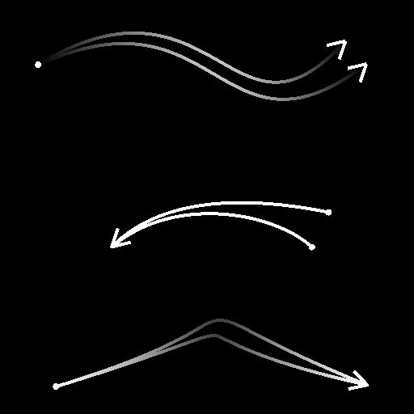

# Spline-Zusammenführungsliste

<table>
<tr style="border: 0;">
<td width="33.33%" style="border: 0;" valign="top">

<b>In:</b> Spline &amp; Path Tools > Spline-Werkzeuge

</td>
<td width="100.00%" style="border: 0;" valign="top">

## Beschreibung

Fügt alle Splines in der Eingabeliste zu einem einzigen Spline zusammen.

</td>
</tr>
</table>

## Eingaben

|  |  |
|:---|:---|
| <b>Spline-Kabel</b> <i>Farbe</i> | Die Koordinaten der in den RGBA-Kanälen eines Farbbildes codierten Punkte der Eingabesplines: <b>R</b> - X-Position <b>G</b> - Y-Position <b>B</b> - Height <b>A</b> - Packed data:  - Sign: Spline ist geschlossen (negativ) oder offen (positiv);  - Absolute Wert: Thickness + 1. |
| <b>Spline-Daten</b> <i>Farbe</i> | Zusätzliche Daten der Eingabe-Splines, die in den RGBA-Kanälen eines Farbbildes codiert sind. <b>R</b> - Tangenten X <b>G</b> - Tangenten Y <b>B</b> - Nicht verwendet <b>A</b> - Nicht verwendet |
| <b>Spline-Betrag</b> <i>Integer</i> | Die Anzahl der Eingabe-Splines. |

## Ausgaben

|  |  |
|:---|:---|
| <b>Vorschau</b> <i>Graustufen</i> | Die Vorschau der zusammengeführten Splines als Graustufenbild. |
| <b>Spline-Kabel</b> <i>Farbe</i> | Die Koordinaten der Punkte der zusammengeführten Splines, die in den RGBA-Kanälen eines Farbbildes codiert sind. <b>R</b> - X-Position <b>G</b> - Y-Position <b>B</b> - Height <b>A</b> - Packed data:  - Sign: Spline ist geschlossen (negativ) oder offen (positiv);  - Absolute Wert: Thickness + 1. |
| <b>Spline-Daten</b> <i>Farbe</i> | Zusätzliche Daten der zusammengeführten Splines, die in den RGBA-Kanälen eines Farbbildes codiert sind. <b>R</b> - Tangenten X <b>G</b> - Tangenten Y <b>B</b> - Nicht verwendet <b>A</b> - Nicht verwendet |
| <b>Spline-Betrag</b> <i>Integer</i> | Die Anzahl der zusammengeführten Splines. |

## Parameter

|  |  |
|:---|:---|
| <b>Schwellenwert für geschlossene Spline-Distanz</b> <i>Gleitend</i> | Der Abstand im Textur-Raum, unterhalb dessen zwei Enden eines Splines als ein Punkt verarbeitet werden, der diesen Spline schließt. Dies verhindert Überlappungen beim Streuen von Formen oder beim Zuordnen von Bildern entlang der Splines. |
| <b>Vorschau</b> |  |
| <b>Segmentierungsbetrag</b> <i>Integer</i> | Passt die Anzahl der Segmente an, die zum Zeichnen der Spline-Visualisierung in der Vorschauausgabe verwendet werden. Ein höherer Wert führt zu einer glatteren Linie. |
| <b>Richtungshelfer anzeigen</b> <i>Boolescher Wert</i> | Zeigt einen Punkt am Anfang des Splines und eine Pfeilspitze an seinem Ende in der Vorschauausgabe an. |
| <b>Umschlag der Thickness anzeigen</b> <i>Boolescher Wert</i> | Zeigt an den Kanten der Spline-Thickness zusätzliche Linien an. |
| <b>Thickness (px)</b> <i>Gleitend</i> | Passt die Thickness der Spline-Visualisierung in Pixel in der Vorschau an. |

## Beispiele

<table>
<tr style="border: 0;">
<td style="border: 0;" valign="top">

<table>
  <tr>
    <td>
      
       <i>Vorher</i>
    </td>
    <td>
      
       <i>Nach</i>
    </td>
  </tr>
</table>

</td>
<td style="border: 0;" valign="top">

<table>
  <tr>
    <td>
      
       <i>Vorher</i>
    </td>
    <td>
      
       <i>Nach</i>
    </td>
  </tr>
</table>

</td>
</tr>
</table>

