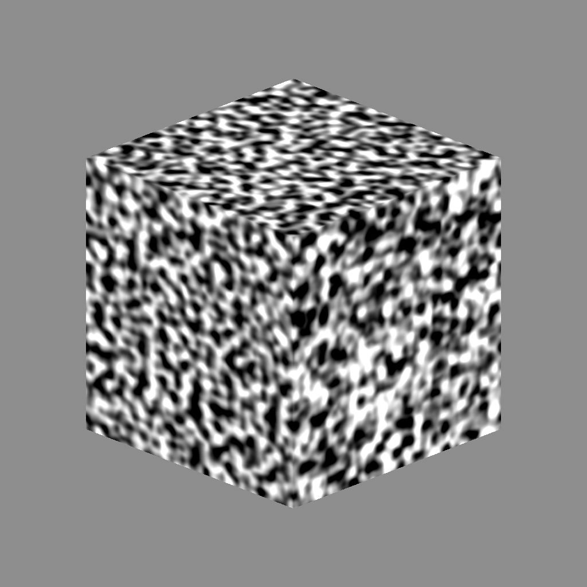

# 3D Perlin Rauschen

<table>
<tr style="border: 0;">
<td width="41.60%" style="border: 0;" valign="top">

{width="200px"}

**In:** *Texturgeneratoren**/Noises*

**Fortgeschrittene**

</td>
<td width="58.30%" style="border: 0;" valign="top">

## Beschreibung

Der Knoten **3D Perlin Rauschen** generiert eine Perlin-Rauschen im 3D-Raum auf der Grundlage der Eingabe **Positionszuordnung**.

Dieser Knoten kann mit [Cube 3D GBuffers](../../../../../../compositing-graphs/nodes-reference-for-com/node-library/texture-generators/patterns/cube-3d-gbuffers/cube-3d-gbuffers.md) als Eingabe anstelle einer tatsächlichen durch Baking erzeugte Map (wie im folgenden Beispielbild) getestet werden.

>[!WARNING]
>
> Dieses Geräusch soll nur mit dem *GPU-Modul verwendet werden* (d. h. **Direct3D** oder **OpenGL**). Wechseln Sie zu **Extras > Modul wechseln...** oder drücken Sie die Taste **F9**, um das gewünschte Modul auszuwählen.

</td>
</tr>
</table>

## Parameter

* **Umkehren** *Boolesche Wert*\
  Kehrt das Ausgabebild um.
* **Skalierung** *Fließkommazahl*\
  Steuert die Skalierung der 3D-Perlin-Rauschen.
* **Größe** *Fließkommazahl3*\
  Steuert die Größe der 3D-Perlin-Rauschen in den Achsen **X**, **Y** und **Z**. Nicht einheitliche Werte führen zu einem *Dehnungs- oder Squashing*-Effekt.
* **Offset** *Float3*\
  Wendet einen Offset auf die *Position* der 3D-Perlin-Rauschen in den Achsen **X**, **Y** und **Z** an.
* **Intensität der Verzerrung** *Gleitend*\
  Steuert die Intensität eines *Verkrümmungseffekts*, der auf der 3D-Perlin-Rauschen angewendet wird.
* **Verzerrung-Skalierungsmultiplikator** *Fließkommazahl*\
  Steuert die Skalierung des *sich verformenden Musters*, das im Verkrümmungseffekt verwendet wird, der durch die **Intensität der Verzerrung** gesteuert wird.
* **Grundlinie** *Fließkommazahl*\
  Wendet einen *offset* auf den Basiswert *Luminanz* für die Werteverteilung der 3D-Perlin-Rauschen an.
* **Kontrast** *Fließkommazahl*\
  Passt den Kontrast der 3D-Perlin-Rauschen an.
* **Absolut** *Boolesche Wert*\
  Verwendet absolute Werte auf der 3D-Perlin-Rauschen. Dadurch wird *die Wertverteilung für die Werte* unter 0,5 *effektiv umgekehrt*.
* **Kachelung aktivieren** *Boolesche Wert*\
  Passt die 3D-Perlin-Rauschen so an, dass sich das resultierende Muster *in X-, Y- und Z-Achse wiederholt*.

## Beispielbilder

<table>
<tr style="border: 0;">
<td style="border: 0;" valign="top">

{width="256px"}

</td>
<td style="border: 0;" valign="top">

{width="256px"}

</td>
<td style="border: 0;" valign="top">

{width="256px"}

</td>
</tr>
</table>
