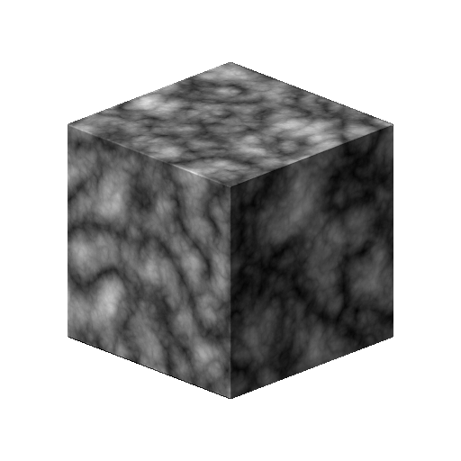

# 3D-Fraktal mit verkipptem Rauschen

<table>
<tr style="border: 0;">
<td width="41.60%" style="border: 0;" valign="top">

{width="200px"}

**In:** *Texturgeneratoren**/Noises*

**Fortgeschrittene**

</td>
<td width="58.30%" style="border: 0;" valign="top">

## Beschreibung

Der Knoten **3D Ridge Noise Fractal** generiert ein *fraktales* Ridge-Rauschen im 3D-Raum basierend auf der **Positionszuordnung**-Eingabe.

Dieser Knoten kann mit [Cube 3D GBuffers](../../../../../../compositing-graphs/nodes-reference-for-com/node-library/texture-generators/patterns/cube-3d-gbuffers/cube-3d-gbuffers.md) als Eingabe anstelle einer tatsächlichen durch Baking erzeugte Map (wie im folgenden Beispielbild) getestet werden.

>[!WARNING]
>
> Dieses Geräusch soll nur mit dem *GPU-Modul verwendet werden* (d. h. **Direct3D** oder **OpenGL**). Wechseln Sie zu **Extras > Modul wechseln...** oder drücken Sie die Taste **F9**, um das gewünschte Modul auszuwählen.

</td>
</tr>
</table>

## Parameter

* **Umkehren** *Boolesche Wert*\
  Kehrt das Ausgabebild um.
* **Skalierung** *Fließkommazahl*\
  Steuert die Skalierung des fraktalen 3D-Rauschens mit Ridge.
* **Größe** *Fließkommazahl3*\
  Steuert die Größe des fraktalen 3D-Ridge-Rauschens in den Achsen **X**, **Y** und **Z**. Nicht einheitliche Werte führen zu einem *Dehnungs- oder Squashing*-Effekt.
* **Offset** *Float3*\
  Wendet einen Offset auf die *Position* des fraktalen 3D-Rauschens mit Ridge in den Achsen **X**, **Y** und **Z** an.
* **Intensität der Verzerrung** *Gleitend*\
  Steuert die Intensität eines *Verkrümmungseffekts*, der auf das fraktale 3D-Rauschen mit Ridge angewendet wird.
* **Verzerrung-Skalierungsmultiplikator** *Fließkommazahl*\
  Steuert die Skalierung des *sich verformenden Musters*, das im Verkrümmungseffekt verwendet wird, der durch die **Intensität der Verzerrung** gesteuert wird.
* **Min Level** *Ganzzahl*\
  Die minimale *Wiederholungsstufe*, die im fraktalen Muster verwendet wird. Ein größerer Mindest-/Höchstbereich führt zu einem *reicheren Muster* mit Variationen in mehr Frequenzbereichen.
* **Max. Stufe** *Ganzzahl*\
  Die maximale *Wiederholungsstufe*, die im fraktalen Muster verwendet wird. Ein größerer Mindest-/Höchstbereich führt zu einem *reicheren Muster* mit Variationen in mehr Frequenzbereichen.
* **Rauheit** *Fließkommazahl*\
  Steuert die *Balance* zwischen niedrigen und hohen *Wiederholungsstufen* im fraktalen Muster.\
  *Hinweis*: Ein Wert von **0** führt zu einer Ausgabe, die *nicht in Zeile* enthält, auf die andere niedrige Werte folgen. Dies wird erwartet.
* **Lakunarität** *Gleitend*\
  Steuert, wie das angewendete fraktale Muster &quot;*&quot; Leerzeichen &quot;*&quot; ausfüllt. Ein *höherer* Wert führt zu *weniger Lücken* im Muster und einem *dichteren* Rauschen.
* **Globale Deckkraft** *Gleitend*\
  Steuert den *Bereich* der fraktalen 3D-Rauschwerte mit Ridge *um* den **Grundlinienwert**.
* **Grundlinie** *Fließkommazahl*\
  Wendet einen *Versatz* auf den Grundlinienwert *Luminanz* für die 3D-Rauschwertverteilung an.
* **Kontrast** *Fließkommazahl*\
  Passt den Kontrast des 3D-Rauschens mit gekräuselten Linien an.
* **Kachelung aktivieren** *Boolesche Wert*\
  Passt das 3D-Rauschen an, sodass sich das resultierende Muster ** in der X-, Y- und Z-Achse wiederholt.

## Beispielbilder

<table>
<tr style="border: 0;">
<td style="border: 0;" valign="top">

{width="256px"}

</td>
<td style="border: 0;" valign="top">

{width="256px"}

</td>
</tr>
</table>
