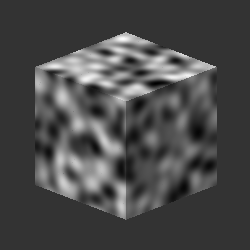

# Einfaches 3D-Rauschen

<table>
<tr style="border: 0;">
<td width="33.33%" style="border: 0;" valign="top">

{width="128px"}

<b>In:</b> Textur Generators > Rauschen

</td>
<td width="100.00%" style="border: 0;" valign="top">

## Beschreibung

Erzeugt ein prozedurales Rauschen, wenn eine eingebettete Positionsabbildung an den Eingangssteckplatz angeschlossen wird. Es ist nur für die Verwendung mit der GPU-Engine vorgesehen.\
Ähnlich wie [3D Perlin Noise](../../../../../../compositing-graphs/nodes-reference-for-com/node-library/texture-generators/noises/3d-perlin-noise/3d-perlin-noise.md), jedoch schneller und einfacher, für Fälle, in denen Leistung und Geschwindigkeit wichtig sind.

Dieses Rauschen kann mit [Cube 3D GBuffers](https://support.allegorithmic.com/documentation/display/SDDOC/Cube+3D+GBuffers) als Eingabe anstelle einer tatsächlichen durch Baking erzeugte Map (wie im folgenden Beispielbild) getestet werden.

</td>
</tr>
</table>

## Parameter

|  |  |
|:---|:---|
| <b>Skalierung</b> <i>0.0 - 64.0</i> | Legen Sie die globale Skalierung für den Effekt fest. |
| <b>Größe</b> <i>0.0 - 2.0</i> | Führen Sie eine ungleichmäßige Skalierung auf X-, Y- und Z-Achsen separat durch. |

## Beispiele

<table style="margin-top: 32px; margin-bottom: 32px">
    <tr style="border: 0">
        <td style="border: 0; background: transparent">
            
        </td>
    </tr>
</table>
