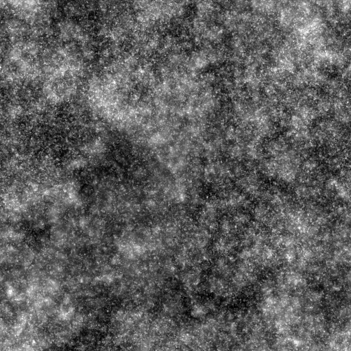

# BnW-Punkte 1

<table>
<tr style="border: 0;">
<td style="border: 0;" valign="top">

<table>
<tr style="border: 0;">
<td width="33.33%" style="border: 0;" valign="top">

{width="200px"}

<b>In:</b> Texturgeneratoren > Rauschen

</td>
<td width="100.00%" style="border: 0;" valign="top">

## Beschreibung

Eine Variation der groben <b>Schwarz-Weiß-Flecken (BnW)</b>, die Geräusche verursachen.

Siehe auch: [BnW-Punkte 2](../../../../../../compositing-graphs/nodes-reference-for-com/node-library/texture-generators/noises/bnw-spots-2/bnw-spots-2.md), [BnW-Punkte 3](../../../../../../compositing-graphs/nodes-reference-for-com/node-library/texture-generators/noises/bnw-spots-3/bnw-spots-3.md)

</td>
</tr>
</table>

## Ausgaben

|  |  |
| --- | --- |
| <b>Ausgabe</b> *Graustufen* | Das erzeugte Rauschen als Graustufen-Bitmap. |

## Parameter

|  |  |
| --- | --- |
| <b>Skalierung</b> Ganze Zahl | Die Unterteilung des Rasters, das zum Erzeugen der Rauschkacheln verwendet wird.    Ein höherer Wert führt dazu, dass mehr Kacheln gezeichnet werden und das Rauschen dichter ist. |
| <b>Störung</b> Float | Versetzt die Bestandteile des Rauschens.    So kannst du das Rauschen animieren. |
| <b>Störungsgeschwindigkeit</b> Gleitend | Passt den Abstand des Versatzes an, der vom <b>Disorder</b>-Parameter angewendet wird.    Mit dieser Option können Sie die Geschwindigkeit des Versatzes bei der Animation des Rauschens steuern. |
| <b>Disorder Anisotropie</b> Float | Steuert die Richtungsspanne des Versatzes, der vom <b>Disorder</b>-Parameter angewendet wird, wobei ein höherer Wert zu einer engeren, definierteren Richtung führt.    Die Anisotropie wird durch den Parameter <b>Disorder Direction Angle</b> gesteuert. |
| <b>Winkel der Anisotropie der Störung</b> Gleitend | Steuert die Richtung des Versatzes, der vom <b>Disorder</b>-Parameter angewendet wird, wenn der <b>Disorder Anisotropie</b>-Parameter nicht Null ist. |
| <b>Unregelmäßigkeit</b> Unregelmäßigkeit | Die Balance der Rauschoktaven, bei denen ein höherer Wert die Oktaven mit höherer Frequenz sichtbarer macht. |
| <b>Kachelversatz</b> Gleitkomma2 | Steuert die Position des Abschnitts der unendlichen Ebene, der zum Rendern des Rauschens verwendet wird. |
| <b>Nicht quadratische Erweiterung</b> Boolescher Wert | Bei nicht quadratischen Bildern bleibt das erzeugte Kachelquadrat erhalten und erweitert die Rauscherzeugung auf die Grenzen des Bildes. |

## Beispiele

<table>
<tr style="border: 0;">
<td style="border: 0;" valign="top">

{zoomable="yes"}

</td>
<td style="border: 0;" valign="top">

{zoomable="yes"}

</td>
</tr>
</table>

<table>
<tr style="border: 0;">
<td style="border: 0;" valign="top">

{zoomable="yes"}

</td>
<td style="border: 0;" valign="top">

{zoomable="yes"}

</td>
</tr>
</table>

</td>
<td style="border: 0;" valign="top">

</td>
<td style="border: 0;" valign="top">

</td>
</tr>
</table>
