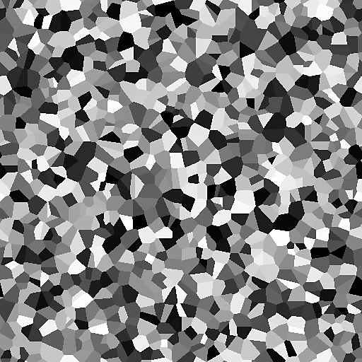

# ZELLEN 4

<table>
<tr style="border: 0;">
<td style="border: 0;" valign="top">

<table>
<tr style="border: 0;">
<td width="33.33%" style="border: 0;" valign="top">

{width="200px"}

<b>In:</b> Texturgeneratoren > Rauschen

</td>
<td width="100.00%" style="border: 0;" valign="top">

## Beschreibung

Eine Variation der <b>Zellen</b> von Walled Noise.

Jeder Zelle ist eine flache Farbe zugewiesen, die zufällig oder aus einem Eingabebild aufgenommen werden kann.

Siehe auch: [Zellen 1](../../../../../../compositing-graphs/nodes-reference-for-com/node-library/texture-generators/noises/cells-1/cells-1.md), [Zellen 2](../../../../../../compositing-graphs/nodes-reference-for-com/node-library/texture-generators/noises/cells-2/cells-2.md), [Zellen 3](../../../../../../compositing-graphs/nodes-reference-for-com/node-library/texture-generators/noises/cells-3/cells-3.md)

</td>
</tr>
</table>

<table>
<tr style="border: 0;">
<td style="border: 0;" valign="top">

### Eingaben

</td>
<td style="border: 0;" valign="top">

### Ausgaben

</td>
<td style="border: 0;" valign="top">

### Parameter

</td>
<td style="border: 0;" valign="top">

### Beispiele

</td>
</tr>
</table>

## Eingaben

|  |  |
| --- | --- |
| <b>Eingabe</b> *Graustufen* |  |

## Ausgaben

|  |  |
| --- | --- |
| <b>Ausgabe</b> *Graustufen* | Das erzeugte Rauschen als Graustufen-Bitmap. |

## Parameter

|  |  |
| --- | --- |
| <b>Skalierung</b> Ganze Zahl | Die Unterteilung des Rasters, das zum Erzeugen der Rauschkacheln verwendet wird.    Ein höherer Wert führt dazu, dass mehr Kacheln gezeichnet werden und das Rauschen dichter ist. |
| <b>Störung</b> Float | Versetzt die Bestandteile des Rauschens.    So kannst du das Rauschen animieren. |
| <b>Störungsgeschwindigkeit</b> Gleitend | Passt den Abstand des Versatzes an, der vom <b>Disorder</b>-Parameter angewendet wird.    Mit dieser Option können Sie die Geschwindigkeit des Versatzes bei der Animation des Rauschens steuern. |
| <b>Farbquelle</b> Ganze Zahl | Die Quelle der auf die Zellen angewendeten einheitlichen Farbe:<ul data-preserve-html="true"> <li data-preserve-html="true"><b><i>Zufällig:</i></b> Verwenden Sie eine zufällige Farbe, die durch die zufällige Seed des Knotens gesteuert wird.</li> <li data-preserve-html="true"><b><i>Pseudozufall:</i></b> Verwenden Sie eine zufällige Farbe, der ein separater Wert für den Benutzersatz zugewiesen ist</li> <li data-preserve-html="true"><b><i>Bildeingabe:</i></b> Verwenden der Farbe, die an der Zellenposition im Eingabebild aufgenommen wurde</li> </ul> |
| <b>Pseudorandom seed</b> Integer *Verfügbar, wenn &quot;Farbquelle&quot; auf &quot;Pseudorandom&quot; festgelegt ist* | Ermöglicht das Ändern des Startwerts für die Farbe getrennt vom Startwert des Knotens. |
| <b>Nicht quadratische Erweiterung</b> Boolescher Wert | Bei nicht quadratischen Bildern bleibt das erzeugte Kachelquadrat erhalten und erweitert die Rauscherzeugung auf die Grenzen des Bildes. |

## Beispiele

<table>
<tr style="border: 0;">
<td style="border: 0;" valign="top">

{zoomable="yes"}

</td>
<td style="border: 0;" valign="top">

{zoomable="yes"}

</td>
</tr>
</table>

</td>
<td style="border: 0;" valign="top">

</td>
<td style="border: 0;" valign="top">

</td>
</tr>
</table>
