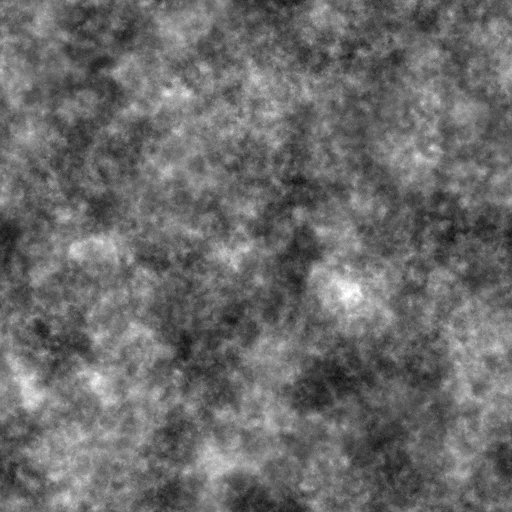
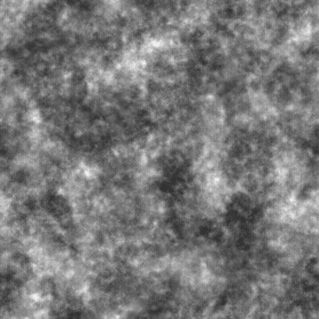

# Wolken 3

<table>
<tr style="border: 0;">
<td width="33.33%" style="border: 0;" valign="top">

{width="200px"}

<b>In:</b> Texturen-Generatoren > Rauschen

</td>
<td width="100.00%" style="border: 0;" valign="top">

## Beschreibung

Eine Variation der groben <b>Wolken</b>-Geräusche.

Siehe auch: [Wolken 1](../../../../../../compositing-graphs/nodes-reference-for-com/node-library/texture-generators/noises/clouds-1/clouds-1.md), [Wolken 2](../../../../../../compositing-graphs/nodes-reference-for-com/node-library/texture-generators/noises/clouds-2/clouds-2.md)

</td>
</tr>
</table>

## Ausgaben

|  |  |
|:---|:---|
| <b>Ausgabe</b> <i>Graustufen</i> | Das erzeugte Rauschen als Graustufen-Bitmap. |

## Parameter

|  |  |
|:---|:---|
| <b>Skalierung</b> <i>Integer</i> | Die Unterteilung des Rasters, der zum Generieren der Rauschen-Kacheln verwendet wird.    Ein höherer Wert führt dazu, dass mehr Kacheln gezeichnet werden und das Rauschen dichter ist. |
| <b>Störung</b> <i>Fließkommazahl</i> | Versetzt die Bestandteile des Rauschens.    So animierst du die Rauschen. |
| <b>Störungsgeschwindigkeit</b> <i>Fließkommazahl</i> | Passt den Abstand des Versatzes an, der vom <b>Disorder</b>-Parameter angewendet wird.    Mit dieser Option können Sie die Geschwindigkeit des Versatzes bei der Animation des Rauschens steuern. |
| <b>Anisotropie der Störung</b> <i>Gleitend</i> | Steuert die Richtungsspanne des Versatzes, der vom <b>Disorder</b>-Parameter angewendet wird, wobei ein höherer Wert zu einer engeren, definierteren Richtung führt.    Die Anisotropie wird durch den Parameter <b>Disorder Direction Angle</b> gesteuert. |
| <b>Disorder anisotropy angle</b> <i>Gleitend</i> | Steuert die Richtung des Versatzes, der vom <b>Disorder</b>-Parameter angewendet wird, wenn der <b>Disorder Anisotropie</b>-Parameter nicht Null ist. |
| <b>Kachelversatz</b> <i>Float2</i> | Steuert die Position des Abschnitts der unendlichen Ebene, der zum Rendern des Rauschens verwendet wird. |
| <b>Nicht quadratische Erweiterung</b> <i>Boolescher Wert</i> | Bei nicht quadratischen Bildern bleibt das erzeugte Kachelquadrat erhalten und erweitert die Rauscherzeugung auf die Grenzen des Bildes. |

## Beispiele

<table>
<tr style="border: 0;">
<td style="border: 0;" valign="top">

{zoomable="yes"}

</td>
<td style="border: 0;" valign="top">

{zoomable="yes"}

</td>
</tr>
</table>

<table>
<tr style="border: 0;">
<td style="border: 0;" valign="top">

{zoomable="yes"}

</td>
<td style="border: 0;" valign="top">

{zoomable="yes"}

</td>
</tr>
</table>
