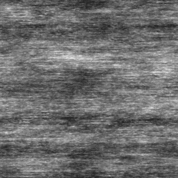

# RICHTUNGSRAUSCHEN 1

<table>
<tr style="border: 0;">
<td width="33.33%" style="border: 0;" valign="top">

{width="200px"}

<b>In:</b> Texturen-Generatoren > Rauschen

</td>
<td width="100.00%" style="border: 0;" valign="top">

## Beschreibung

Eine Variante der <b>Richtungsrauschen</b>-Rauschen.

Siehe auch: [Richtungsrauschen 2](../../../../../../compositing-graphs/nodes-reference-for-com/node-library/texture-generators/noises/directional-noise-2/directional-noise-2.md), [Richtungsrauschen 3](../../../../../../compositing-graphs/nodes-reference-for-com/node-library/texture-generators/noises/directional-noise-3/directional-noise-3.md), [Richtungsrauschen 4](../../../../../../compositing-graphs/nodes-reference-for-com/node-library/texture-generators/noises/directional-noise-4/directional-noise-4.md)

</td>
</tr>
</table>

## Ausgaben

|  |  |
|:---|:---|
| <b>Ausgabe</b> <i>Graustufen</i> | Die generierte Rauschen als Graustufen-Bitmap. |

## Parameter

|  |  |
|:---|:---|
| <b>Skalierung</b> <i>Ganzzahl</i> | Die Unterteilung des Rasters, der zum Generieren der Rauschen-Kacheln verwendet wird.    Ein höherer Wert führt dazu, dass mehr Kacheln gezeichnet werden und das Rauschen dichter ist. |
| <b>Störung</b> <i>Fließkommazahl</i> | Versetzt die Bestandteile der Rauschen.    So animierst du die Rauschen. |
| <b>Störungsgeschwindigkeit</b> <i>Fließkommazahl</i> | Passt den Abstand des Versatzes an, der vom <b>Disorder</b>-Parameter angewendet wird.    Dies kann verwendet werden, um die Geschwindigkeit des Versatzes bei der Animation des Rauschen zu steuern. |
| <b>Anisotropie der Störung</b> <i>Fließkommazahl</i> | Steuert die Richtungsspanne des Versatzes, der vom <b>Disorder</b>-Parameter angewendet wird, wobei ein höherer Wert zu einer engeren, definierteren Richtung führt.    Die Richtung wird durch den Parameter <b>Disorder anisotropy angle</b> gesteuert. |
| <b>Disorder anisotropy angle</b> <i>Fließkommazahl</i> | Steuert die Richtung des Versatzes, der vom <b>Disorder</b>-Parameter angewendet wird, wenn der Parameter &quot;Disorder Anisotropie&quot; nicht Null ist. |
| <b>Winkel</b> <i>Fließkommazahl</i> | Der Winkel, der zum Festlegen der Richtung des Rauschen verwendet wird, in der Anzahl der Windungen und ausgehend von der horizontalen rechten Seite. |
| <b>zufälliger Winkel</b> <i>Fließkommazahl</i> | Die maximale Anzahl zufälliger Variationen, die auf den Wert <b>Winkel</b> in der Anzahl der Windungen angewendet werden. |
| <b>Kachelversatz</b> <i>Fließkommazahl2</i> | Steuert die Position des Abschnitts der unendlichen Ebene, der zum Rendern des Rauschen verwendet wird. |
| <b>Nicht quadratische Erweiterung</b> <i>Boolesche Wert</i> | Behält bei nicht quadratischen Bildern das erzeugte Kachelquadrat bei und erweitert die Rauschen-Generation auf die Grenzen des Bildes. |

## Beispiele

<table>
<tr style="border: 0;">
<td style="border: 0;" valign="top">

{zoomable="yes"}

</td>
<td style="border: 0;" valign="top">

{zoomable="yes"}

</td>
</tr>
</table>

<table>
<tr style="border: 0;">
<td style="border: 0;" valign="top">

{zoomable="yes"}

</td>
<td style="border: 0;" valign="top">

{zoomable="yes"}

</td>
</tr>
</table>
