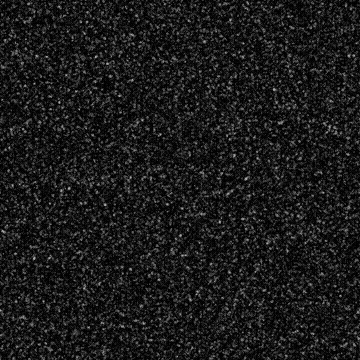
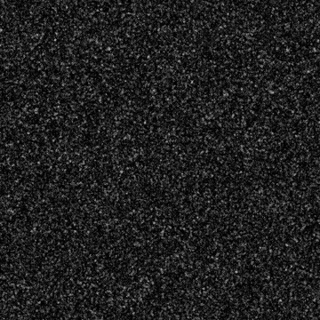

# DIRT 5

<table>
<tr style="border: 0;">
<td width="33.33%" style="border: 0;" valign="top">

{width="200px"}

<b>In:</b> Texturen-Generatoren > Rauschen

</td>
<td width="100.00%" style="border: 0;" valign="top">

## Beschreibung

Eine Variation der körnigen <b>Dirt</b>-Rauschen.

Siehe auch: [Dirt 1](../../../../../../compositing-graphs/nodes-reference-for-com/node-library/texture-generators/noises/dirt-1/dirt-1.md), [Dirt 2](../../../../../../compositing-graphs/nodes-reference-for-com/node-library/texture-generators/noises/dirt-2/dirt-2.md), [Dirt 3](../../../../../../compositing-graphs/nodes-reference-for-com/node-library/texture-generators/noises/dirt-3/dirt-3.md), [Dirt 4](../../../../../../compositing-graphs/nodes-reference-for-com/node-library/texture-generators/noises/dirt-4/dirt-4.md), [Dirt-Verlauf](../../../../../../compositing-graphs/nodes-reference-for-com/node-library/texture-generators/noises/dirt-gradient/dirt-gradient.md)

</td>
</tr>
</table>

## Ausgaben

|  |  |
|:---|:---|
| <b>Ausgabe</b> <i>Graustufen</i> | Die generierte Rauschen als Graustufen-Bitmap. |

## Parameter

|  |  |
|:---|:---|
| <b>Skalierung</b> <i>Ganzzahl</i> | Die Unterteilung des Rasters, der zum Generieren der Rauschen-Kacheln verwendet wird.    Ein höherer Wert führt dazu, dass mehr Kacheln gezeichnet werden und das Rauschen dichter ist. |
| <b>Störung</b> <i>Fließkommazahl</i> | Versetzt die Bestandteile der Rauschen.    So animierst du die Rauschen. |
| <b>Störungsgeschwindigkeit</b> <i>Fließkommazahl</i> | Passt den Abstand des Versatzes an, der vom <b>Disorder</b>-Parameter angewendet wird.    Dies kann verwendet werden, um die Geschwindigkeit des Versatzes bei der Animation des Rauschen zu steuern. |
| <b>Anisotropie der Störung</b> <i>Fließkommazahl</i> | Steuert die Richtungsspanne des Versatzes, der vom <b>Disorder</b>-Parameter angewendet wird, wobei ein höherer Wert zu einer engeren, definierteren Richtung führt.    Die Richtung wird durch den Parameter <b>Disorder anisotropy angle</b> gesteuert. |
| <b>Disorder anisotropy angle</b> <i>Fließkommazahl</i> | Steuert die Richtung des Versatzes, der vom <b>Disorder</b>-Parameter angewendet wird, wenn der <b>Disorder Anisotropie</b>-Parameter nicht Null ist. |
| <b>Kachelversatz</b> <i>Fließkommazahl2</i> | Steuert die Position des Abschnitts der unendlichen Ebene, der zum Rendern des Rauschen verwendet wird. |
| <b>Nicht quadratische Erweiterung</b> <i>Boolesche Wert</i> | Behält bei nicht quadratischen Bildern das erzeugte Kachelquadrat bei und erweitert die Rauschen-Generation auf die Grenzen des Bildes. |

## Beispiele

<table style="table-layout:fixed">
    <tr style="border: 0;">
        <td style="border: 0;">
            
        </td>
        <td style="border: 0;">
            
        </td>
        <td style="border: 0;">
            
        </td>
    </tr>
    <tr style="border: 0;">
        <td style="border: 0;">
            
        </td>
        <td style="border: 0;"></td>
        <td style="border: 0;"></td>
    </tr>
</table>
