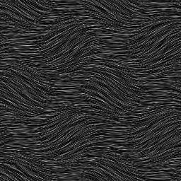

# Fur 2

<table>
<tr style="border: 0;">
<td width="33.33%" style="border: 0;" valign="top">

{width="128px"}

<b>In:</b> Texturgeneratoren > Rauschen

</td>
<td width="100.00%" style="border: 0;" valign="top">

## Beschreibung

Dadurch entsteht eine wellenförmige Art von pelzartigem Rauschen.

</td>
</tr>
</table>

## Parameter

|  |  |
|:---|:---|
| <b>Skalierung</b> <i>1 - 8</i> | Legt die globale Skalierung für den Effekt fest. |
| <b>Waves Scale</b> <i>0.0 - 1.0</i> | Ändert die Größe der Wellen. Größer bedeutet weniger Wiederholungen. |
| <b>Wellenrotation</b> <i>0.0 - 1.0</i> | Verdreht die Wellen mehr. Dieser Wert sollte wahrscheinlich niedrig gehalten werden, da die Ergebnisse extrem sein können. |
| <b>Quadratische Ausbreitung</b> <i>False/True</i> | Ermöglicht die Kompensation von Quetsch und Dehnung bei nicht quadratischen Verhältnissen. |

## Beispiele

<table style="margin-top: 32px; margin-bottom: 32px">
    <tr style="border: 0">
        <td style="border: 0; background: transparent">
            
        </td>
    </tr>
</table>
