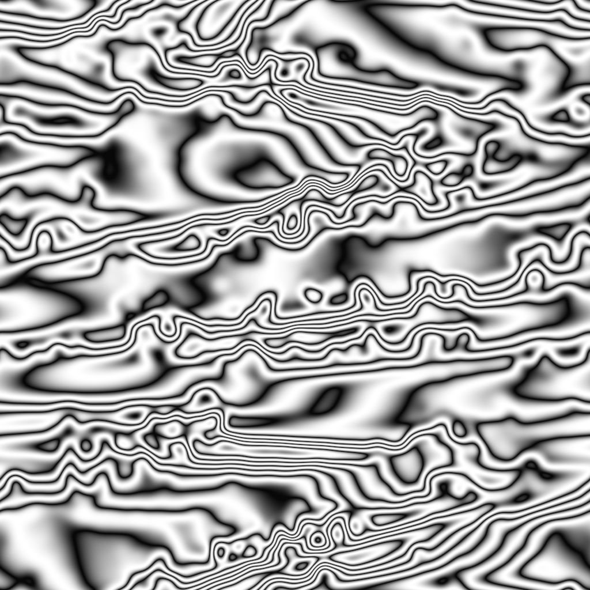

# Schmutz Damas

<table>
<tr style="border: 0;">
<td width="41.60%" style="border: 0;" valign="top">

{width="200px"}

**In:** *Texturgeneratoren**/Noises*

**Einfach**

</td>
<td width="58.30%" style="border: 0;" valign="top">

## Beschreibung

Der Knoten **Schmutz Damas** generiert eine Schmutz-Map, die einem Damaskus-Stahlmuster ähnelt.

</td>
</tr>
</table>

## Parameter

* **Balance** *Gleitend* Passt die Balance zwischen dunklen und hellen Werten an.
* **Kontrast** *Unverankert* Passt den Kontrast des Bildes an.
* **Umkehren** *Boolesch* Kehrt die Ausgabe des Bildes um, indem ein `1-x`-Vorgang verwendet wird.
* **Quadratische Ausbreitung** *Boolesch* Aktiviert die Kompensation von Squash- und Dehnungsverhältnissen mit nicht quadratischen Verhältnissen.
* Erweitert
  * **Verzerrung** *Unverankert* Passt die Verzerrung im Muster an.
  * **Divisionen** *Ganze Zahl* Passt die Anzahl der Divisionen oder Verlaufswiederholungen im Muster an.
  * **Wellen** *Ganze Zahl* Passt die Stärke der Wellen im Muster an.
  * **Details** *Fließend* Passt die Intensität der kleineren Verzerrungen an.
  * **Drehung zufällig** *Unverankert* Passt die Zufälligkeit der Drehung für jede Welle an.

## Beispielbilder

{width="256px"}
