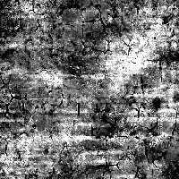

# Schmutz Map 011

<table>
<tr style="border: 0;">
<td width="33.33%" style="border: 0;" valign="top">

{width="128px"}

<b>In:</b> Textur Generators > Rauschen

</td>
<td width="100.00%" style="border: 0;" valign="top">

## Beschreibung

Dadurch wird eine komplexe, kombinierte Noisemap erzeugt. Es kann als detailliertes prozedurale sehr nützlich sein, aber beachten Sie, dass diese sehr leistungsintensiv und damit langsamer zu generieren sind.

</td>
</tr>
</table>

## Parameter

|  |  |
|:---|:---|
| <b>Risse</b> <i>0.0 - 1.0</i> |  |
| <b>Saldo</b> <i>0.0 - 1.0</i> | Verschiebt die Balance des Ergebnisses zwischen Schwarz und Weiß, wie bei einer Helligkeitsanpassung. |
| <b>Kontrast</b> <i>0.0 - 1.0</i> | Passt den Kontrast des Ergebnisses an. |
| <b>Umkehren</b> <i>False/True</i> | Kehrt das Ergebnis um. |
| <b>Pinselmuster</b> <i>0.0 - 1.0</i> | Fügt eine Maske um die Kanten hinzu, wenn sie als Alpha-Pinsel verwendet wird. |
| <b>Quadratische Ausbreitung</b> <i>False/True</i> | Ermöglicht die Kompensation von Squash und dehn mit nicht quadratischen Verhältnissen. |

## Beispiele

<table style="margin-top: 32px; margin-bottom: 32px">
    <tr style="border: 0">
        <td style="border: 0; background: transparent">
            
        </td>
    </tr>
</table>
