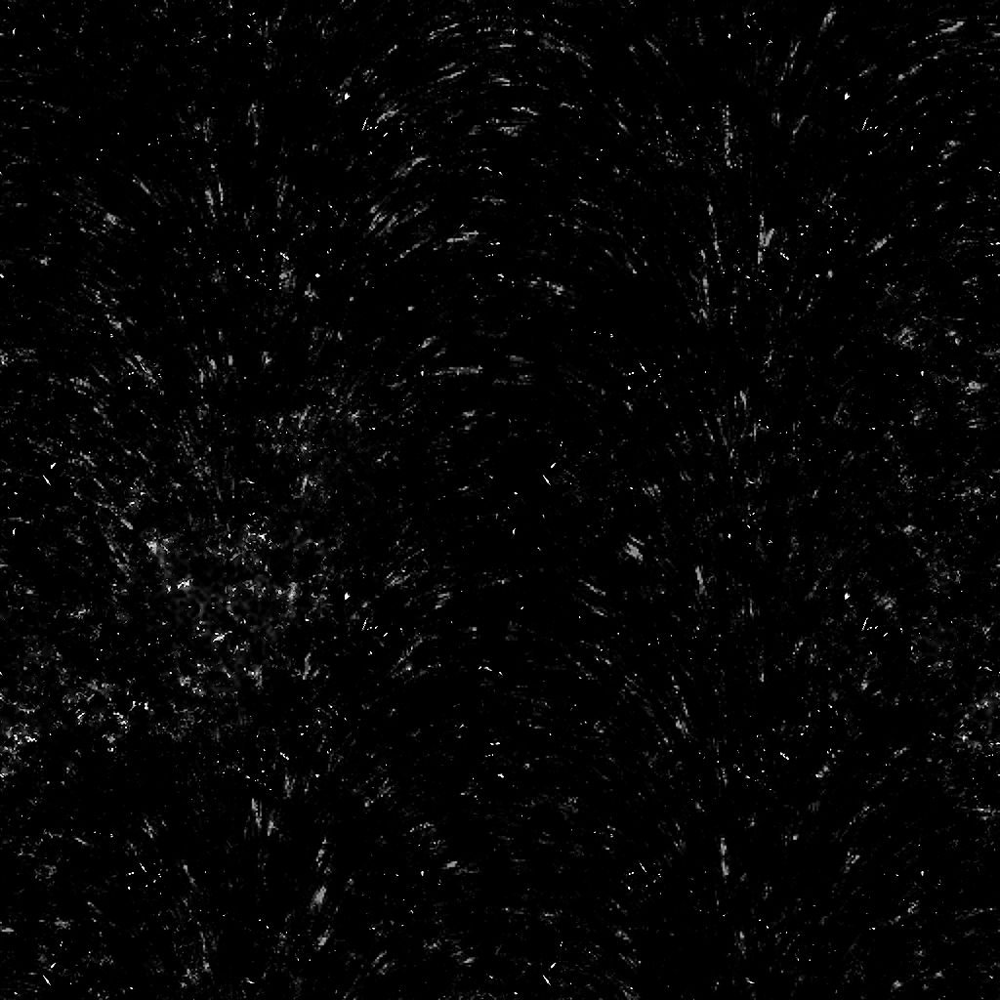

# Schmutz Shavings

<table>
<tr style="border: 0;">
<td width="33.33%" style="border: 0;" valign="top">

{width="200px"}

<b>In:</b> Textur Generators > Rauschen

</td>
<td width="100.00%" style="border: 0;" valign="top">

## Beschreibung

Der Knoten **Schmutz Shavings** in [Substance 3D Designer](https://www.adobe.com/products/substance3d-designer.html) generiert eine Schmutz-Map, die den auf einer Fläche verstreuten Spänen ähnelt.

</td>
</tr>
</table>

## Parameter

|  |  |
|:---|:---|
| <b>Saldo</b> <i>Gleitend</i> | Passt die Balance zwischen dunklen und hellen Werten an. |
| <b>Kontrast</b> <i>Gleitend</i> | Passt den Kontrast des Bildes an. |
| <b>Umkehren</b> <i>Boolescher Wert</i> | Kehrt die Ausgabe des Bildes um, indem ein `1-x`-Vorgang verwendet wird. |
| <b>Quadratische Ausbreitung</b> <i>Boolescher Wert</i> | Ermöglicht die Kompensation von Quetsch und Dehnung bei nicht quadratischen Verhältnissen. |
| <b>Erweitert</b> |  |
| <b>Anzahl der Kratzpunkte</b> <i>Gleitend</i> | Der Betrag und die *Deckung* des Effekts &quot;Kratzpunkte&quot;, der zum Erzeugen von Spänen verwendet wird. |
| <b>Scratch Spots-Kachelung</b> <i>Integer</i> | Die Kachelung des Effekts &quot;Kratzpunkte&quot;, der zum Erzeugen von Spänen verwendet wird. |
| <b>Intensität der Dust</b> <i>Fließkommazahl</i> | Die Intensität der Überlagerung der Dust auf der Oberfläche. |
| <b>Intensität schärfen</b> <i>Fließkommazahl</i> | Die Intensität des globalen Scharfzeichnungseffekts. |

## Beispiele

<table style="table-layout:fixed">
    <tr style="border: 0;">
        <td style="border: 0;">
            
        </td>
        <td style="border: 0;">
            
        </td>
        <td style="border: 0;"></td>
    </tr>
</table>
