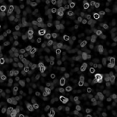

# Mikroskopansicht

<table>
<tr style="border: 0;">
<td width="33.33%" style="border: 0;" valign="top">

{width="128px"}

<b>In:</b> Textur Generators > Rauschen

</td>
<td width="100.00%" style="border: 0;" valign="top">

## Beschreibung

Dadurch entsteht eine verzerrte Rauschen, die wie Bakterien oder Organismen unter einem Mikroskop aussieht.

</td>
</tr>
</table>

## Parameter

|  |  |
|:---|:---|
| <b>Skalierung</b> <i>0 - 10</i> | Legt die globale Skalierung für den Effekt fest. |
| <b>Verkrümmungsintensität</b> <i>0.0 - 1.0</i> | Legt die Intensität des Verkrümmungseffekts fest. Denke daran, dass du auch negativ werden kannst, indem du doppelklickst und -1 eingibst. |
| <b>Störung</b> <i>0.0 - 1.0</i> | Phasenverschiebung des Rauschens, um kleine Schwankungen zu erzeugen |
| <b>Quadratische Ausbreitung</b> <i>False/True</i> | Ermöglicht die Kompensation von Quetsch und Dehnung bei nicht quadratischen Verhältnissen. |

## Beispiele

<table style="table-layout:fixed">
    <tr style="border: 0;">
        <td style="border: 0;">
            
        </td>
        <td style="border: 0;"></td>
        <td style="border: 0;"></td>
    </tr>
</table>
