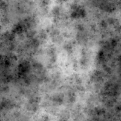

# Feuchtigkeitslärm 2

<table>
<tr style="border: 0;">
<td style="border: 0;" valign="top">

<table>
<tr style="border: 0;">
<td width="33.33%" style="border: 0;" valign="top">

{width="200px"}

<b>In:</b> Texturgeneratoren > Rauschen

</td>
<td width="100.00%" style="border: 0;" valign="top">

## Beschreibung

Eine Variation der reichen und schwammigen <b>Feuchtigkeit</b>-Geräusche.

Platten unterschiedlicher Härte und Größe, die verstreut sind und von der unten stehenden Farbe ausgehend von einem grauen Grund hinzugefügt oder subtrahiert werden.

Siehe auch: [Feuchtigkeitsrauschen 1](../../../../../../compositing-graphs/nodes-reference-for-com/node-library/texture-generators/noises/moisture-noise/moisture-noise.md)

</td>
</tr>
</table>

<table>
<tr style="border: 0;">
<td style="border: 0;" valign="top">

### Ausgaben

</td>
<td style="border: 0;" valign="top">

### Parameter

</td>
<td style="border: 0;" valign="top">

### Beispiele

</td>
</tr>
</table>

## Ausgaben

|  |  |
| --- | --- |
| <b>Ausgabe</b> *Graustufen* | Das erzeugte Rauschen als Graustufen-Bitmap. |

## Parameter

|  |  |
| --- | --- |
| <b>Skalierung</b> Ganze Zahl | Die Unterteilung des Rasters, das zum Erzeugen der Rauschkacheln verwendet wird.    Ein höherer Wert führt dazu, dass mehr Kacheln gezeichnet werden und das Rauschen dichter ist. |
| <b>Störung</b> Float | Versetzt die Bestandteile des Rauschens.    So kannst du das Rauschen animieren. |
| <b>Störungsgeschwindigkeit</b> Gleitend | Passt den Abstand des Versatzes an, der vom <b>Disorder</b>-Parameter angewendet wird.    Mit dieser Option können Sie die Geschwindigkeit des Versatzes bei der Animation des Rauschens steuern. |
| <b>Disorder Anisotropie</b> Float | Steuert die Richtungsspanne des Versatzes, der vom <b>Disorder</b>-Parameter angewendet wird, wobei ein höherer Wert zu einer engeren, definierteren Richtung führt.    Die Anisotropie wird durch den Parameter <b>Disorder Direction Angle</b> gesteuert. |
| <b>Winkel der Anisotropie der Störung</b> Gleitend | Steuert die Richtung des Versatzes, der vom <b>Disorder</b>-Parameter angewendet wird, wenn der <b>Disorder Anisotropie</b>-Parameter nicht Null ist. |
| <b>Mustergröße</b> Float2 | Ein Multiplikator für die Größe eines gestreuten Musters., wobei 1,0 seine ursprüngliche Größe ist. |
| <b>Musterwinkel</b> Gleitend | Der Winkel, der verwendet wird, um die Richtung des gestreuten Musters festzulegen, in der Anzahl der Windungen und ausgehend von der horizontalen rechten Seite. |
| <b>zufälliger Musterwinkel</b> Gleitkomma | Die maximale zufällige Schwankungsbreite, die auf den Wert <b>Musterwinkel</b> in Windungszahlen angewendet wird. |
| <b>Globale Deckkraft</b> Gleitend | Die Deckkraft aller Bestandteile des Rauschens, wobei 0,0 zu einem flachen grauen Grundton führt und 1,0 das Ergebnis der vollständigen Addition oder Subtraktion ist, die von den Bestandteilen angewendet wird. |
| <b>Kachelversatz</b> Gleitkomma2 | Steuert die Position des Abschnitts der unendlichen Ebene, der zum Rendern des Rauschens verwendet wird. |
| <b>Nicht quadratische Erweiterung</b> Boolescher Wert | Bei nicht quadratischen Bildern bleibt das erzeugte Kachelquadrat erhalten und erweitert die Rauscherzeugung auf die Grenzen des Bildes. |

## Beispiele

<table>
<tr style="border: 0;">
<td style="border: 0;" valign="top">

{zoomable="yes"}

</td>
<td style="border: 0;" valign="top">

{zoomable="yes"}

</td>
</tr>
</table>

<table>
<tr style="border: 0;">
<td style="border: 0;" valign="top">

{zoomable="yes"}

</td>
<td style="border: 0;" valign="top">

{zoomable="yes"}

</td>
</tr>
</table>

</td>
<td style="border: 0;" valign="top">

</td>
<td style="border: 0;" valign="top">

</td>
</tr>
</table>
