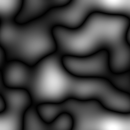

# Plasma

<table>
<tr style="border: 0;">
<td width="33.33%" style="border: 0;" valign="top">

{width="128px"}

<b>In:</b> Textur Generators > Rauschen

</td>
<td width="100.00%" style="border: 0;" valign="top">

## Beschreibung

Dadurch wird eine etwas andere Variante von [Gaußschem Rauschen](../../../../../../compositing-graphs/nodes-reference-for-com/node-library/texture-generators/noises/gaussian-noise/gaussian-noise.md) erzeugt, mit längeren dunklen Streifen als Täler. Es verfügt über eine ähnliche Abstandssteuerung für die Skalierung, die die Unterteilung beibehält.

</td>
</tr>
</table>

## Parameter

|  |  |
|:---|:---|
| <b>Skalierung</b> <i>1 - 128</i> | Legt die globale Skalierung für den Effekt fest. |
| <b>Störung</b> <i>0.0 - 1.0</i> | Phasenverschiebt das Rauschen, um kleine Schwankungen einzuführen. |
| <b>Quadratische Ausbreitung</b> <i>False/True</i> | Ermöglicht die Kompensation von Quetsch und Dehnung bei nicht quadratischen Verhältnissen. |

## Beispiele

<table style="margin-top: 32px; margin-bottom: 32px">
    <tr style="border: 0">
        <td style="border: 0; background: transparent">
            
        </td>
    </tr>
</table>
