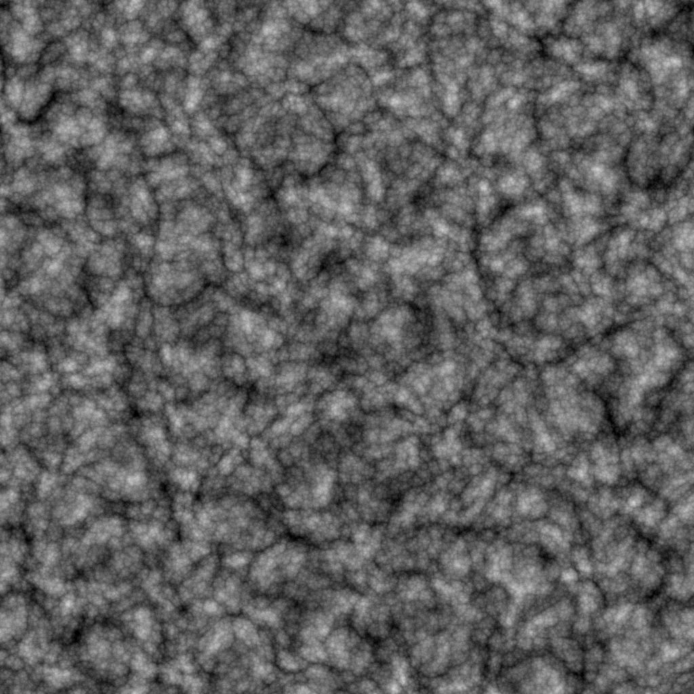

# Voronoi Fractal

<table>
<tr style="border: 0;">
<td width="33.33%" style="border: 0;" valign="top">

{width="200px"}

<b>In:</b> Textur Generators > Rauschen

</td>
<td width="100.00%" style="border: 0;" valign="top">

## Beschreibung

Der Knoten **Voronoi Fractal** generiert eine *fraktale* 3D-Voronoi-Rauschen, die einem 2D-Bild mithilfe einer *Z-down orthografischen Projektion* zugeordnet ist.

Dieser Knoten kann mit [Cube GBuffers](../../../../../../compositing-graphs/nodes-reference-for-com/node-library/texture-generators/patterns/cube-3d-gbuffers/cube-3d-gbuffers.md) als Eingabe anstelle einer eigentlichen durch Baking erzeugte Map (wie im folgenden Beispielbild) getestet werden.

>[!WARNING]
>
> Dieses Geräusch darf nur mit dem *GPU-Modul verwendet werden* (d. h. **Direct** oder **OpenGL**). Wechseln Sie zu **Extras > Modul wechseln...** oder drücken Sie die Taste **F9**, um das gewünschte Modul auszuwählen.

</td>
</tr>
</table>

## Parameter

|  |  |
|:---|:---|
| <b>Umkehren</b> <i>Boolescher Wert</i> | Kehrt das Ausgabebild um. |
| <b>Skalierung</b> <i>Gleitend</i> | Steuert die Skalierung der fraktalen Voronoi-Rauschen.  *Hinweis*: Wenn **Kacheln** auf *einer Achse* aktiviert ist, ist die Skalenanpassung *gestuft*. Dies wird erwartet. |
| <b>Größe</b> <i>Float3</i> | Steuert die Größe der fraktalen Voronoi-Rauschen in den Achsen **X**, **Y** und **Z**. Nicht einheitliche Werte führen zu einem *dehnend oder auslöschenden*-Effekt.  *Hinweis*: Wenn **Kachelung** für *eine beliebige Achse* aktiviert ist, ist die Größenanpassung *schrittweise*. Dies wird erwartet. |
| <b>Offset</b> <i>Float3</i> | Wendet einen Offset auf die *Position* der fraktalen Voronoi-Rauschen in den Achsen **X**, **Y** und **Z** an. |
| <b>Störung</b> <i>Float3</i> | Die Intensität des *zufälligen Versatzes*, der auf jeden Punkt des Rauschens in den Achsen **X**, **Y** und **Z** angewendet wird. |
| <b>Intensität der Verzerrung</b> <i>Gleitend</i> | Steuert die Intensität eines *Verkrümmungseffekts*, der auf das fraktale Voronoi-Rauschen angewendet wird. |
| <b>Verzerrungen-Skalierungsmultiplikator</b> <i>Gleitend</i> | Steuert die Skalierung des *sich verformenden Musters*, das im Verkrümmungseffekt verwendet wird, der durch die **Intensität der Verzerrung** gesteuert wird. |
| <b>Min. Stufe</b> <i>Integer</i> | Die minimale *Wiederholungsstufe*, die im fraktalen Muster verwendet wird. Ein größerer Mindest-/Höchstbereich führt zu einem *reicheren Muster* mit Variationen in mehr Frequenzbereichen. |
| <b>Max. Stufe</b> <i>Integer</i> | Die maximale *Wiederholungsstufe*, die im fraktalen Muster verwendet wird. Ein größerer Mindest-/Höchstbereich führt zu einem *reicheren Muster* mit Variationen in mehr Frequenzbereichen. |
| <b>Raueit</b> <i>Gleitend</i> | Steuert die *Balance* zwischen niedrigen und hohen *Wiederholungsstufen* im fraktalen Muster.  *Hinweis*: Ein Wert von **0** führt zu einer Ausgabe, die *nicht in Zeile* enthält, auf die andere niedrige Werte folgen. Dies wird erwartet.  *Hinweis 2*: Dieser Parameter ist nur verfügbar, wenn der Parameter **Überblendmodus** auf *Hinzufügen* festgelegt ist. |
| <b>Lakunarität</b> <i>Gleitend</i> | Steuert, wie das angewendete fraktale Muster &quot;*&quot; Leerzeichen &quot;*&quot; ausfüllt. Ein *höherer* Wert führt zu *weniger Lücken* im Muster und einem *dichteren* Rauschen. |
| <b>Globale Deckkraft</b> <i>Gleitend</i> | Steuert den *Bereich* der fraktalen Perlin-Rauschwerte von 0. |
| <b>Abgerundete Kurve</b> <i>Gleitend</i> | Rundet die *Steigung* um jeden Punkt der Rauschen, um sie *konvex* zu machen.  *Hinweis*: Dieser Parameter ist nicht verfügbar, wenn der **Style**-Parameter auf *Edge* festgelegt ist. |
| <b>Entfernungsskala</b> <i>Gleitend</i> | Passt den *Abstand des Farbverlaufs* um jeden Punkt des Rauschens an. |
| <b>Entfernungsmodus</b> <i>Integer</i> | Legt die Methode auf *Berechnen des Abstandsverlaufs* um jeden Punkt der Rauschen fest:  - *Euklidean* - *Manhattan* - *Chebyshev* - *Minkowski* |
| <b>Minkowski-Zahl</b> <i>Gleitend</i> | Die Reihenfolge *p* der Minkowski-Entfernung. Wenn wir den Abstandsverlauf in Quadranten unterteilen, wirkt sich diese Zahl wie folgt auf diese Quadranten aus:  - p ist *genau* 1: Straight - p ist *niedriger* als 1: Konkav - p ist *größer* als 1: Konvex  Interessante Werte:  - *1.0*: Entfernung von Manhattan - *2.0*: Euklidische Entfernung - *Unendlich*: Chebyshev-Abstand   *Hinweis*: Dieser Parameter ist nur verfügbar, wenn der Parameter **Entfernungsmodus** auf *Minkowski* festgelegt ist. |
| <b>Füllmethode</b> <i>Integer</i> | Legt die Methode zum Mischen der Werte von *überlappenden Zellen* im Raum fest:  - *Hinzufügen*: Fügen Sie die Werte  - *Max* hinzu: Beibehalten des *höchsten*-Werts -*Min*: Beibehalten des *niedrigsten*-Werts |
| <b>Stil</b> <i>Integer</i> | Legt die *-Methode zum Rendern der Daten* der fraktalen Voronoi-Rauschen fest, da die Rauschen auf einer Menge von Punkten im Raum basiert:  - *F1*: der Abstand zum *nächstgelegenen Punkt* im Raum - *F2*: der Abstand zum *zweitnächsten Punkt* im Raum - *F2-F1* - *F1\* F2 * -* F1/F2 * -* Edge *: die* Kante zwischen jeder Zelle *der Rauschen im Leerzeichen -* Zufallsfarbe *: jeder Zelle der Rauschen im Raum eine* zufällige flache Farbe* zuweisen |
| <b>Edge-Thickness</b> <i>Gleitend</i> | Stellt die Thickness der Kanten ein, die zwischen den Zellen der fraktalen Voronoi-Rauschen erkannt werden. Kanten werden in den X-, Y- und Z-Achsen erkannt, daher können einige Stärken schneller zunehmen als andere, je nach *Tiefe* der Zellen.  *Hinweis*: Dieser Parameter ist nur verfügbar, wenn der **Style**-Parameter auf *Edge* festgelegt ist. |
| <b>Zufallsfarben-Startmodus</b> <i>Integer</i> | Legt die Methode zum *Erfassen* des zufälligen Seeds für die Farbauswahl pro Zelle fest:  - *Globale zufällige Seeds*: Verwenden Sie das Seed *geerbt* vom Knoten  - *Manuelles Seed*: Verwenden Sie ein *diskretes* Seed   *Hinweis*: Dieser Parameter ist nur verfügbar, wenn der **Style**-Parameter auf *Random color* festgelegt ist. |
| <b>Zufallsfarbensamen</b> <i>Integer</i> | Der diskrete Zufallswert, der für die Farbauswahl pro Zelle verwendet werden soll.  *Hinweis*: Dieser Parameter ist nur verfügbar, wenn der **Style**-Parameter auf *Zufallsfarbe* und der **Zufallsfarben-Übertragungsmodus**-Parameter auf *Manuelle Übertragung* festgelegt ist. |
| <b>Kachelung aktivieren</b> <i>Boolescher Wert</i> | Stellt die fraktale Voronoi-Rauschen so ein, dass sich das resultierende Muster *in X-, Y- und Z-Achse wiederholt*. |

## Beispiele

<table style="margin-top: 32px; margin-bottom: 32px">
    <tr style="border: 0">
        <td style="border: 0; background: transparent">
            
        </td>
        <td style="border: 0; background: transparent">
            
        </td>
        <td style="border: 0; background: transparent">
            
        </td>
        <td style="border: 0; background: transparent">
            
        </td>
        <td style="border: 0; background: transparent">
            
        </td>
        <td style="border: 0; background: transparent">
            
        </td>
        <td style="border: 0; background: transparent">
            
        </td>
        <td style="border: 0; background: transparent">
            
        </td>
    </tr>
</table>
