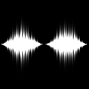

# Waveform 1

<table>
<tr style="border: 0;">
<td width="33.33%" style="border: 0;" valign="top">

{width="200px"}

<b>In:</b> Texturgeneratoren > Rauschen

</td>
<td width="100.00%" style="border: 0;" valign="top">

## Beschreibung

Horizontale Anordnung von vom Benutzer ausgewählten Mustern, die in einer Form ähnlich einer Wellenform gestapelt sind.

</td>
</tr>
</table>

## Ausgaben

|  |  |
|:---|:---|
| <b>Ausgabe</b> <i>Graustufen</i> | Das erzeugte Rauschen als Graustufen-Bitmap. |

## Parameter

|  |  |
|:---|:---|
| <b>Beispiele</b> <i>Integer</i> | Die Anzahl der Muster, die entlang der X-Achse platziert werden, um die Wellenform zu zeichnen, wobei ein niedrigerer Wert zu einer abgestuften Darstellung führt. |
| <b>Funktion</b> <i>Integer</i> | Die Funktion, mit der die Wellenform gezeichnet wird.   Dadurch wird die vertikale Größe des Musters gesteuert, das an jedem Sample platziert wird:<ul data-preserve-html="true"> <li data-preserve-html="true"><i>Wert-Rauschen:</i> Eine zufällige Verteilung von Werten</li> <li data-preserve-html="true"><i>Kosinus:</i> Die Werte folgen dem Verlauf einer Kosinusfunktion</li> <li data-preserve-html="true"><i>Benutzerdefinierte Funktion:</i> Verwenden Sie eine vom Benutzer verfasste Funktion zum Steuern der Werte.</li> </ul> |
| <b>Benutzerdefinierte Funktion</b> <i>Gleitend</i>   *Verfügbar, wenn &quot;Function&quot; auf &quot;Custom function&quot; festgelegt ist* | Berechnet die vertikale Größe des Musters, das an jedem Sample platziert wird.   Verfügbare Variablen:<ul data-preserve-html="true"> <li data-preserve-html="true"><b>Pos</b> (<i>float</i>) Die Position des Musters auf der X-Achse. Dies kann zur Auswahl von Mustern verwendet werden.</li> </ul> |
| <b>Raueit</b> <i>Gleitend</i> | Interpoliert zwischen einer sauberen und glatten Wellenform mit einer raueren und gleichmäßigeren Wellenform.    Das kann man sich als klares Signal oder weißes Rauschen vorstellen. |
| <b>Skalierung</b> <i>Integer</i> | Die horizontale Spanne der im Bild sichtbaren Wellenform. |
| <b>Amplitude min.</b> <i>Gleitend</i> | Der Mindestwert (oder die Thickness) der Wellenform. |
| <b>Maximale Amplitude</b> <i>Gleitend</i> | Der Maximalwert (oder die Thickness) der Wellenform. |
| <b>Rauschen</b> <i>Gleitend</i> | Wendet Rauschen auf die Wellenform an, die zufällig von ihrer vertikalen Spanne subtrahiert. |
| <b>Position</b> <i>Integer</i> | Die Position der Wellenform im Bild:<ul data-preserve-html="true"> <li data-preserve-html="true"><i>Zentriert:</i> Der Ursprung befindet sich in der vertikalen Mitte des Bildes</li> <li data-preserve-html="true"><i>Unten:</i> Der Ursprung befindet sich am unteren Rand des Bildes.</li> </ul> |
| <b>Muster</b> <i>Integer</i> | Das Muster, das bei jedem Sample der Wellenform platziert wird. |
| <b>Mustervariation</b> <i>Gleitend</i> | Für einige Muster ist eine zusätzliche Anpassung verfügbar. |
| <b>Störung</b> <i>Gleitend</i> | Verschiebt die Werte der Wellenform.    Mit dieser Option kannst du den Clip animieren. |
| <b>Störungsgeschwindigkeit</b> <i>Gleitend</i> | Passt den Abstand des Versatzes an, der vom <b>Disorder</b>-Parameter angewendet wird.    Mit dieser Option können Sie die Geschwindigkeit des Versatzes bei der Animation der Wellenform steuern. |

## Beispiele

<table>
<tr style="border: 0;">
<td style="border: 0;" valign="top">

{zoomable="yes"}

</td>
<td style="border: 0;" valign="top">

</td>
</tr>
</table>
