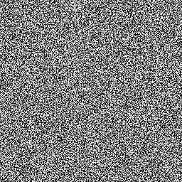

# Weißes Rauschen schnell

<table>
<tr style="border: 0;">
<td width="33.33%" style="border: 0;" valign="top">

{width="128px"}

<b>In:</b> Textur Generators > Rauschen

</td>
<td width="100.00%" style="border: 0;" valign="top">

## Beschreibung

Dies ist eine schnellere Version von [White Rauschen](../../../../../../compositing-graphs/nodes-reference-for-com/node-library/texture-generators/noises/white-noise/white-noise.md), wenn die Qualität nicht Ihr Hauptanliegen ist und Sie etwas an Leistung sparen möchten. In den meisten Fällen sollten Sie mit dieser schnellen Version einverstanden sein.

</td>
</tr>
</table>

## Beispiele

<table style="margin-top: 32px; margin-bottom: 32px">
    <tr style="border: 0">
        <td style="border: 0; background: transparent">
            
        </td>
    </tr>
</table>
