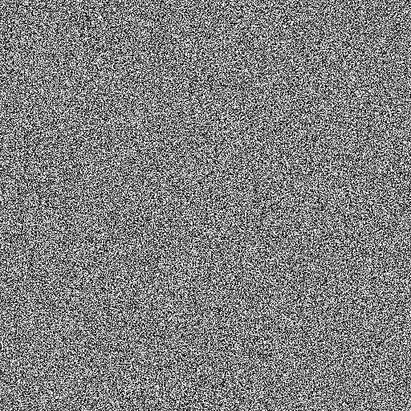

# Weißes Rauschen

<table>
<tr style="border: 0;">
<td style="border: 0;" valign="top">

<table>
<tr style="border: 0;">
<td width="33.33%" style="border: 0;" valign="top">

{width="200px"}

<b>In:</b> Texturgeneratoren > Rauschen

</td>
<td width="100.00%" style="border: 0;" valign="top">

## Beschreibung

Erzeugt eine weiße Rauschen mit einer von drei Methoden, die auf verschiedene Histogrammformen abzielen: einheitlich, Gaußsch und Dreieck.

</td>
</tr>
</table>

## Ausgaben

|  |  |
| --- | --- |
| <b>Ausgabe</b> *Graustufen* | Das erzeugte Rauschen als Graustufen-Bitmap. |

## Parameter

|  |  |
| --- | --- |
| <b>Ganzzahl der Rauschen-Distribution </b> | Die Methode zur Verteilung der Inhaltsstoffe auf eine Histogrammform:<ul data-preserve-html="true"> <li data-preserve-html="true"><i>Einheitlich:</i> Ein flaches Histogramm.</li> <li data-preserve-html="true"><i>Gaußsch:</i> Ein Histogramm, das eine Normalverteilung darstellt, ähnlich einer Glockenkurve.</li> <li data-preserve-html="true"><i>Dreieck:</i> Ein dreieckiges Histogramm.</li> </ul> |
| <b>Störung</b> Float | Versetzt die Bestandteile des Rauschens.    So kannst du das Rauschen animieren. |
| <b>Störungsgeschwindigkeit</b> Gleitend | Passt den Abstand des Versatzes an, der vom <b>Disorder</b>-Parameter angewendet wird.    Mit dieser Option können Sie die Geschwindigkeit des Versatzes bei der Animation des Rauschens steuern. |

## Beispiele

<table>
<tr style="border: 0;">
<td style="border: 0;" valign="top">

{zoomable="yes"}

</td>
<td style="border: 0;" valign="top">

{zoomable="yes"}

</td>
</tr>
</table>

</td>
<td style="border: 0;" valign="top">

</td>
<td style="border: 0;" valign="top">

</td>
</tr>
</table>
