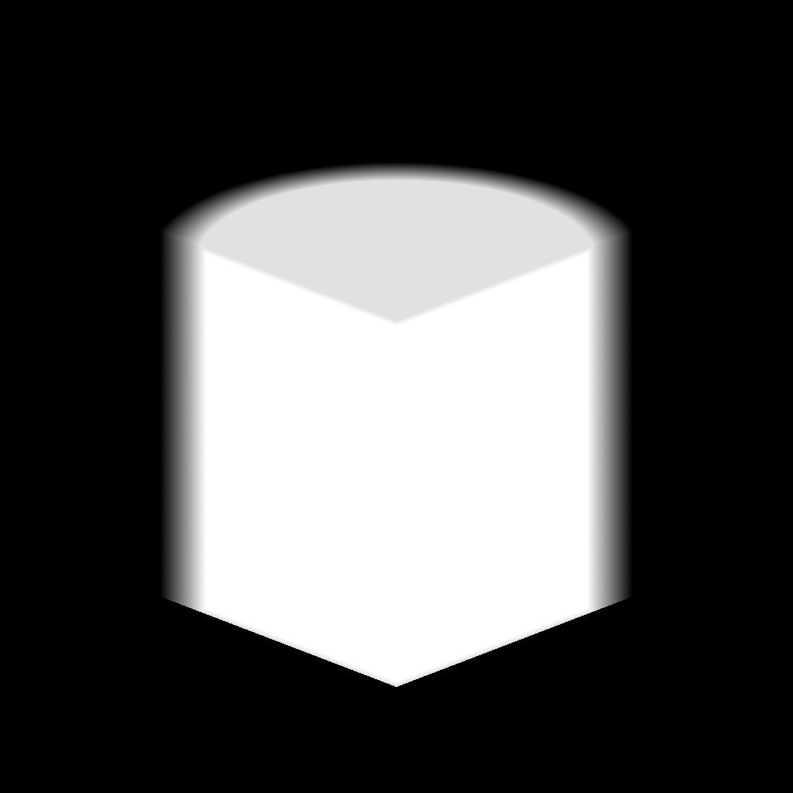

# 3D-Volumenmaske

<table>
<tr style="border: 0;">
<td width="41.60%" style="border: 0;" valign="top">

{width="256px"}

**In:** Generator*/Pattern*

**Einfach**

</td>
<td width="58.30%" style="border: 0;" valign="top">

## Beschreibung

Der Knoten **3D Volume Mask** generiert eine Darstellung einer *primitiven Form* basierend auf der Eingabezuordnung **Position**.

</td>
</tr>
</table>

## Parameter

### Eingaben

* **Position** *Farbe*\
  Die Karte, die die *3D-Raumkoordinaten* beschreibt, in denen die Grundform dargestellt wird.\
  Die **X/Y/Z**-Koordinaten werden den **R/G/B**-Kanälen zugeordnet.

### Parameter

* **Shape** *Integer*\
  Die Grundform, die dargestellt werden soll:
  * *Cube*- *Zylinder*- *Kugel*
* **Skalierung** *Gleitend*\
  Definiert die *globale*-Skalierung der primitiven Ebene, die *einheitlich* auf alle Achsen angewendet wird.
* **Größe** *Gleitend3*\
  Definiert die Größe der Form auf jeder Achse.
* **Positionseingabe** *Ganzzahl*\
  Die Methode von *, die Leerzeichen* durch die **Position**-Eingabe darstellt:
  * *UV-Position*: Verwenden Sie eine *UV-Karte*. Die X/Y (U/V)-Koordinaten werden den R/G-Kanälen zugeordnet. Die Z-Achse wird als *orthogonaler Vorwärtsvektor* angenommen.
  * *Weltraumposition*: Verwenden Sie eine *Positionszuordnung*, um die Grundform im 3D-Raum zuzuordnen. Die X/Y/Z-Koordinaten werden den R/G/B-Kanälen zugeordnet.
* **UV** *Gleitkomma2* positionieren\
  Die Position der Grundform im UV-Raum.\
  *Hinweis*: Dieser Parameter ist nur verfügbar, wenn der Parameter **Positionseingabe** auf *UV-Position* festgelegt ist.
* **Position** *Gleitkomma3*\
  Die Position des Primitiven im Weltraum.\
  *Hinweis*: Dieser Parameter ist nur verfügbar, wenn der Parameter **Positionseingabe** auf *Weltraumposition* festgelegt ist.
* **Drehung** *Gleitend3*\
  Definiert die Drehung der Form im Welt-Raum.
* **Breite der weichen Kante** *Gleitend*\
  Passt die Breite des *verblassenden Farbverlaufs* von der Oberfläche der Grundform nach innen an.

## Beispielbilder

<table>
<tr style="border: 0;">
<td style="border: 0;" valign="top">

{width="256px"}

</td>
<td style="border: 0;" valign="top">

{width="256px"}

</td>
<td style="border: 0;" valign="top">

{width="256px"}

</td>
<td style="border: 0;" valign="top">

{width="256px"}

</td>
</tr>
</table>
