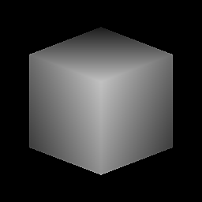

# Cube 3D

<table>
<tr style="border: 0;">
<td style="border: 0;" valign="top">

## Cube 3D

**In:** *Texturgeneratoren**/Muster*

**Einfach**

</td>
<td style="border: 0;" valign="top">

## Beschreibung

Erzeugt einen 3D-Graustufenwürfel mit Schattierung, die auch als Bildschirm-Tiefe dient. Der resultierende Würfel hat superscharfe und scharfe Kanten, wenn er mit hochpräzisen Bit-Tiefen verwendet wird. Sehr interessant und nützlich!

## Parameter

* **Orientierungsversatz**:\
  Ermöglicht eine 3D-ähnliche X- und Y-Drehung des Würfels. Dies kann auch durch Bearbeiten des kleinen Punkts in der 2D-Vorschau erfolgen (wie im Beispiel unten gezeigt).
* **Größe**: *0.0 - 1.0* Ermöglicht eine ungleichmäßige Neuskalierung des Würfels.
* **Skalierung**: *0.0 - 1.0*\
  Skaliert den gesamten Würfel gleichmäßig.
* **Quadratische Ausbreitung**: *False/True*\
  Ermöglicht die Kompensation von Quetsch und Dehnung bei nicht quadratischen Verhältnissen.

## Beispielbilder

</td>
</tr>
</table>
