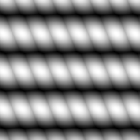

# Fasern 2

<table>
<tr style="border: 0;">
<td style="border: 0;" valign="top">

{width="128px"}

## Fasern 2

**In:** *Texturgeneratoren**/Muster*

**Einfach**

</td>
<td style="border: 0;" valign="top">

## Beschreibung

Einfaches Stoffmuster. Kann für Mesh, Tuch oder andere organische Height- und Detailmaps verwendet werden. Eine kleinere Version finden Sie auch unter [Fibers 1](../../../../../../compositing-graphs/nodes-reference-for-com/node-library/texture-generators/patterns/fibers-1/fibers-1.md).

## Parameter

* **Anordnen**: *1 - 16*\
  Legt fest, wie oft das Ergebnis gekachelt werden soll.
* **Quadratische Ausbreitung**: *False/True*\
  Ermöglicht die Kompensation von Quetsch und Dehnung bei nicht quadratischen Verhältnissen.

## Beispielbilder

</td>
</tr>
</table>
