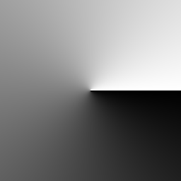

# Kreisförmiger Verlauf

<table>
<tr style="border: 0;">
<td style="border: 0;" valign="top">

{width="128px"}

## Kreisförmiger Verlauf

**In:** *Texturgeneratoren**/Muster*

**Einfach**

</td>
<td style="border: 0;" valign="top">

## Beschreibung

Erstellt einen Graustufen-Farbverlaufsübergang, der durch zwei benutzerdefinierte Punkte kreisförmig definiert wird. Der Übergang erfolgt nicht von a nach b, sondern als Umdrehung um den ersten Punkt, beginnend und endend am zweiten Punkt. Denke daran, dass die Ergebnisse nie kacheln werden.

## Parameter

* **Punkt 1**:\
  Erster Punkt, um den Verlauf zu drehen, muss nicht zentriert werden
* **Punkt 2**:\
  Zweiter Punkt, an dem der Verlauf beginnen und enden soll.
* **Quadratische Ausbreitung**: *False/True*\
  Aktivieren Sie die Kompensation von Quetschen und Dehnen mit nicht quadratischen Verhältnissen.

</td>
</tr>
</table>
