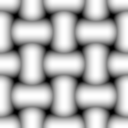

# Gitter 2

<table>
<tr style="border: 0;">
<td width="33.33%" style="border: 0;" valign="top">

{width="128px"}

<b>In:</b> Texturgeneratoren > Muster

</td>
<td width="100.00%" style="border: 0;" valign="top">

## Beschreibung

Einfaches Netzmuster mit Fettblöcken. Kann zum Erstellen von Height- und Detailzuordnungen verwendet werden.

</td>
</tr>
</table>

## Parameter

|  |  |
|:---|:---|
| <b>Kacheln</b> <i>1 - 16</i> | Legt fest, wie oft das Ergebnis gekachelt werden soll. |
| <b>Um 45 Grad drehen</b> <i>False/True</i> | Dreht das Ergebnis. |
| <b>Quadratische Ausbreitung</b> <i>False/True</i> | Ermöglicht die Kompensation von Quetsch und Dehnung bei nicht quadratischen Verhältnissen. |

## Beispiele

<table style="margin-top: 32px; margin-bottom: 32px">
    <tr style="border: 0">
        <td style="border: 0; background: transparent">
            
        </td>
    </tr>
</table>
